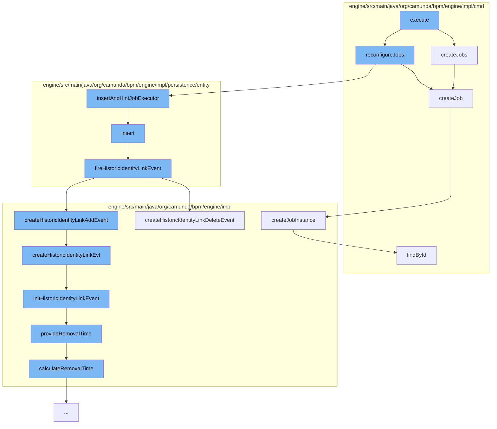

This document will cover the process of executing the History Cleanup Command in the Camunda BPM engine. The process includes the following steps:

1. Creating jobs for history cleanup
2. Reconfiguring jobs
3. Inserting and hinting the job executor
4. Firing historic identity link events
5. Creating historic identity link events
6. Initializing historic identity link events
7. Providing removal time for historic identity link events.



<SwmSnippet path="/engine/src/main/java/org/camunda/bpm/engine/impl/cmd/HistoryCleanupCmd.java" line="122">

---

# Creating jobs for history cleanup

The `createJobs` function is responsible for creating jobs for history cleanup. It acquires an exclusive lock and checks if there are any existing history cleanup jobs. If none exist, it creates new jobs and adds them to the job manager.

```java
  protected List<Job> createJobs(int[][] minuteChunks) {
    CommandContext commandContext = Context.getCommandContext();

    JobManager jobManager = commandContext.getJobManager();
    int maxRetries = HistoryCleanupHelper.getMaxRetries();

    acquireExclusiveLock(commandContext);

    //check again after lock
    List<Job> historyCleanupJobs = getHistoryCleanupJobs();

    if (historyCleanupJobs.isEmpty()) {
      for (int[] minuteChunk : minuteChunks) {
        JobEntity job = createJob(minuteChunk, maxRetries);
        jobManager.insertAndHintJobExecutor(job);
        historyCleanupJobs.add(job);
      }
    }

    return historyCleanupJobs;
  }
```

---

</SwmSnippet>

<SwmSnippet path="/engine/src/main/java/org/camunda/bpm/engine/impl/cmd/HistoryCleanupCmd.java" line="196">

---

# Reconfiguring jobs

The `createJob` function is called within the `createJobs` function. It creates a new job instance with the given minute chunk and maximum retries.

```java
  @SuppressWarnings("unchecked")
  protected JobEntity createJob(int[] minuteChunk, int maxRetries) {
    HistoryCleanupContext context = createCleanupContext(minuteChunk, maxRetries);
    return HISTORY_CLEANUP_JOB_DECLARATION.createJobInstance(context);
  }
```

---

</SwmSnippet>

<SwmSnippet path="/engine/src/main/java/org/camunda/bpm/engine/impl/persistence/entity/JobManager.java" line="82">

---

# Inserting and hinting the job executor

The `insert` function is called within the `insertAndHintJobExecutor` function. It inserts the job into the database and fires a historic identity link event.

```java

  public void deleteJob(JobEntity job) {
    deleteJob(job, true);
  }

  public void deleteJob(JobEntity job, boolean fireDeleteEvent) {
    getDbEntityManager().delete(job);
```

---

</SwmSnippet>

<SwmSnippet path="/engine/src/main/java/org/camunda/bpm/engine/impl/persistence/entity/IdentityLinkEntity.java" line="204">

---

# Firing historic identity link events

The `fireHistoricIdentityLinkEvent` function is responsible for creating a history event for the identity link. Depending on the event type, it creates either a historic identity link add event or a historic identity link delete event.

```java
  public void fireHistoricIdentityLinkEvent(final HistoryEventType eventType) {
    ProcessEngineConfigurationImpl processEngineConfiguration = Context.getProcessEngineConfiguration();

    HistoryLevel historyLevel = processEngineConfiguration.getHistoryLevel();
    if(historyLevel.isHistoryEventProduced(eventType, this)) {

      HistoryEventProcessor.processHistoryEvents(new HistoryEventProcessor.HistoryEventCreator() {
        @Override
        public HistoryEvent createHistoryEvent(HistoryEventProducer producer) {
          HistoryEvent event = null;
          if (HistoryEvent.IDENTITY_LINK_ADD.equals(eventType.getEventName())) {
            event = producer.createHistoricIdentityLinkAddEvent(IdentityLinkEntity.this);
          } else if (HistoryEvent.IDENTITY_LINK_DELETE.equals(eventType.getEventName())) {
            event = producer.createHistoricIdentityLinkDeleteEvent(IdentityLinkEntity.this);
          }
          return event;
        }
      });

    }
  }
```

---

</SwmSnippet>

<SwmSnippet path="/engine/src/main/java/org/camunda/bpm/engine/impl/history/producer/DefaultHistoryEventProducer.java" line="950">

---

# Creating historic identity link events

The `createHistoricIdentityLinkEvt` function is called within the `createHistoricIdentityLinkAddEvent` and `createHistoricIdentityLinkDeleteEvent` functions. It initializes a new historic identity link event with the given identity link and event type.

```java
  protected HistoryEvent createHistoricIdentityLinkEvt(IdentityLink identityLink, HistoryEventTypes eventType) {
    // create historic identity link event
    HistoricIdentityLinkLogEventEntity evt = newIdentityLinkEventEntity();
    // Mapping all the values of identity link to HistoricIdentityLinkEvent
    initHistoricIdentityLinkEvent(evt, identityLink, eventType);
    return evt;
  }
```

---

</SwmSnippet>

<SwmSnippet path="/engine/src/main/java/org/camunda/bpm/engine/impl/history/producer/DefaultHistoryEventProducer.java" line="962">

---

# Initializing historic identity link events

The `initHistoricIdentityLinkEvent` function is responsible for initializing the historic identity link event. It sets the process definition ID, process definition key, tenant ID, time, type, user ID, group ID, task ID, operation type, event type, and assigner ID of the event.

```java
  protected void initHistoricIdentityLinkEvent(HistoricIdentityLinkLogEventEntity evt, IdentityLink identityLink, HistoryEventType eventType) {

    if (identityLink.getTaskId() != null) {
      TaskEntity task = Context
          .getCommandContext()
          .getTaskManager()
          .findTaskById(identityLink.getTaskId());

      evt.setProcessDefinitionId(task.getProcessDefinitionId());

      if (task.getProcessDefinition() != null) {
        evt.setProcessDefinitionKey(task.getProcessDefinition().getKey());
      }

      ExecutionEntity execution = task.getExecution();
      if (execution != null) {
        evt.setRootProcessInstanceId(execution.getRootProcessInstanceId());

        if (isHistoryRemovalTimeStrategyStart()) {
          provideRemovalTime(evt);
        }
```

---

</SwmSnippet>

<SwmSnippet path="/engine/src/main/java/org/camunda/bpm/engine/impl/history/producer/DefaultHistoryEventProducer.java" line="1300">

---

# Providing removal time for historic identity link events

The `provideRemovalTime` function is called within the `initHistoricIdentityLinkEvent` function. It calculates and sets the removal time for the historic identity link event.

```java
  protected void provideRemovalTime(HistoricBatchEntity historicBatch) {
    Date removalTime = calculateRemovalTime(historicBatch);
    if (removalTime != null) {
      historicBatch.setRemovalTime(removalTime);
    }
  }
```

---

</SwmSnippet>

&nbsp;

*This is an auto-generated document by Swimm AI 🌊 and has not yet been verified by a human*

<SwmMeta version="3.0.0" repo-id="Z2l0aHViJTNBJTNBQ2l0aS1jYW11bmRhJTNBJTNBZ2lsYWRuYXZvdA==" repo-name="Citi-camunda" doc-type="flows"><sup>Powered by [Swimm](/)</sup></SwmMeta>
