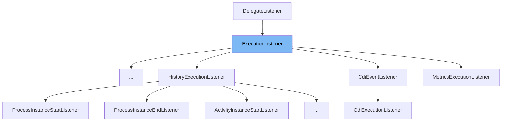

This document will cover the following topics related to the `ExecutionListener` class:

1. What is `ExecutionListener`
2. Variables and functions in `ExecutionListener`
3. Usage example of `ExecutionListener`



# What is ExecutionListener

`ExecutionListener` is a callback interface used to notify of execution events such as starting a process instance, ending an activity instance, or taking a transition. It is part of the Camunda BPMN engine and is used to handle events during the execution of a process.

<SwmSnippet path="/engine/src/main/java/org/camunda/bpm/engine/delegate/ExecutionListener.java" line="30">

---

# Variables in ExecutionListener

The `ExecutionListener` interface defines three string variables: `EVENTNAME_START`, `EVENTNAME_END`, and `EVENTNAME_TAKE`. These represent the different types of events that an `ExecutionListener` can handle.

```java
  String EVENTNAME_START = "start";
  String EVENTNAME_END = "end";
  String EVENTNAME_TAKE = "take";
```

---

</SwmSnippet>

<SwmSnippet path="/engine/src/main/java/org/camunda/bpm/engine/delegate/ExecutionListener.java" line="34">

---

# Function in ExecutionListener

The `notify` function is the main function of the `ExecutionListener` interface. It is called when an event occurs during the execution of a process. The `DelegateExecution` parameter represents the execution context in which the event occurred.

```java
  void notify(DelegateExecution execution) throws Exception;
```

---

</SwmSnippet>

<SwmSnippet path="/webapps/assembly/src/main/runtime/develop/java/org/camunda/bpm/pa/service/FailingListener.java" line="28">

---

# Usage example of ExecutionListener

The `FailingListener` class is an example of how to implement the `ExecutionListener` interface. It overrides the `notify` function to provide custom behavior when an event occurs during the execution of a process.

```java
  public void notify(DelegateExecution execution) throws Exception {
    Long longVar = (Long) execution.getVariable("longVar");
    if (longVar == null || longVar > 20) {
      throw new RuntimeException("validation failed");
    }
  }

}
```

---

</SwmSnippet>

&nbsp;

*This is an auto-generated document by Swimm AI 🌊 and has not yet been verified by a human*

<SwmMeta version="3.0.0" repo-id="Z2l0aHViJTNBJTNBQ2l0aS1jYW11bmRhJTNBJTNBZ2lsYWRuYXZvdA==" repo-name="Citi-camunda" doc-type="class"><sup>Powered by [Swimm](/)</sup></SwmMeta>
