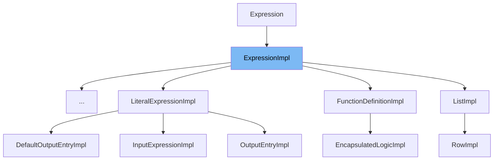

This document will cover the `ExpressionImpl` class in the Citi-camunda repo. We'll cover:

1. What is `ExpressionImpl`.
2. Variables and functions in `ExpressionImpl`.
3. Usage example of `ExpressionImpl`.



# What is ExpressionImpl

`ExpressionImpl` is an abstract class that extends `DmnElementImpl` and implements `Expression`. It is part of the Decision Model and Notation (DMN) model in the Camunda platform, which is used for defining and executing decisions. `ExpressionImpl` represents an expression in the DMN model, which is a piece of logic that can be evaluated to produce a result.

<SwmSnippet path="/model-api/dmn-model/src/main/java/org/camunda/bpm/model/dmn/impl/instance/ExpressionImpl.java" line="32">

---

# Variables and functions

`typeRefAttribute` is a static attribute of type `Attribute<String>`. It is used to store the type reference of the expression.

```java
  protected static Attribute<String> typeRefAttribute;
```

---

</SwmSnippet>

<SwmSnippet path="/model-api/dmn-model/src/main/java/org/camunda/bpm/model/dmn/impl/instance/ExpressionImpl.java" line="34">

---

The constructor `ExpressionImpl` takes a `ModelTypeInstanceContext` as an argument and passes it to the superclass constructor.

```java
  public ExpressionImpl(ModelTypeInstanceContext instanceContext) {
    super(instanceContext);
  }
```

---

</SwmSnippet>

<SwmSnippet path="/model-api/dmn-model/src/main/java/org/camunda/bpm/model/dmn/impl/instance/ExpressionImpl.java" line="38">

---

The function `getTypeRef` is used to get the value of the `typeRefAttribute`.

```java
  public String getTypeRef() {
    return typeRefAttribute.getValue(this);
  }
```

---

</SwmSnippet>

<SwmSnippet path="/model-api/dmn-model/src/main/java/org/camunda/bpm/model/dmn/impl/instance/ExpressionImpl.java" line="42">

---

The function `setTypeRef` is used to set the value of the `typeRefAttribute`.

```java
  public void setTypeRef(String typeRef) {
    typeRefAttribute.setValue(this, typeRef);
  }
```

---

</SwmSnippet>

<SwmSnippet path="/model-api/dmn-model/src/main/java/org/camunda/bpm/model/dmn/impl/instance/ExpressionImpl.java" line="46">

---

The function `registerType` is used to register the `Expression` type in the model builder. It defines the type, sets the namespace URI, extends the `DmnElement` type, and sets it as an abstract type. It also builds the `typeRefAttribute`.

```java
  public static void registerType(ModelBuilder modelBuilder) {
    ModelElementTypeBuilder typeBuilder = modelBuilder.defineType(Expression.class, DMN_ELEMENT_EXPRESSION)
      .namespaceUri(LATEST_DMN_NS)
      .extendsType(DmnElement.class)
      .abstractType();

    typeRefAttribute = typeBuilder.stringAttribute(DMN_ATTRIBUTE_TYPE_REF)
      .build();

    typeBuilder.build();
  }
```

---

</SwmSnippet>

<SwmSnippet path="/model-api/dmn-model/src/main/java/org/camunda/bpm/model/dmn/impl/instance/DecisionTableImpl.java" line="44">

---

# Usage example

`ExpressionImpl` is used as a base class in `DecisionTableImpl`. This shows how `ExpressionImpl` can be extended to create more specific types of expressions in the DMN model.

```java
public class DecisionTableImpl extends ExpressionImpl implements DecisionTable {
```

---

</SwmSnippet>

&nbsp;

*This is an auto-generated document by Swimm AI 🌊 and has not yet been verified by a human*

<SwmMeta version="3.0.0" repo-id="Z2l0aHViJTNBJTNBQ2l0aS1jYW11bmRhJTNBJTNBZ2lsYWRuYXZvdA==" repo-name="Citi-camunda" doc-type="general-class"><sup>Powered by [Swimm](/)</sup></SwmMeta>
