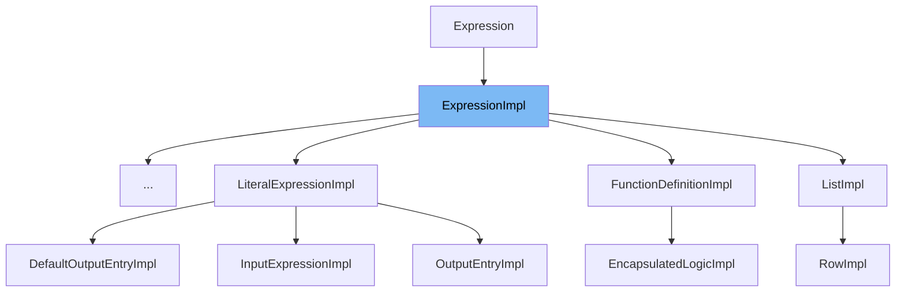

This document will cover the <SwmToken path="/model-api/dmn-model/src/main/java/org/camunda/bpm/model/dmn/impl/instance/ExpressionImpl.java" pos="34:3:3" line-data="  public ExpressionImpl(ModelTypeInstanceContext instanceContext) {">`ExpressionImpl`</SwmToken> class in the Citi-camunda repo. We'll cover:

1. What is <SwmToken path="/model-api/dmn-model/src/main/java/org/camunda/bpm/model/dmn/impl/instance/ExpressionImpl.java" pos="34:3:3" line-data="  public ExpressionImpl(ModelTypeInstanceContext instanceContext) {">`ExpressionImpl`</SwmToken>.
2. Variables and functions in <SwmToken path="/model-api/dmn-model/src/main/java/org/camunda/bpm/model/dmn/impl/instance/DecisionTableImpl.java" pos="44:8:8" line-data="public class DecisionTableImpl extends ExpressionImpl implements DecisionTable {">`ExpressionImpl`</SwmToken>.
3. Usage example of <SwmToken path="/model-api/dmn-model/src/main/java/org/camunda/bpm/model/dmn/impl/instance/ExpressionImpl.java" pos="34:3:3" line-data="  public ExpressionImpl(ModelTypeInstanceContext instanceContext) {">`ExpressionImpl`</SwmToken>.



# What is <SwmToken path="/model-api/dmn-model/src/main/java/org/camunda/bpm/model/dmn/impl/instance/DecisionTableImpl.java" pos="44:8:8" line-data="public class DecisionTableImpl extends ExpressionImpl implements DecisionTable {">`ExpressionImpl`</SwmToken>

<SwmToken path="/model-api/dmn-model/src/main/java/org/camunda/bpm/model/dmn/impl/instance/ExpressionImpl.java" pos="34:3:3" line-data="  public ExpressionImpl(ModelTypeInstanceContext instanceContext) {">`ExpressionImpl`</SwmToken> is an abstract class that extends <SwmToken path="/model-api/dmn-model/src/main/java/org/camunda/bpm/model/dmn/impl/instance/ExpressionImpl.java" pos="30:10:10" line-data="public abstract class ExpressionImpl extends DmnElementImpl implements Expression {">`DmnElementImpl`</SwmToken> and implements <SwmToken path="/model-api/dmn-model/src/main/java/org/camunda/bpm/model/dmn/impl/instance/ExpressionImpl.java" pos="30:14:14" line-data="public abstract class ExpressionImpl extends DmnElementImpl implements Expression {">`Expression`</SwmToken>. It is part of the Decision Model and Notation (DMN) model in the Camunda platform, which is used for defining and executing decisions. <SwmToken path="/model-api/dmn-model/src/main/java/org/camunda/bpm/model/dmn/impl/instance/ExpressionImpl.java" pos="34:3:3" line-data="  public ExpressionImpl(ModelTypeInstanceContext instanceContext) {">`ExpressionImpl`</SwmToken> represents an expression in the DMN model, which is a piece of logic that can be evaluated to produce a result.

<SwmSnippet path="/model-api/dmn-model/src/main/java/org/camunda/bpm/model/dmn/impl/instance/ExpressionImpl.java" line="32">

---

# Variables and functions

<SwmToken path="/model-api/dmn-model/src/main/java/org/camunda/bpm/model/dmn/impl/instance/ExpressionImpl.java" pos="52:1:1" line-data="    typeRefAttribute = typeBuilder.stringAttribute(DMN_ATTRIBUTE_TYPE_REF)">`typeRefAttribute`</SwmToken> is a static attribute of type <SwmToken path="/model-api/dmn-model/src/main/java/org/camunda/bpm/model/dmn/impl/instance/ExpressionImpl.java" pos="32:5:8" line-data="  protected static Attribute&lt;String&gt; typeRefAttribute;">`Attribute<String>`</SwmToken>. It is used to store the type reference of the expression.

```java
  protected static Attribute<String> typeRefAttribute;
```

---

</SwmSnippet>

<SwmSnippet path="/model-api/dmn-model/src/main/java/org/camunda/bpm/model/dmn/impl/instance/ExpressionImpl.java" line="34">

---

The constructor <SwmToken path="/model-api/bpmn-model/src/main/java/org/camunda/bpm/model/bpmn/impl/instance/ExpressionImpl.java" pos="49:3:3" line-data="  public ExpressionImpl(ModelTypeInstanceContext instanceContext) {">`ExpressionImpl`</SwmToken> takes a <SwmToken path="/model-api/dmn-model/src/main/java/org/camunda/bpm/model/dmn/impl/instance/ExpressionImpl.java" pos="34:5:5" line-data="  public ExpressionImpl(ModelTypeInstanceContext instanceContext) {">`ModelTypeInstanceContext`</SwmToken> as an argument and passes it to the superclass constructor.

```java
  public ExpressionImpl(ModelTypeInstanceContext instanceContext) {
    super(instanceContext);
  }
```

---

</SwmSnippet>

<SwmSnippet path="/model-api/dmn-model/src/main/java/org/camunda/bpm/model/dmn/impl/instance/ExpressionImpl.java" line="38">

---

The function <SwmToken path="/model-api/dmn-model/src/main/java/org/camunda/bpm/model/dmn/impl/instance/ExpressionImpl.java" pos="38:5:5" line-data="  public String getTypeRef() {">`getTypeRef`</SwmToken> is used to get the value of the <SwmToken path="/model-api/dmn-model/src/main/java/org/camunda/bpm/model/dmn/impl/instance/ExpressionImpl.java" pos="39:3:3" line-data="    return typeRefAttribute.getValue(this);">`typeRefAttribute`</SwmToken>.

```java
  public String getTypeRef() {
    return typeRefAttribute.getValue(this);
  }
```

---

</SwmSnippet>

<SwmSnippet path="/model-api/dmn-model/src/main/java/org/camunda/bpm/model/dmn/impl/instance/ExpressionImpl.java" line="42">

---

The function <SwmToken path="/model-api/dmn-model/src/main/java/org/camunda/bpm/model/dmn/impl/instance/ExpressionImpl.java" pos="42:5:5" line-data="  public void setTypeRef(String typeRef) {">`setTypeRef`</SwmToken>to set the value of the <SwmToken path="/model-api/dmn-model/src/main/java/org/camunda/bpm/model/dmn/impl/instance/ExpressionImpl.java" pos="43:1:1" line-data="    typeRefAttribute.setValue(this, typeRef);">`typeRefAttribute`</SwmToken>.

```java
  public void setTypeRef(String typeRef) {
    typeRefAttribute.setValue(this, typeRef);
  }
```

---

</SwmSnippet>

<SwmSnippet path="/model-api/dmn-model/src/main/java/org/camunda/bpm/model/dmn/impl/instance/ExpressionImpl.java" line="46">

---

The function <SwmToken path="/model-api/dmn-model/src/main/java/org/camunda/bpm/model/dmn/impl/instance/ExpressionImpl.java" pos="46:7:7" line-data="  public static void registerType(ModelBuilder modelBuilder) {">`registerType`</SwmToken> is used to register the <SwmToken path="/model-api/dmn-model/src/main/java/org/camunda/bpm/model/dmn/impl/instance/ExpressionImpl.java" pos="47:11:11" line-data="    ModelElementTypeBuilder typeBuilder = modelBuilder.defineType(Expression.class, DMN_ELEMENT_EXPRESSION)">`Expression`</SwmToken> type in the model builder. It defines the type, sets the namespace URI, extends the <SwmToken path="/model-api/dmn-model/src/main/java/org/camunda/bpm/model/dmn/impl/instance/ExpressionImpl.java" pos="49:4:4" line-data="      .extendsType(DmnElement.class)">`DmnElement`</SwmToken> type, and sets it as an abstract type. It also builds the <SwmToken path="/model-api/dmn-model/src/main/java/org/camunda/bpm/model/dmn/impl/instance/ExpressionImpl.java" pos="52:1:1" line-data="    typeRefAttribute = typeBuilder.stringAttribute(DMN_ATTRIBUTE_TYPE_REF)">`typeRefAttribute`</SwmToken>.

```java
  public static void registerType(ModelBuilder modelBuilder) {
    ModelElementTypeBuilder typeBuilder = modelBuilder.defineType(Expression.class, DMN_ELEMENT_EXPRESSION)
      .namespaceUri(LATEST_DMN_NS)
      .extendsType(DmnElement.class)
      .abstractType();

    typeRefAttribute = typeBuilder.stringAttribute(DMN_ATTRIBUTE_TYPE_REF)
      .build();

    typeBuilder.build();
  }
```

---

</SwmSnippet>

<SwmSnippet path="/model-api/dmn-model/src/main/java/org/camunda/bpm/model/dmn/impl/instance/DecisionTableImpl.java" line="44">

---

# Usage example

<SwmToken path="/model-api/dmn-model/src/main/java/org/camunda/bpm/model/dmn/impl/instance/DecisionTableImpl.java" pos="44:8:8" line-data="public class DecisionTableImpl extends ExpressionImpl implements DecisionTable {">`ExpressionImpl`</SwmToken> is used as a base class in <SwmToken path="/model-api/dmn-model/src/main/java/org/camunda/bpm/model/dmn/impl/instance/DecisionTableImpl.java" pos="44:4:4" line-data="public class DecisionTableImpl extends ExpressionImpl implements DecisionTable {">`DecisionTableImpl`</SwmToken>. This shows how <SwmToken path="/model-api/dmn-model/src/main/java/org/camunda/bpm/model/dmn/impl/instance/DecisionTableImpl.java" pos="44:8:8" line-data="public class DecisionTableImpl extends ExpressionImpl implements DecisionTable {">`ExpressionImpl`</SwmToken> can be extended to create more specific types of expressions in the DMN model.

```java
public class DecisionTableImpl extends ExpressionImpl implements DecisionTable {
```

---

</SwmSnippet>

&nbsp;

*This is an auto-generated document by Swimm AI 🌊 and has not yet been verified by a human*

<SwmMeta version="3.0.0" repo-id="Z2l0aHViJTNBJTNBQ2l0aS1jYW11bmRhJTNBJTNBZ2lsYWRuYXZvdA==" repo-name="Citi-camunda"><sup>Powered by [Swimm](https://app.swimm.io/)</sup></SwmMeta>
