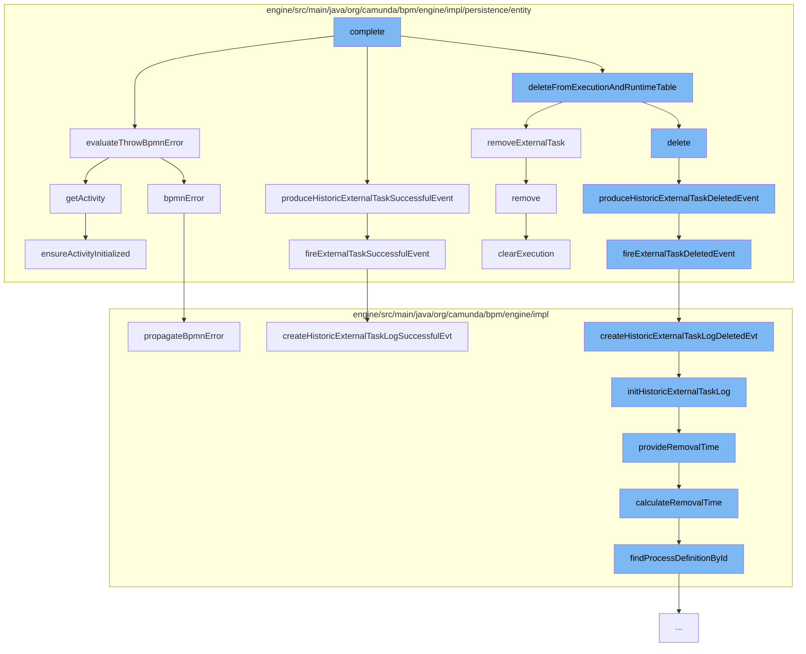

This document will cover the process of completing an external task in the Camunda BPMN engine, which includes:

1. Evaluating BPMN errors
2. Producing historic external task successful event
3. Deleting from execution and runtime table
4. Propagating BPMN error



<SwmSnippet path="/engine/src/main/java/org/camunda/bpm/engine/impl/persistence/entity/ExternalTaskEntity.java" line="519">

---

# Evaluating BPMN errors

The function `evaluateThrowBpmnError` is used to evaluate if there are any BPMN errors in the execution of the task. If an error matches the error event definition, it throws a BPMN error.

```java
  protected boolean evaluateThrowBpmnError(ExecutionEntity execution, boolean continueOnException) {
    List<CamundaErrorEventDefinition> camundaErrorEventDefinitions = (List<CamundaErrorEventDefinition>) execution.getActivity().getProperty(BpmnProperties.CAMUNDA_ERROR_EVENT_DEFINITION.getName());
    if (camundaErrorEventDefinitions != null && !camundaErrorEventDefinitions.isEmpty()) {
      for (CamundaErrorEventDefinition camundaErrorEventDefinition : camundaErrorEventDefinitions) {
        if (errorEventDefinitionMatches(camundaErrorEventDefinition, continueOnException)) {
          bpmnError(camundaErrorEventDefinition.getErrorCode(), errorMessage, null);
          return true;
        }
      }
    }
    return false;
  }
```

---

</SwmSnippet>

<SwmSnippet path="/engine/src/main/java/org/camunda/bpm/engine/impl/persistence/entity/ExternalTaskEntity.java" line="605">

---

# Producing historic external task successful event

The function `produceHistoricExternalTaskDeletedEvent` is used to produce a historic event when an external task is deleted. It triggers the `fireExternalTaskDeletedEvent` function.

```java
  protected void produceHistoricExternalTaskDeletedEvent() {
    CommandContext commandContext = Context.getCommandContext();
    commandContext.getHistoricExternalTaskLogManager().fireExternalTaskDeletedEvent(this);
  }
```

---

</SwmSnippet>

<SwmSnippet path="/engine/src/main/java/org/camunda/bpm/engine/impl/persistence/entity/ExecutionEntity.java" line="1632">

---

# Deleting from execution and runtime table

The function `removeExternalTask` is used to remove an external task from the execution. It removes the task from the internal list of external tasks.

```java
  public void removeExternalTask(ExternalTaskEntity externalTask) {
    getExternalTasksInternal().remove(externalTask);
  }
```

---

</SwmSnippet>

<SwmSnippet path="/engine/src/main/java/org/camunda/bpm/engine/impl/bpmn/helper/BpmnExceptionHandler.java" line="93">

---

# Propagating BPMN error

The function `propagateBpmnError` is used to propagate a BPMN error. It calls the `propagateError` function with the error code and message.

```java
  public static void propagateBpmnError(BpmnError error, ActivityExecution execution) throws Exception {
    propagateError(error.getErrorCode(), error.getMessage(), null, execution);
  }
```

---

</SwmSnippet>

&nbsp;

*This is an auto-generated document by Swimm AI 🌊 and has not yet been verified by a human*

<SwmMeta version="3.0.0" repo-id="Z2l0aHViJTNBJTNBQ2l0aS1jYW11bmRhJTNBJTNBZ2lsYWRuYXZvdA==" repo-name="Citi-camunda" doc-type="flows"><sup>Powered by [Swimm](/)</sup></SwmMeta>
