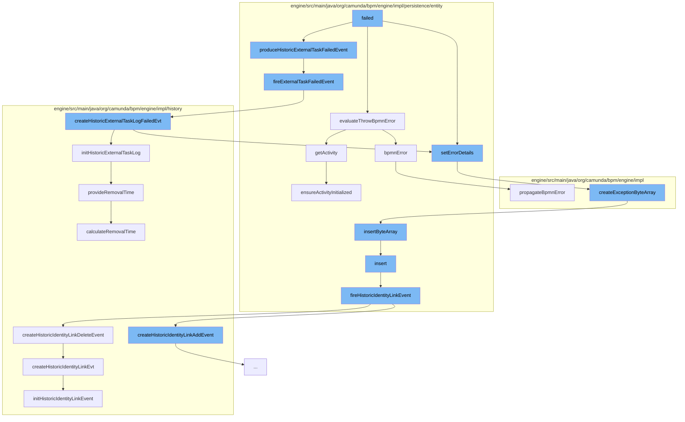

This document will cover the process of handling failed external tasks in the Camunda BPMN engine. The steps include:

1. Setting error details for the failed task
2. Firing an external task failed event
3. Creating a historic external task log failed event
4. Creating an exception byte array
5. Inserting the byte array
6. Inserting an identity link
7. Firing a historic identity link event



<SwmSnippet path="/engine/src/main/java/org/camunda/bpm/engine/impl/persistence/entity/ExternalTaskEntity.java" line="313">

---

# Setting error details for the failed task

The `setErrorDetails` function is used to set the error details for a failed external task. It converts the exception message to a byte array and stores it in a `ByteArrayEntity`. If the `ByteArrayEntity` does not exist, it is created and the exception byte array is set as its content.

```java
  protected void setErrorDetails(String exception) {
    EnsureUtil.ensureNotNull("exception", exception);

    byte[] exceptionBytes = toByteArray(exception);

    ByteArrayEntity byteArray = getErrorByteArray();

    if(byteArray == null) {
      byteArray = createExceptionByteArray(EXCEPTION_NAME,exceptionBytes, ResourceTypes.RUNTIME);
      errorDetailsByteArrayId = byteArray.getId();
      errorDetailsByteArray = byteArray;
    }
    else {
      byteArray.setBytes(exceptionBytes);
    }
  }
```

---

</SwmSnippet>

<SwmSnippet path="/engine/src/main/java/org/camunda/bpm/engine/impl/persistence/entity/HistoricExternalTaskLogManager.java" line="126">

---

# Firing an external task failed event

The `fireExternalTaskFailedEvent` function is used to trigger a failed event for an external task. It creates a historic external task log failed event for the task.

```java
  public void fireExternalTaskFailedEvent(final ExternalTask externalTask) {
    if (isHistoryEventProduced(HistoryEventTypes.EXTERNAL_TASK_FAIL, externalTask)) {
      HistoryEventProcessor.processHistoryEvents(new HistoryEventProcessor.HistoryEventCreator() {
        @Override
        public HistoryEvent createHistoryEvent(HistoryEventProducer producer) {
          return producer.createHistoricExternalTaskLogFailedEvt(externalTask);
        }

        @Override
        public void postHandleSingleHistoryEventCreated(HistoryEvent event) {
          ((ExternalTaskEntity) externalTask).setLastFailureLogId(event.getId());
        }
      });
    }
  }
```

---

</SwmSnippet>

<SwmSnippet path="/engine/src/main/java/org/camunda/bpm/engine/impl/history/producer/DefaultHistoryEventProducer.java" line="1210">

---

# Creating a historic external task log failed event

The `createHistoricExternalTaskLogFailedEvt` function is used to create a historic log event for a failed external task. It initializes the historic external task log with the task details and sets the error details.

```java
  @Override
  public HistoryEvent createHistoricExternalTaskLogFailedEvt(ExternalTask task) {
    HistoricExternalTaskLogEntity event = initHistoricExternalTaskLog((ExternalTaskEntity) task, ExternalTaskState.FAILED);
    event.setErrorMessage(task.getErrorMessage());
    String errorDetails = ((ExternalTaskEntity) task).getErrorDetails();
    if( errorDetails != null) {
      event.setErrorDetails(errorDetails);
    }
    return event;
  }
```

---

</SwmSnippet>

<SwmSnippet path="/engine/src/main/java/org/camunda/bpm/engine/impl/util/ExceptionUtil.java" line="69">

---

# Creating an exception byte array

The `createExceptionByteArray` function is used to create a byte array from the exception message. The byte array is then persisted.

```java
  /**
   * create ByteArrayEntity with specified name and payload and make sure it's
   * persisted
   *
   * used in Jobs and ExternalTasks
   *
   * @param name - type\source of the exception
   * @param byteArray - payload of the exception
   * @param type - resource type of the exception
   * @return persisted entity
   */
  public static ByteArrayEntity createExceptionByteArray(String name, byte[] byteArray, ResourceType type) {
    ByteArrayEntity result = null;

    if (byteArray != null) {
      result = new ByteArrayEntity(name, byteArray, type);
      Context.getCommandContext()
        .getByteArrayManager()
        .insertByteArray(result);
    }

```

---

</SwmSnippet>

<SwmSnippet path="/engine/src/main/java/org/camunda/bpm/engine/impl/persistence/entity/ByteArrayManager.java" line="44">

---

# Inserting the byte array

The `insertByteArray` function is used to persist the byte array in the database.

```java
  public void insertByteArray(ByteArrayEntity arr) {
    arr.setCreateTime(ClockUtil.getCurrentTime());
    getDbEntityManager().insert(arr);
  }
```

---

</SwmSnippet>

<SwmSnippet path="/engine/src/main/java/org/camunda/bpm/engine/impl/persistence/entity/IdentityLinkEntity.java" line="82">

---

# Inserting an identity link

The `insert` function is used to persist an identity link in the database. It also triggers a historic identity link event.

```java
  public void insert() {
    Context
      .getCommandContext()
      .getDbEntityManager()
      .insert(this);
    fireHistoricIdentityLinkEvent(HistoryEventTypes.IDENTITY_LINK_ADD);
  }
```

---

</SwmSnippet>

<SwmSnippet path="/engine/src/main/java/org/camunda/bpm/engine/impl/persistence/entity/IdentityLinkEntity.java" line="204">

---

# Firing a historic identity link event

The `fireHistoricIdentityLinkEvent` function is used to trigger a historic identity link event. It creates a historic identity link event and initializes it with the identity link details.

```java
  public void fireHistoricIdentityLinkEvent(final HistoryEventType eventType) {
    ProcessEngineConfigurationImpl processEngineConfiguration = Context.getProcessEngineConfiguration();

    HistoryLevel historyLevel = processEngineConfiguration.getHistoryLevel();
    if(historyLevel.isHistoryEventProduced(eventType, this)) {

      HistoryEventProcessor.processHistoryEvents(new HistoryEventProcessor.HistoryEventCreator() {
        @Override
        public HistoryEvent createHistoryEvent(HistoryEventProducer producer) {
          HistoryEvent event = null;
          if (HistoryEvent.IDENTITY_LINK_ADD.equals(eventType.getEventName())) {
            event = producer.createHistoricIdentityLinkAddEvent(IdentityLinkEntity.this);
          } else if (HistoryEvent.IDENTITY_LINK_DELETE.equals(eventType.getEventName())) {
            event = producer.createHistoricIdentityLinkDeleteEvent(IdentityLinkEntity.this);
          }
          return event;
        }
      });

    }
  }
```

---

</SwmSnippet>

&nbsp;

*This is an auto-generated document by Swimm AI 🌊 and has not yet been verified by a human*

<SwmMeta version="3.0.0" repo-id="Z2l0aHViJTNBJTNBQ2l0aS1jYW11bmRhJTNBJTNBZ2lsYWRuYXZvdA==" repo-name="Citi-camunda" doc-type="flows"><sup>Powered by [Swimm](/)</sup></SwmMeta>
