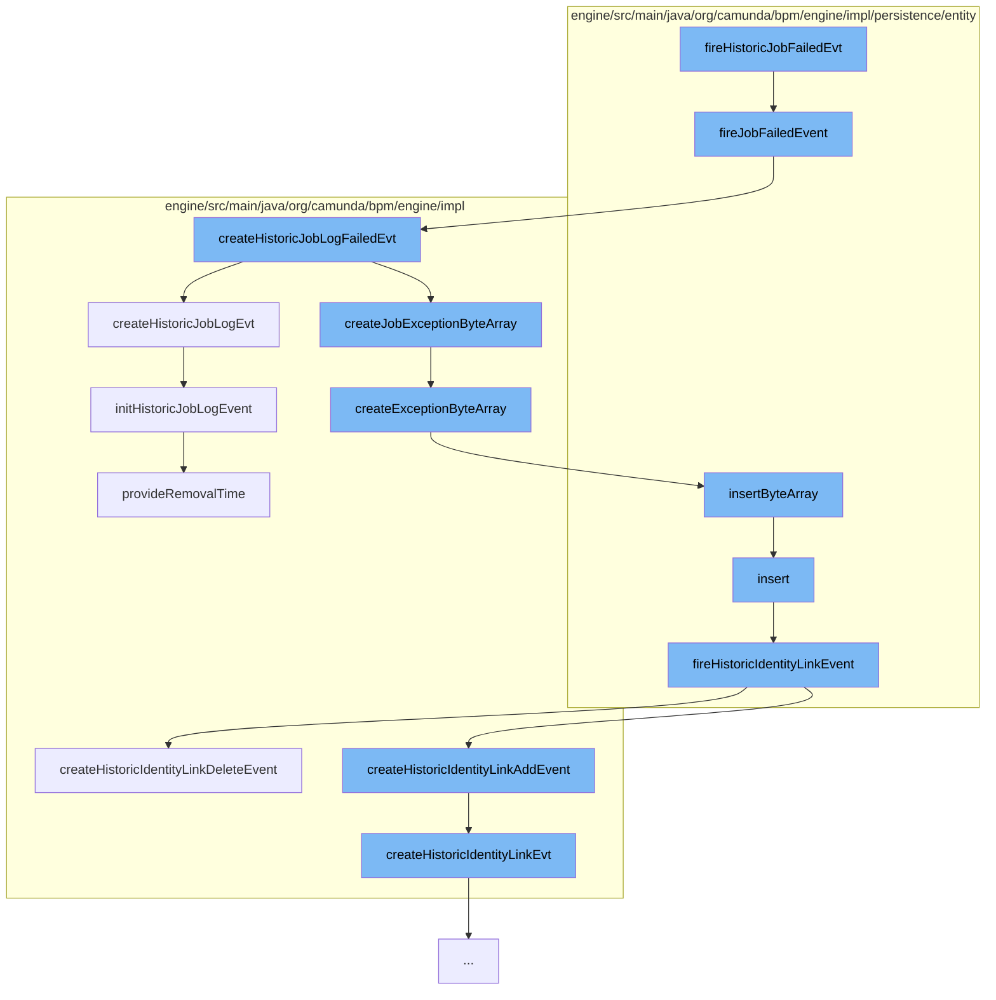

This document will cover the process of handling failed jobs in the Camunda BPM engine. The process includes the following steps:

1. Firing the job failed event
2. Creating the historic job log for the failed event
3. Creating the exception byte array for the job failure
4. Inserting the exception byte array
5. Firing the historic identity link event



<SwmSnippet path="/engine/src/main/java/org/camunda/bpm/engine/impl/persistence/entity/HistoricJobLogManager.java" line="194">

---

# Firing the job failed event

The `fireJobFailedEvent` function is triggered when a job fails. It checks if a history event is produced for the job failure and then processes the history events.

```java
  public void fireJobFailedEvent(final Job job, final Throwable exception) {
    if (isHistoryEventProduced(HistoryEventTypes.JOB_FAIL, job)) {
      HistoryEventProcessor.processHistoryEvents(new HistoryEventProcessor.HistoryEventCreator() {
        @Override
        public HistoryEvent createHistoryEvent(HistoryEventProducer producer) {
          return producer.createHistoricJobLogFailedEvt(job, exception);
        }

        @Override
        public void postHandleSingleHistoryEventCreated(HistoryEvent event) {
          ((JobEntity) job).setLastFailureLogId(event.getId());
        }
      });
    }
  }
```

---

</SwmSnippet>

<SwmSnippet path="/engine/src/main/java/org/camunda/bpm/engine/impl/history/producer/DefaultHistoryEventProducer.java" line="1085">

---

# Creating the historic job log for the failed event

The `createHistoricJobLogFailedEvt` function creates a historic job log event for the failed job. If an exception occurred during the job execution, it captures the exception message and stacktrace, and creates a byte array for the exception.

```java
  public HistoryEvent createHistoricJobLogFailedEvt(Job job, Throwable exception) {
    HistoricJobLogEventEntity event = (HistoricJobLogEventEntity) createHistoricJobLogEvt(job, HistoryEventTypes.JOB_FAIL);

    if(exception != null) {
      // exception message
      event.setJobExceptionMessage(exception.getMessage());

      // stacktrace
      String exceptionStacktrace = getExceptionStacktrace(exception);
      byte[] exceptionBytes = toByteArray(exceptionStacktrace);

      ByteArrayEntity byteArray = createJobExceptionByteArray(exceptionBytes, ResourceTypes.HISTORY);

      byteArray.setRootProcessInstanceId(event.getRootProcessInstanceId());
      byteArray.setRemovalTime(event.getRemovalTime());

      event.setExceptionByteArrayId(byteArray.getId());
    }

    return event;
  }
```

---

</SwmSnippet>

<SwmSnippet path="/engine/src/main/java/org/camunda/bpm/engine/impl/util/ExceptionUtil.java" line="69">

---

# Creating the exception byte array for the job failure

The `createExceptionByteArray` function creates a ByteArrayEntity for the exception that occurred during the job execution. The byte array is persisted for later use.

```java
  /**
   * create ByteArrayEntity with specified name and payload and make sure it's
   * persisted
   *
   * used in Jobs and ExternalTasks
   *
   * @param name - type\source of the exception
   * @param byteArray - payload of the exception
   * @param type - resource type of the exception
   * @return persisted entity
   */
  public static ByteArrayEntity createExceptionByteArray(String name, byte[] byteArray, ResourceType type) {
    ByteArrayEntity result = null;

    if (byteArray != null) {
      result = new ByteArrayEntity(name, byteArray, type);
      Context.getCommandContext()
        .getByteArrayManager()
        .insertByteArray(result);
    }

```

---

</SwmSnippet>

<SwmSnippet path="/engine/src/main/java/org/camunda/bpm/engine/impl/persistence/entity/ByteArrayManager.java" line="44">

---

# Inserting the exception byte array

The `insertByteArray` function persists the ByteArrayEntity created for the exception. It sets the creation time of the byte array and inserts it into the database.

```java
  public void insertByteArray(ByteArrayEntity arr) {
    arr.setCreateTime(ClockUtil.getCurrentTime());
    getDbEntityManager().insert(arr);
  }
```

---

</SwmSnippet>

<SwmSnippet path="/engine/src/main/java/org/camunda/bpm/engine/impl/persistence/entity/IdentityLinkEntity.java" line="204">

---

# Firing the historic identity link event

The `fireHistoricIdentityLinkEvent` function is triggered after the ByteArrayEntity is persisted. It checks if a history event is produced for the identity link and then processes the history events.

```java
  public void fireHistoricIdentityLinkEvent(final HistoryEventType eventType) {
    ProcessEngineConfigurationImpl processEngineConfiguration = Context.getProcessEngineConfiguration();

    HistoryLevel historyLevel = processEngineConfiguration.getHistoryLevel();
    if(historyLevel.isHistoryEventProduced(eventType, this)) {

      HistoryEventProcessor.processHistoryEvents(new HistoryEventProcessor.HistoryEventCreator() {
        @Override
        public HistoryEvent createHistoryEvent(HistoryEventProducer producer) {
          HistoryEvent event = null;
          if (HistoryEvent.IDENTITY_LINK_ADD.equals(eventType.getEventName())) {
            event = producer.createHistoricIdentityLinkAddEvent(IdentityLinkEntity.this);
          } else if (HistoryEvent.IDENTITY_LINK_DELETE.equals(eventType.getEventName())) {
            event = producer.createHistoricIdentityLinkDeleteEvent(IdentityLinkEntity.this);
          }
          return event;
        }
      });

    }
  }
```

---

</SwmSnippet>

&nbsp;

*This is an auto-generated document by Swimm AI 🌊 and has not yet been verified by a human*

<SwmMeta version="3.0.0" repo-id="Z2l0aHViJTNBJTNBQ2l0aS1jYW11bmRhJTNBJTNBZ2lsYWRuYXZvdA==" repo-name="Citi-camunda" doc-type="flows"><sup>Powered by [Swimm](/)</sup></SwmMeta>
