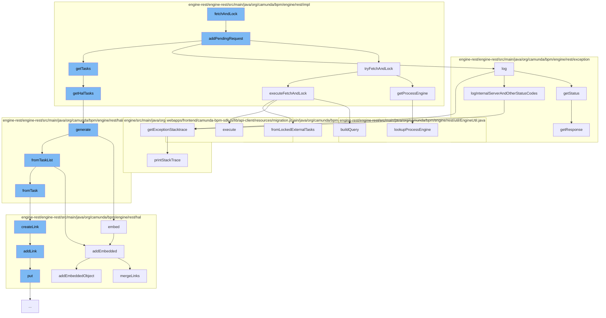

This document will cover the process of fetching and locking tasks in the Camunda Platform, which includes:

1. Adding a pending request
2. Trying to fetch and lock
3. Handling exceptions
4. Generating HAL tasks
5. Embedding relations in HAL resources.



<SwmSnippet path="/engine-rest/engine-rest/src/main/java/org/camunda/bpm/engine/rest/impl/FetchAndLockHandlerImpl.java" line="294">

---

# Adding a Pending Request

The `addPendingRequest` function is the entry point for adding a new request to fetch and lock tasks. It takes a DTO, an asynchronous response, and a process engine as parameters. It checks if the async response timeout is within the allowed limit, sets up the incoming request, and attempts to fetch and lock tasks. If successful, it either resumes the async response with the locked tasks or defers the request. If an error occurs, it resumes the async response with the error.

```java
  @Override
  public void addPendingRequest(FetchExternalTasksExtendedDto dto, AsyncResponse asyncResponse, ProcessEngine processEngine) {
    Long asyncResponseTimeout = dto.getAsyncResponseTimeout();
    if (asyncResponseTimeout != null && asyncResponseTimeout > MAX_REQUEST_TIMEOUT) {
      asyncResponse.resume(new InvalidRequestException(Status.BAD_REQUEST, "The asynchronous response timeout cannot be set to a value greater than "
          + MAX_REQUEST_TIMEOUT + " milliseconds"));
      return;
    }

    IdentityService identityService = processEngine.getIdentityService();
    Authentication authentication = identityService.getCurrentAuthentication();
    String processEngineName = processEngine.getName();

    FetchAndLockRequest incomingRequest = new FetchAndLockRequest()
      .setProcessEngineName(processEngineName)
      .setAsyncResponse(asyncResponse)
      .setAuthentication(authentication)
      .setDto(dto);

    LOG.log(Level.FINEST, "New request: {0}", incomingRequest);

```

---

</SwmSnippet>

<SwmSnippet path="/engine-rest/engine-rest/src/main/java/org/camunda/bpm/engine/rest/impl/FetchAndLockHandlerImpl.java" line="236">

---

# Trying to Fetch and Lock

The `tryFetchAndLock` function attempts to fetch and lock tasks. It sets the current authentication, builds the fetch and lock DTO, and executes the fetch and lock operation. If an exception occurs, it captures it and clears the authentication.

```java
  protected FetchAndLockResult tryFetchAndLock(FetchAndLockRequest request) {

    ProcessEngine processEngine = null;
    IdentityService identityService = null;
    FetchAndLockResult result = null;

    try {
      processEngine = getProcessEngine(request);

      identityService = processEngine.getIdentityService();
      identityService.setAuthentication(request.getAuthentication());

      FetchExternalTasksExtendedDto fetchingDto = request.getDto();
      List<LockedExternalTaskDto> lockedTasks = executeFetchAndLock(fetchingDto, processEngine);
      result = FetchAndLockResult.successful(lockedTasks);
    }
    catch (Exception e) {
      result = FetchAndLockResult.failed(e);
    }
    finally {
      if (identityService != null) {
```

---

</SwmSnippet>

<SwmSnippet path="/engine-rest/engine-rest/src/main/java/org/camunda/bpm/engine/rest/exception/ExceptionHandlerHelper.java" line="101">

---

# Handling Exceptions

The `getStatus` function determines the appropriate HTTP response status based on the type of exception. It differentiates between ProcessEngineException, RestException, and WebApplicationException.

```java
  public Response.Status getStatus(Throwable exception) {
    Response.Status responseStatus = Response.Status.INTERNAL_SERVER_ERROR;

    if (exception instanceof ProcessEngineException) {
      responseStatus = getStatus((ProcessEngineException)exception);
    }
    else if (exception instanceof RestException) {
      responseStatus = getStatus((RestException) exception);
    }
    else if (exception instanceof WebApplicationException) {
      //we need to check this, as otherwise the logic for processing WebApplicationException will be overridden
      final int statusCode = ((WebApplicationException) exception).getResponse().getStatus();
      responseStatus = Response.Status.fromStatusCode(statusCode);
    }
    return responseStatus;
  }
```

---

</SwmSnippet>

<SwmSnippet path="/engine-rest/engine-rest/src/main/java/org/camunda/bpm/engine/rest/impl/TaskRestServiceImpl.java" line="73">

---

# Generating HAL Tasks

The `getHalTasks` function generates a list of HAL-formatted tasks. It creates a TaskQueryDto from the query parameters, executes the task query, and generates a HalTaskList from the matching tasks and total count.

```java
  public HalTaskList getHalTasks(UriInfo uriInfo, Integer firstResult, Integer maxResults) {
    TaskQueryDto queryDto = new TaskQueryDto(getObjectMapper(), uriInfo.getQueryParameters());

    ProcessEngine engine = getProcessEngine();
    TaskQuery query = queryDto.toQuery(engine);

    // get list of tasks
    List<Task> matchingTasks = executeTaskQuery(firstResult, maxResults, query);

    // get total count
    long count = query.count();

    return HalTaskList.generate(matchingTasks, count, engine);
```

---

</SwmSnippet>

<SwmSnippet path="/engine-rest/engine-rest/src/main/java/org/camunda/bpm/engine/rest/hal/HalResource.java" line="90">

---

# Embedding Relations in HAL Resources

The `embed` function embeds a relation in a HAL resource. It resolves the linked resources for the given relation and adds them to the embedded resources of the HAL resource.

```java
  /**
   * Can be used to embed a relation. Embedded all linked resources in the given relation.
   *
   * @param relation the relation to embedded
   * @param processEngine used to resolve the resources
   * @return the resource itself.
   */
  @SuppressWarnings("unchecked")
  public T embed(HalRelation relation, ProcessEngine processEngine) {
    List<HalResource<?>> resolvedLinks = linker.resolve(relation, processEngine);
    if(resolvedLinks != null && resolvedLinks.size() > 0) {
      addEmbedded(relation.relName, resolvedLinks);
    }
    return (T) this;
  }
```

---

</SwmSnippet>

&nbsp;

*This is an auto-generated document by Swimm AI 🌊 and has not yet been verified by a human*

<SwmMeta version="3.0.0" repo-id="Z2l0aHViJTNBJTNBQ2l0aS1jYW11bmRhJTNBJTNBZ2lsYWRuYXZvdA==" repo-name="Citi-camunda" doc-type="flows"><sup>Powered by [Swimm](/)</sup></SwmMeta>
