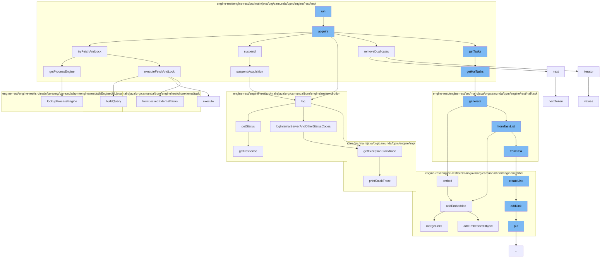

This document will cover the process of Fetching and Locking tasks in the Camunda BPMN engine, which includes:

1. Acquiring tasks
2. Trying to fetch and lock tasks
3. Handling exceptions
4. Suspending acquisition
5. Embedding HAL resources



<SwmSnippet path="/engine-rest/engine-rest/src/main/java/org/camunda/bpm/engine/rest/impl/FetchAndLockHandlerImpl.java" line="89">

---

# Acquiring tasks

The `acquire` method is responsible for acquiring tasks. It drains the queue of new requests and adds them to the pending requests. It then iterates over the pending requests and tries to fetch and lock each one. If the request is successful and there are locked tasks or the request has expired, it resumes the async response and removes the request. If the request fails, it resumes the async response with the exception and removes the request. If there are no pending requests, it suspends the acquisition.

```java
  protected void acquire() {
    LOG.log(Level.FINEST, "Acquire start");

    queue.drainTo(newRequests);

    if (!newRequests.isEmpty()) {
      if (isUniqueWorkerRequest) {
        removeDuplicates();
      }

      pendingRequests.addAll(newRequests);
      newRequests.clear();
    }

    LOG.log(Level.FINEST, "Number of pending requests {0}", pendingRequests.size());

    long backoffTime = MAX_BACK_OFF_TIME; //timestamp

    Iterator<FetchAndLockRequest> iterator = pendingRequests.iterator();
    while (iterator.hasNext()) {

```

---

</SwmSnippet>

<SwmSnippet path="/engine-rest/engine-rest/src/main/java/org/camunda/bpm/engine/rest/impl/FetchAndLockHandlerImpl.java" line="236">

---

# Trying to fetch and lock tasks

The `tryFetchAndLock` method tries to fetch and lock tasks. It sets the authentication for the identity service and tries to execute the fetch and lock. If successful, it returns the locked tasks. If it fails, it returns the exception. The authentication is cleared after the fetch and lock is attempted.

```java
  protected FetchAndLockResult tryFetchAndLock(FetchAndLockRequest request) {

    ProcessEngine processEngine = null;
    IdentityService identityService = null;
    FetchAndLockResult result = null;

    try {
      processEngine = getProcessEngine(request);

      identityService = processEngine.getIdentityService();
      identityService.setAuthentication(request.getAuthentication());

      FetchExternalTasksExtendedDto fetchingDto = request.getDto();
      List<LockedExternalTaskDto> lockedTasks = executeFetchAndLock(fetchingDto, processEngine);
      result = FetchAndLockResult.successful(lockedTasks);
    }
    catch (Exception e) {
      result = FetchAndLockResult.failed(e);
    }
    finally {
      if (identityService != null) {
```

---

</SwmSnippet>

<SwmSnippet path="/engine-rest/engine-rest/src/main/java/org/camunda/bpm/engine/rest/exception/ExceptionLogger.java" line="38">

---

# Handling exceptions

The `log` method logs exceptions. It gets the status of the exception and logs it. If the status code is less than 500, it logs the exception stack trace at debug level. If the status code is 500 or more, it logs the exception stack trace at error level.

```java
  public void log(Throwable throwable) {
    Response.Status status = ExceptionHandlerHelper.getInstance().getStatus(throwable);
    int statusCode = status.getStatusCode();

    if (statusCode < 500) {
      logDebug(String.valueOf(statusCode), getExceptionStacktrace(throwable));
      return;
    }

    logInternalServerAndOtherStatusCodes(throwable, statusCode);
  }
```

---

</SwmSnippet>

<SwmSnippet path="/engine-rest/engine-rest/src/main/java/org/camunda/bpm/engine/rest/impl/FetchAndLockHandlerImpl.java" line="212">

---

# Suspending acquisition

The `suspendAcquisition` method suspends the acquisition for a certain amount of milliseconds. If the acquisition is running and the queue is empty, it suspends the acquisition and logs it. If the handler thread is interrupted, it interrupts the current thread.

```java
  protected void suspendAcquisition(long millis) {
    try {
      if (queue.isEmpty() && isRunning) {
        LOG.log(Level.FINEST, "Suspend acquisition for {0}ms", millis);
        condition.await(millis);
        LOG.log(Level.FINEST, "Acquisition woke up");
      }
    }
    finally {
      if (handlerThread.isInterrupted()) {
        Thread.currentThread().interrupt();
      }
    }
  }
```

---

</SwmSnippet>

<SwmSnippet path="/engine-rest/engine-rest/src/main/java/org/camunda/bpm/engine/rest/hal/HalResource.java" line="90">

---

# Embedding HAL resources

The `embed` method embeds a relation. It resolves the linked resources for the relation and if there are any, it adds them to the embedded resources.

```java
  /**
   * Can be used to embed a relation. Embedded all linked resources in the given relation.
   *
   * @param relation the relation to embedded
   * @param processEngine used to resolve the resources
   * @return the resource itself.
   */
  @SuppressWarnings("unchecked")
  public T embed(HalRelation relation, ProcessEngine processEngine) {
    List<HalResource<?>> resolvedLinks = linker.resolve(relation, processEngine);
    if(resolvedLinks != null && resolvedLinks.size() > 0) {
      addEmbedded(relation.relName, resolvedLinks);
    }
    return (T) this;
  }
```

---

</SwmSnippet>

&nbsp;

*This is an auto-generated document by Swimm AI 🌊 and has not yet been verified by a human*

<SwmMeta version="3.0.0" repo-id="Z2l0aHViJTNBJTNBQ2l0aS1jYW11bmRhJTNBJTNBZ2lsYWRuYXZvdA==" repo-name="Citi-camunda" doc-type="flows"><sup>Powered by [Swimm](/)</sup></SwmMeta>
