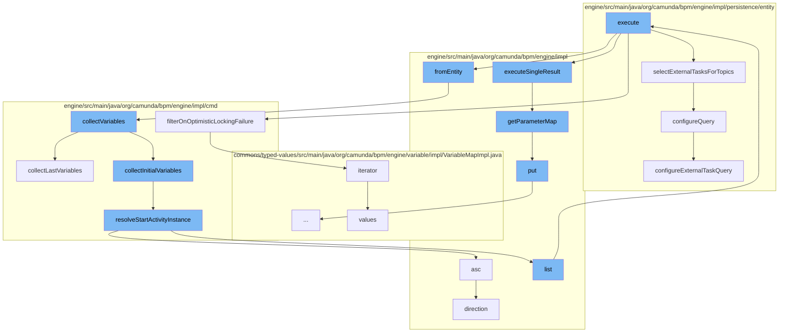

This document will cover the process of fetching and processing external tasks in the Camunda BPM engine. The steps include:

1. Fetching external tasks
2. Filtering tasks on optimistic locking failure
3. Converting tasks to entity
4. Collecting variables
5. Resolving start activity instance
6. Configuring the query for external tasks.



<SwmSnippet path="/engine/src/main/java/org/camunda/bpm/engine/impl/cmd/FetchExternalTasksCmd.java" line="1">

---

# Fetching external tasks

The `execute` function in `FetchExternalTasksCmd.java` is the entry point for fetching external tasks. It calls `selectExternalTasksForTopics` to fetch the tasks and `filterOnOptimisticLockingFailure` to filter out tasks that failed due to optimistic locking.

```java
/*
 * Copyright Camunda Services GmbH and/or licensed to Camunda Services GmbH
 * under one or more contributor license agreements. See the NOTICE file
 * distributed with this work for additional information regarding copyright
 * ownership. Camunda licenses this file to you under the Apache License,
 * Version 2.0; you may not use this file except in compliance with the License.
 * You may obtain a copy of the License at
 *
 *     http://www.apache.org/licenses/LICENSE-2.0
 *
```

---

</SwmSnippet>

<SwmSnippet path="/engine/src/main/java/org/camunda/bpm/engine/impl/cmd/FetchExternalTasksCmd.java" line="11">

---

# Filtering tasks on optimistic locking failure

`filterOnOptimisticLockingFailure` function filters out tasks that failed due to optimistic locking. It iterates over the tasks and removes those that have an optimistic locking exception.

```java
 * Unless required by applicable law or agreed to in writing, software
 * distributed under the License is distributed on an "AS IS" BASIS,
 * WITHOUT WARRANTIES OR CONDITIONS OF ANY KIND, either express or implied.
 * See the License for the specific language governing permissions and
 * limitations under the License.
 */
package org.camunda.bpm.engine.impl.cmd;

import static org.camunda.bpm.engine.impl.Direction.DESCENDING;
import static org.camunda.bpm.engine.impl.ExternalTaskQueryProperty.PRIORITY;
```

---

</SwmSnippet>

<SwmSnippet path="/engine/src/main/java/org/camunda/bpm/engine/impl/externaltask/LockedExternalTaskImpl.java" line="1">

---

# Converting tasks to entity

`fromEntity` function is used to convert the fetched tasks into `LockedExternalTaskImpl` entities. It also calls `collectVariables` to collect the variables associated with the tasks.

```java
/*
 * Copyright Camunda Services GmbH and/or licensed to Camunda Services GmbH
 * under one or more contributor license agreements. See the NOTICE file
 * distributed with this work for additional information regarding copyright
 * ownership. Camunda licenses this file to you under the Apache License,
 * Version 2.0; you may not use this file except in compliance with the License.
 * You may obtain a copy of the License at
 *
 *     http://www.apache.org/licenses/LICENSE-2.0
 *
```

---

</SwmSnippet>

<SwmSnippet path="/engine/src/main/java/org/camunda/bpm/engine/impl/cmd/RestartProcessInstancesCmd.java" line="173">

---

# Collecting variables

`collectVariables` function collects the variables associated with the tasks. It calls `collectInitialVariables` and `collectLastVariables` to collect the initial and last variables respectively.

```java
  protected VariableMap collectVariables(CommandContext commandContext,
                                         HistoricProcessInstance processInstance) {
    VariableMap variables = null;

    if (builder.isInitialVariables()) {
      variables = collectInitialVariables(commandContext, processInstance);
    }
    else {
      variables = collectLastVariables(commandContext, processInstance);
    }

    return variables;
  }
```

---

</SwmSnippet>

<SwmSnippet path="/engine/src/main/java/org/camunda/bpm/engine/impl/cmd/RestartProcessInstancesCmd.java" line="242">

---

# Resolving start activity instance

`resolveStartActivityInstance` function is used to resolve the start activity instance for the process instance. It queries the historic activity instances and returns the first one.

```java
  protected HistoricActivityInstance resolveStartActivityInstance(
      HistoricProcessInstance processInstance) {
    HistoryService historyService = Context.getProcessEngineConfiguration().getHistoryService();

    String processInstanceId = processInstance.getId();
    String startActivityId = processInstance.getStartActivityId();

    ensureNotNull("startActivityId", startActivityId);

    List<HistoricActivityInstance> historicActivityInstances = historyService
        .createHistoricActivityInstanceQuery()
        .processInstanceId(processInstanceId)
        .activityId(startActivityId)
        .orderPartiallyByOccurrence()
        .asc()
        .list();

    ensureNotEmpty("historicActivityInstances", historicActivityInstances);

    HistoricActivityInstance startActivityInstance = historicActivityInstances.get(0);
    return startActivityInstance;
```

---

</SwmSnippet>

<SwmSnippet path="/engine/src/main/java/org/camunda/bpm/engine/impl/persistence/entity/ExternalTaskManager.java" line="161">

---

# Configuring the query for external tasks

`configureQuery` function is used to configure the query for fetching external tasks. It calls `configureExternalTaskQuery` to apply the necessary configurations.

```java
  protected void configureQuery(ExternalTaskQueryImpl query) {
    getAuthorizationManager().configureExternalTaskQuery(query);
    getTenantManager().configureQuery(query);
  }
```

---

</SwmSnippet>

&nbsp;

*This is an auto-generated document by Swimm AI 🌊 and has not yet been verified by a human*

<SwmMeta version="3.0.0" repo-id="Z2l0aHViJTNBJTNBQ2l0aS1jYW11bmRhJTNBJTNBZ2lsYWRuYXZvdA==" repo-name="Citi-camunda" doc-type="flows"><sup>Powered by [Swimm](/)</sup></SwmMeta>
