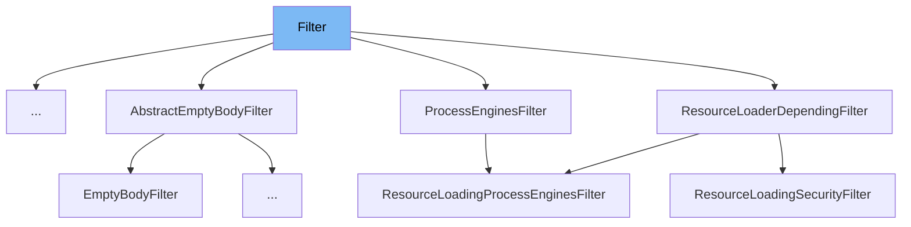

This document will cover the `Filter` interface in the Citi-camunda repository. We'll cover:

1. What is `Filter`.
2. Variables and functions in `Filter`.
3. An example of how to use `Filter`.



# What is Filter

`Filter` is an interface in the Camunda BPM platform. It is used for defining filters that can be applied to various queries in the platform. Filters are used to narrow down the results of a query based on certain criteria.

<SwmSnippet path="/engine/src/main/java/org/camunda/bpm/engine/filter/Filter.java" line="30">

---

# Variables and functions

The function `getId` is used to get the id of the filter.

```java
  String getId();
```

---

</SwmSnippet>

<SwmSnippet path="/engine/src/main/java/org/camunda/bpm/engine/filter/Filter.java" line="35">

---

The function `getResourceType` is used to get the resource type of the filter.

```java
  String getResourceType();
```

---

</SwmSnippet>

<SwmSnippet path="/engine/src/main/java/org/camunda/bpm/engine/filter/Filter.java" line="40">

---

The function `getName` is used to get the name of the filter.

```java
  String getName();
```

---

</SwmSnippet>

<SwmSnippet path="/engine/src/main/java/org/camunda/bpm/engine/filter/Filter.java" line="46">

---

The function `setName` is used to set the name of the filter.

```java
  Filter setName(String name);
```

---

</SwmSnippet>

<SwmSnippet path="/engine/src/main/java/org/camunda/bpm/engine/filter/Filter.java" line="51">

---

The function `getOwner` is used to get the owner of the filter.

```java
  String getOwner();
```

---

</SwmSnippet>

<SwmSnippet path="/engine/src/main/java/org/camunda/bpm/engine/filter/Filter.java" line="57">

---

The function `setOwner` is used to set the owner of the filter.

```java
  Filter setOwner(String owner);
```

---

</SwmSnippet>

<SwmSnippet path="/engine/src/main/java/org/camunda/bpm/engine/filter/Filter.java" line="62">

---

The function `getQuery` is used to get the saved query as a query object.

```java
  <T extends Query<?, ?>> T getQuery();
```

---

</SwmSnippet>

<SwmSnippet path="/engine/src/main/java/org/camunda/bpm/engine/filter/Filter.java" line="68">

---

The function `setQuery` is used to set the saved query as a query object.

```java
  <T extends Query<?, ?>> Filter setQuery(T query);
```

---

</SwmSnippet>

<SwmSnippet path="/engine/src/main/java/org/camunda/bpm/engine/filter/Filter.java" line="77">

---

The function `extend` is used to extend the query with the additional query.

```java
  <T extends Query<?, ?>> Filter extend(T extendingQuery);
```

---

</SwmSnippet>

<SwmSnippet path="/engine/src/main/java/org/camunda/bpm/engine/filter/Filter.java" line="82">

---

The function `getProperties` is used to get the properties as a map.

```java
  Map<String, Object> getProperties();
```

---

</SwmSnippet>

<SwmSnippet path="/engine/src/main/java/org/camunda/bpm/engine/filter/Filter.java" line="88">

---

The function `setProperties` is used to set the properties as a map.

```java
  Filter setProperties(Map<String, Object> properties);
```

---

</SwmSnippet>

# Usage example

The `Filter` interface is implemented by the `ProcessEngineAuthenticationFilter` class. This class uses the methods defined in the `Filter` interface to manage the filter properties and query.

&nbsp;

*This is an auto-generated document by Swimm AI 🌊 and has not yet been verified by a human*

<SwmMeta version="3.0.0" repo-id="Z2l0aHViJTNBJTNBQ2l0aS1jYW11bmRhJTNBJTNBZ2lsYWRuYXZvdA==" repo-name="Citi-camunda" doc-type="class"><sup>Powered by [Swimm](/)</sup></SwmMeta>
