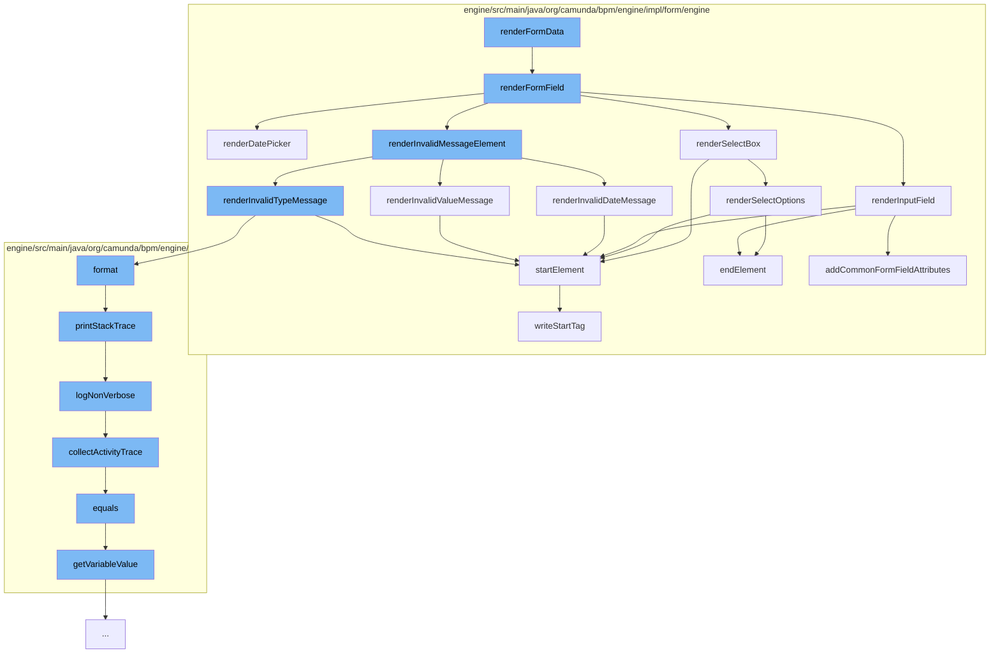

This document will cover the process of rendering form data in the Camunda Platform, which includes:

1. Rendering the form field
2. Rendering different types of form fields such as date picker, select box, and input field
3. Rendering invalid message elements
4. Logging errors and collecting activity trace.



<SwmSnippet path="/engine/src/main/java/org/camunda/bpm/engine/impl/form/engine/AbstractRenderFormDelegate.java" line="156">

---

# Rendering the form field

The `renderFormField` function is responsible for rendering a form field. It starts by creating a group for the form field. Then it checks the type of the form field and calls the appropriate rendering function. Finally, it renders any invalid message elements and ends the group.

```java
  protected void renderFormField(FormField formField, HtmlDocumentBuilder documentBuilder) {
    // start group
    HtmlElementWriter divElement = new HtmlElementWriter(DIV_ELEMENT)
        .attribute(CLASS_ATTRIBUTE, FORM_GROUP_CLASS);

    documentBuilder.startElement(divElement);

    String formFieldId = formField.getId();
    String formFieldLabel = formField.getLabel();

    // write label
    if (formFieldLabel != null && !formFieldLabel.isEmpty()) {

      HtmlElementWriter labelElement = new HtmlElementWriter(LABEL_ELEMENT)
          .attribute(FOR_ATTRIBUTE, formFieldId)
          .textContent(formFieldLabel);

      // <label for="...">...</label>
      documentBuilder.startElement(labelElement).endElement();
    }

```

---

</SwmSnippet>

<SwmSnippet path="/engine/src/main/java/org/camunda/bpm/engine/impl/form/engine/AbstractRenderFormDelegate.java" line="208">

---

# Rendering different types of form fields

The `renderDatePicker` function is used to render a date picker form field. It starts by creating an input group for the date picker. Then it creates an input field and adds attributes for the date picker. If the form field is not read-only, it also adds a button to open the date picker.

```java
  protected void renderDatePicker(FormField formField, HtmlDocumentBuilder documentBuilder) {
    boolean isReadOnly = isReadOnly(formField);

    // start input-group
    HtmlElementWriter inputGroupDivElement = new HtmlElementWriter(DIV_ELEMENT)
        .attribute(CLASS_ATTRIBUTE, INPUT_GROUP_CLASS);

    String formFieldId = formField.getId();

    // <div>
    documentBuilder.startElement(inputGroupDivElement);

    // input field
    HtmlElementWriter inputField = createInputField(formField);

    if(!isReadOnly) {
      inputField
          .attribute(DATEPICKER_POPUP_ATTRIBUTE, DATE_FORMAT)
          .attribute(IS_OPEN_ATTRIBUTE, String.format(DATE_FIELD_OPENED_ATTRIBUTE, formFieldId));
    }

```

---

</SwmSnippet>

<SwmSnippet path="/engine/src/main/java/org/camunda/bpm/engine/impl/form/engine/AbstractRenderFormDelegate.java" line="397">

---

# Rendering invalid message elements

The `renderInvalidDateMessage` function is used to render invalid message elements for a date picker form field. It creates two div elements with different expressions for showing the invalid message.

```java
  protected void renderInvalidDateMessage(FormField formField, HtmlDocumentBuilder documentBuilder) {
    String formFieldId = formField.getId();

    HtmlElementWriter firstDivElement = new HtmlElementWriter(DIV_ELEMENT);

    String firstExpression = String.format(REQUIRED_ERROR_EXPRESSION + " && !" + DATE_ERROR_EXPRESSION, formFieldId, formFieldId);

    firstDivElement
        .attribute(NG_SHOW_ATTRIBUTE, firstExpression)
        .attribute(CLASS_ATTRIBUTE, HELP_BLOCK_CLASS)
        .textContent(REQUIRED_FIELD_MESSAGE);

    documentBuilder
        .startElement(firstDivElement)
        .endElement();

    HtmlElementWriter secondDivElement = new HtmlElementWriter(DIV_ELEMENT);

    String secondExpression = String.format(DATE_ERROR_EXPRESSION, formFieldId);

    secondDivElement
```

---

</SwmSnippet>

<SwmSnippet path="/engine/src/main/java/org/camunda/bpm/engine/impl/interceptor/BpmnStackTrace.java" line="39">

---

# Logging errors and collecting activity trace

The `printStackTrace` function is used to log errors. It checks if there are any performed invocations and then logs the stack trace. The `logNonVerbose` function is used to log the stack trace in a non-verbose manner. The `collectActivityTrace` function is used to collect the activity trace.

```java
  public void printStackTrace(boolean verbose) {
    if(perfromedInvocations.isEmpty()) {
      return;
    }

    StringWriter writer = new StringWriter();
    writer.write("BPMN Stack Trace:\n");

    if(!verbose) {
      logNonVerbose(writer);
    }
    else {
      logVerbose(writer);
    }

    LOG.bpmnStackTrace(writer.toString());

    perfromedInvocations.clear();
  }
```

---

</SwmSnippet>

&nbsp;

*This is an auto-generated document by Swimm AI 🌊 and has not yet been verified by a human*

<SwmMeta version="3.0.0" repo-id="Z2l0aHViJTNBJTNBQ2l0aS1jYW11bmRhJTNBJTNBZ2lsYWRuYXZvdA==" repo-name="Citi-camunda" doc-type="flows"><sup>Powered by [Swimm](/)</sup></SwmMeta>
