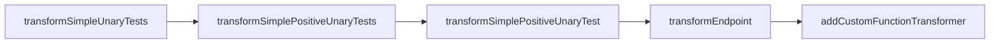

Feel Juel Implementation in Citi-camunda refers to the implementation of the FEEL (Friendly Enough Expression Language) using JUEL (Java Unified Expression Language). It is used to transform FEEL expressions into JUEL expressions. This is done through the `FeelToJuelTransform` interface and its implementation `FeelToJuelTransformImpl`. The transformation process involves various transformers like `NotTransformer`, `ListTransformer`, `ComparisonTransformer`, and others. These transformers are used to handle different types of FEEL expressions and convert them into corresponding JUEL expressions.

<SwmSnippet path="/engine-dmn/feel-juel/src/main/java/org/camunda/bpm/dmn/feel/impl/juel/transform/FeelToJuelTransform.java" line="19">

---

# FeelToJuelTransform Interface

The `FeelToJuelTransform` interface defines the methods that are used for transforming FEEL expressions into JUEL. It includes methods for transforming simple unary tests, simple positive unary tests, simple positive unary test, and endpoint expressions. It also allows adding a transformer for a custom function.

```java
public interface FeelToJuelTransform {

  /**
   * Transform a FEEL simple unary tests expression to a JUEL expression.
   *
   * @param simpleUnaryTests the FEEL simple unary tests expression to transform
   * @param inputName the variable name of the input variable to test against
   * @return the resulting JUEL expression
   */
  String transformSimpleUnaryTests(String simpleUnaryTests, String inputName);

  /**
   * Transform a FEEL simple positive unary tests expression to a JUEL expression.
   *
   * @param simplePositiveUnaryTests the FEEL simple positive unary tests expression to transform
   * @param inputName the variable name of the input variable to test against
   * @return the resulting JUEL expression
   */
  String transformSimplePositiveUnaryTests(String simplePositiveUnaryTests, String inputName);

  /**
```

---

</SwmSnippet>

<SwmSnippet path="/engine-dmn/feel-juel/src/main/java/org/camunda/bpm/dmn/feel/impl/juel/transform/FeelToJuelTransformImpl.java" line="25">

---

# FeelToJuelTransformImpl Class

The `FeelToJuelTransformImpl` class implements the `FeelToJuelTransform` interface. It provides the actual transformation logic for each type of FEEL expression. It uses different transformers for different types of expressions, such as `NotTransformer`, `ListTransformer`, `ComparisonTransformer`, etc.

```java
public class FeelToJuelTransformImpl implements FeelToJuelTransform {

  public static final FeelEngineLogger LOG = FeelLogger.ENGINE_LOGGER;

  public static final FeelToJuelTransformer NOT_TRANSFORMER = new NotTransformer();
  public static final FeelToJuelTransformer HYPHEN_TRANSFORMER = new HyphenTransformer();
  public static final FeelToJuelTransformer LIST_TRANSFORMER = new ListTransformer();
  public static final FeelToJuelTransformer INTERVAL_TRANSFORMER = new IntervalTransformer();
  public static final FeelToJuelTransformer COMPARISON_TRANSFORMER = new ComparisonTransformer();
  public static final FeelToJuelTransformer EQUAL_TRANSFORMER = new EqualTransformer();
  public static final FeelToJuelTransformer ENDPOINT_TRANSFORMER = new EndpointTransformer();
  public static final List<FeelToJuelTransformer> CUSTOM_FUNCTION_TRANSFORMERS = new ArrayList<FeelToJuelTransformer>();

  public String transformSimpleUnaryTests(String simpleUnaryTests, String inputName) {
    simpleUnaryTests = simpleUnaryTests.trim();
    String juelExpression;
    if (HYPHEN_TRANSFORMER.canTransform(simpleUnaryTests)) {
      juelExpression = HYPHEN_TRANSFORMER.transform(this, simpleUnaryTests, inputName);
    }
    else if (NOT_TRANSFORMER.canTransform(simpleUnaryTests)) {
      juelExpression = NOT_TRANSFORMER.transform(this, simpleUnaryTests, inputName);
```

---

</SwmSnippet>

<SwmSnippet path="/engine-dmn/feel-juel/src/main/java/org/camunda/bpm/dmn/feel/impl/juel/FeelEngineImpl.java" line="34">

---

# Usage of FeelToJuelTransform

The `FeelToJuelTransform` is used in the `FeelEngineImpl` class. This class uses the `transform` method of `FeelToJuelTransform` to transform FEEL expressions into JUEL expressions, which are then evaluated within the context of a running process.

```java
  protected FeelToJuelTransform transform;
  protected ExpressionFactory expressionFactory;
  protected ElContextFactory elContextFactory;
  protected Cache<TransformExpressionCacheKey, String> transformExpressionCache;

  public FeelEngineImpl(FeelToJuelTransform transform, ExpressionFactory expressionFactory, ElContextFactory elContextFactory,
      Cache<TransformExpressionCacheKey, String> transformExpressionCache) {
    this.transform = transform;
    this.expressionFactory = expressionFactory;
    this.elContextFactory = elContextFactory;
    this.transformExpressionCache = transformExpressionCache;
  }

  public <T> T evaluateSimpleExpression(String simpleExpression, VariableContext variableContext) {
    throw LOG.simpleExpressionNotSupported();
  }

  public boolean evaluateSimpleUnaryTests(String simpleUnaryTests, String inputName, VariableContext variableContext) {
    try {
      ELContext elContext = createContext(variableContext);
      ValueExpression valueExpression = transformSimpleUnaryTests(simpleUnaryTests, inputName, elContext);
```

---

</SwmSnippet>

# Feel Juel Implementation Functions

The Feel Juel Implementation consists of several key functions that handle the transformation of FEEL expressions to JUEL expressions.

<SwmSnippet path="/engine-dmn/feel-juel/src/main/java/org/camunda/bpm/dmn/feel/impl/juel/transform/FeelToJuelTransformImpl.java" line="38">

---

## transformSimpleUnaryTests

The `transformSimpleUnaryTests` function is used to transform a FEEL simple unary tests expression to a JUEL expression. It checks if the expression can be transformed by the `HYPHEN_TRANSFORMER` or `NOT_TRANSFORMER`, otherwise it transforms simple positive unary tests.

```java
  public String transformSimpleUnaryTests(String simpleUnaryTests, String inputName) {
    simpleUnaryTests = simpleUnaryTests.trim();
    String juelExpression;
    if (HYPHEN_TRANSFORMER.canTransform(simpleUnaryTests)) {
      juelExpression = HYPHEN_TRANSFORMER.transform(this, simpleUnaryTests, inputName);
    }
    else if (NOT_TRANSFORMER.canTransform(simpleUnaryTests)) {
      juelExpression = NOT_TRANSFORMER.transform(this, simpleUnaryTests, inputName);
    }
    else {
      juelExpression = transformSimplePositiveUnaryTests(simpleUnaryTests, inputName);
    }

    return "${" + juelExpression + "}";
  }
```

---

</SwmSnippet>

<SwmSnippet path="/engine-dmn/feel-juel/src/main/java/org/camunda/bpm/dmn/feel/impl/juel/transform/FeelToJuelTransformImpl.java" line="54">

---

## transformSimplePositiveUnaryTests

The `transformSimplePositiveUnaryTests` function is used to transform a FEEL simple positive unary tests expression to a JUEL expression. It checks if the expression can be transformed by the `LIST_TRANSFORMER`, otherwise it transforms simple positive unary test.

```java
  public String transformSimplePositiveUnaryTests(String simplePositiveUnaryTests, String inputName) {
    simplePositiveUnaryTests = simplePositiveUnaryTests.trim();
    if (LIST_TRANSFORMER.canTransform(simplePositiveUnaryTests)) {
      return LIST_TRANSFORMER.transform(this, simplePositiveUnaryTests, inputName);
    }
    else {
      return transformSimplePositiveUnaryTest(simplePositiveUnaryTests, inputName);
    }
  }
```

---

</SwmSnippet>

<SwmSnippet path="/engine-dmn/feel-juel/src/main/java/org/camunda/bpm/dmn/feel/impl/juel/transform/FeelToJuelTransformImpl.java" line="64">

---

## transformSimplePositiveUnaryTest

The `transformSimplePositiveUnaryTest` function is used to transform a FEEL simple positive unary test expression to a JUEL expression. It checks if the expression can be transformed by any of the `CUSTOM_FUNCTION_TRANSFORMERS`, `INTERVAL_TRANSFORMER`, `COMPARISON_TRANSFORMER`, otherwise it uses the `EQUAL_TRANSFORMER`.

```java
  public String transformSimplePositiveUnaryTest(String simplePositiveUnaryTest, String inputName) {
    simplePositiveUnaryTest = simplePositiveUnaryTest.trim(); 
      
    for (FeelToJuelTransformer functionTransformer : CUSTOM_FUNCTION_TRANSFORMERS) {
      if (functionTransformer.canTransform(simplePositiveUnaryTest)) {
        return functionTransformer.transform(this, simplePositiveUnaryTest, inputName);
      }
    }

    if (INTERVAL_TRANSFORMER.canTransform(simplePositiveUnaryTest)) {
      return INTERVAL_TRANSFORMER.transform(this, simplePositiveUnaryTest, inputName);
    }
    else if (COMPARISON_TRANSFORMER.canTransform(simplePositiveUnaryTest)) {
      return COMPARISON_TRANSFORMER.transform(this, simplePositiveUnaryTest, inputName);
    }
    else {
      return EQUAL_TRANSFORMER.transform(this, simplePositiveUnaryTest, inputName);
    }
  }
```

---

</SwmSnippet>

<SwmSnippet path="/engine-dmn/feel-juel/src/main/java/org/camunda/bpm/dmn/feel/impl/juel/transform/FeelToJuelTransformImpl.java" line="84">

---

## transformEndpoint

The `transformEndpoint` function is used to transform a FEEL endpoint expression to a JUEL expression. It uses the `ENDPOINT_TRANSFORMER` for the transformation.

```java
  public String transformEndpoint(String endpoint, String inputName) {
    endpoint = endpoint.trim();
    return ENDPOINT_TRANSFORMER.transform(this, endpoint, inputName);
  }
```

---

</SwmSnippet>

<SwmSnippet path="/engine-dmn/feel-juel/src/main/java/org/camunda/bpm/dmn/feel/impl/juel/transform/FeelToJuelTransformImpl.java" line="89">

---

## addCustomFunctionTransformer

The `addCustomFunctionTransformer` function is used to add a transformer for a custom function. It adds the transformer to the `CUSTOM_FUNCTION_TRANSFORMERS` list.

```java
  public void addCustomFunctionTransformer(FeelToJuelTransformer functionTransformer) {
    CUSTOM_FUNCTION_TRANSFORMERS.add(functionTransformer);
  }
```

---

</SwmSnippet>



# FEEL to JUEL Transformation

FEEL to JUEL Transformation

<SwmSnippet path="/engine-dmn/feel-juel/src/main/java/org/camunda/bpm/dmn/feel/impl/juel/transform/FeelToJuelTransformImpl.java" line="84">

---

## transformEndpoint

The `transformEndpoint` method is used to transform a FEEL endpoint expression into a JUEL expression. It takes an endpoint and an input name as parameters, trims the endpoint, and then uses the `ENDPOINT_TRANSFORMER` to perform the transformation.

```java
  public String transformEndpoint(String endpoint, String inputName) {
    endpoint = endpoint.trim();
    return ENDPOINT_TRANSFORMER.transform(this, endpoint, inputName);
  }
```

---

</SwmSnippet>

<SwmSnippet path="/engine-dmn/feel-juel/src/main/java/org/camunda/bpm/dmn/feel/impl/juel/transform/ComparisonTransformer.java" line="44">

---

## transformComparison

The `transformComparison` method is used in the `ComparisonTransformer` class. It takes a transform, an operator, an endpoint, and an input name as parameters. It uses the `transformEndpoint` method to transform the endpoint into a JUEL expression, and then formats the result into a comparison expression.

```java
  protected String transformComparison(FeelToJuelTransform transform, String operator, String endpoint, String inputName) {
    String juelEndpoint = transform.transformEndpoint(endpoint, inputName);
    return String.format("%s %s %s", inputName, operator, juelEndpoint);
  }
```

---

</SwmSnippet>

&nbsp;

*This is an auto-generated document by Swimm AI 🌊 and has not yet been verified by a human*

<SwmMeta version="3.0.0" repo-id="Z2l0aHViJTNBJTNBQ2l0aS1jYW11bmRhJTNBJTNBZ2lsYWRuYXZvdA==" repo-name="Citi-camunda" doc-type="overview"><sup>Powered by [Swimm](/)</sup></SwmMeta>
