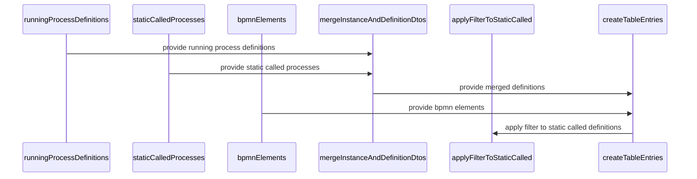

A Process Definition in the context of Camunda Platform and this repository refers to the blueprint from which process instances are created. It is a representation of a process model within the BPMN 2.0 standard, containing details about the process flow, activities, gateways, events, and sequence flows. In the codebase, a process definition is often represented as an object with properties such as id, key, and version. It is used to start new process instances, fetch details about the process, and perform operations like suspending or activating instances of the process.

<SwmSnippet path="/webapps/frontend/ui/cockpit/plugins/base/app/views/processDefinition/calledProcessDefinitionTable.js" line="28">

---

# Process Definition in Code

This code snippet shows the registration of a view for the process definition. The view is identified by the id 'call-process-definitions-table'. It uses a template and a controller, which are defined elsewhere in the code. The controller is responsible for managing the data and behavior of the view.

```javascript
    ViewsProvider.registerDefaultView('cockpit.processDefinition.runtime.tab', {
      id: 'call-process-definitions-table',
      label: 'PLUGIN_CALLED_PROCESS_DEFINITIONS_LABEL',
      template: template,
      controller: [
        '$scope',
        '$location',
        '$q',
        'PluginProcessDefinitionResource',
        '$translate',
        'localConf',
        function(
          $scope,
          $location,
          $q,
          PluginProcessDefinitionResource,
          $translate,
          localConf
        ) {
```

---

</SwmSnippet>

<SwmSnippet path="/webapps/frontend/ui/cockpit/plugins/base/app/views/processDefinition/called-process-definition-table.html" line="12">

---

# Process Definition in HTML

This HTML snippet shows how the process definition is used in the frontend. The process definition id is used to create a link to the runtime view of the process definition. The label of the process definition is displayed as the link text.

```html
      <tr ng-repeat="calledProcessDefinition in calledProcessDefinitions | orderBy:sortObj.sortBy:sortObj.sortReverse">
        <td class="process-definition"
            cam-widget-clipboard="calledProcessDefinition.id">
          <a ng-href="#/process-definition/{{ calledProcessDefinition.id }}/runtime?parentProcessDefinitionId={{ processDefinition.id }}">
            {{ calledProcessDefinition.label }}
          </a>
        </td>
```

---

</SwmSnippet>

<SwmSnippet path="/webapps/frontend/ui/cockpit/plugins/base/app/views/processDefinition/called-process-definition-table.less" line="1">

---

# Process Definition in CSS

This CSS snippet shows how the process definition is styled in the frontend. The class 'process-definition' is used to apply styles to the process definition elements in the HTML.

```less
.call-activity-list {
  list-style: none;
  padding-left: 0;
  margin-bottom: 0;
  li {
    display: block;
  }
}
```

---

</SwmSnippet>

# Process Definition Functions

This section will cover the main functions related to the 'Process Definition' functionality in the Citi-camunda repository.

<SwmSnippet path="/webapps/frontend/ui/cockpit/plugins/base/app/views/processDefinition/calledProcessDefinitionTable.js" line="143">

---

## mergeInstanceAndDefinitionDtos

The `mergeInstanceAndDefinitionDtos` function merges Dtos for currently running and statically linked called processes by their id. It takes two parameters: `runningProcessDefinitions` and `staticCalledProcesses`. The function creates a new object `map` and populates it with the running process definitions. Then, it iterates over the static called processes and merges them with the running ones if they have the same id. The function returns an array of the values of the `map` object.

```javascript
          function mergeInstanceAndDefinitionDtos(
            runningProcessDefinitions,
            staticCalledProcesses
          ) {
            const map = {};
            runningProcessDefinitions.forEach(dto => {
              const newDto = angular.copy(dto);
              newDto.state = 'PLUGIN_CALLED_PROCESS_DEFINITIONS_RUNNING_LABEL';
              map[newDto.id] = newDto;
            });

            staticCalledProcesses.forEach(dto => {
              const newDto = angular.copy(dto);
              if (map[dto.id]) {
                const merged = new Set([
                  ...map[newDto.id].calledFromActivityIds,
                  ...newDto.calledFromActivityIds
                ]);
                map[dto.id].calledFromActivityIds = Array.from(merged).sort();
                map[dto.id].state =
                  'PLUGIN_CALLED_PROCESS_DEFINITIONS_RUNNING_AND_REFERENCED_LABEL';
```

---

</SwmSnippet>

<SwmSnippet path="/webapps/frontend/ui/cockpit/plugins/base/app/views/processDefinition/calledProcessDefinitionTable.js" line="174">

---

## applyFilterToStaticCalled

The `applyFilterToStaticCalled` function applies a filter to the static called definitions. If the filter `activityIdIn` is defined and has length, the function creates a new set `selectedIds` from the filter. Then, it maps over the static called definitions and creates a new object `newDto` for each definition. It also creates an intersection of the called from activity ids and the selected ids. If the intersection has length, it assigns the intersection to the called from activity ids of the new dto and returns the new dto. The function returns the filtered static called definitions.

```javascript
          function applyFilterToStaticCalled(staticCalledDefinitions) {
            if (filter.activityIdIn && filter.activityIdIn.length) {
              const selectedIds = new Set(filter.activityIdIn);
              return staticCalledDefinitions
                .map(dto => {
                  const newDto = angular.copy(dto);
                  const intersection = dto.calledFromActivityIds.filter(e =>
                    selectedIds.has(e)
                  );
                  if (intersection.length) {
                    newDto.calledFromActivityIds = intersection;
                    return newDto;
                  }
                })
                .filter(dto => dto !== undefined);
            }
            return staticCalledDefinitions;
          }
```

---

</SwmSnippet>

<SwmSnippet path="/webapps/frontend/ui/cockpit/plugins/base/app/views/processDefinition/calledProcessDefinitionTable.js" line="193">

---

## createTableEntries

The `createTableEntries` function creates table entries for the process definitions. It takes three parameters: `runningProcessDefinitions`, `staticCalledProcesses`, and `bpmnElements`. The function first merges the running and static process definitions using the `mergeInstanceAndDefinitionDtos` function. Then, it maps over the merged definitions and creates a new object for each definition, extending the definition with the called from activities and the label. The function returns the table entries.

```javascript
          function createTableEntries(
            runningProcessDefinitions,
            staticCalledProcesses,
            bpmnElements
          ) {
            const mergedDefinitions = mergeInstanceAndDefinitionDtos(
              runningProcessDefinitions,
              staticCalledProcesses
            );

            const tableEntries = mergedDefinitions.map(dto => {
              const calledFromActivities = dto.calledFromActivityIds.map(id =>
                extractActivityFromDiagram(bpmnElements, id)
              );

              return angular.extend({}, dto, {
                calledFromActivities: calledFromActivities,
                label: dto.name || dto.key
              });
            });

```

---

</SwmSnippet>



&nbsp;

*This is an auto-generated document by Swimm AI 🌊 and has not yet been verified by a human*

<SwmMeta version="3.0.0" repo-id="Z2l0aHViJTNBJTNBQ2l0aS1jYW11bmRhJTNBJTNBZ2lsYWRuYXZvdA==" repo-name="Citi-camunda" doc-type="overview"><sup>Powered by [Swimm](/)</sup></SwmMeta>
