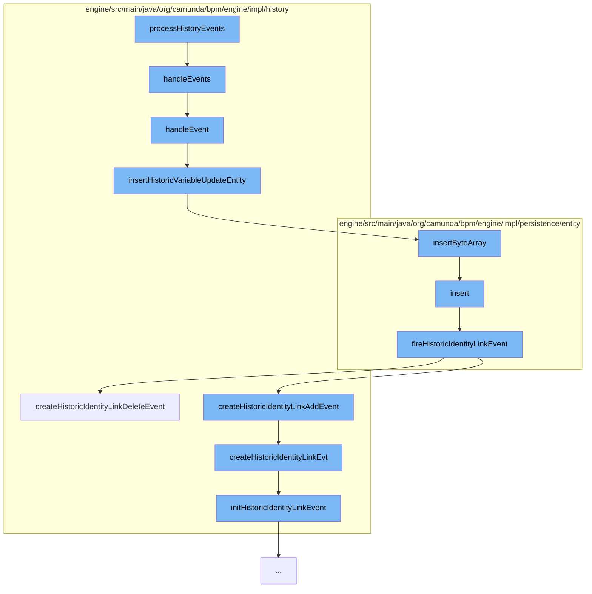

This document will cover the process of handling and processing history events in the Camunda BPM engine. The flow of this process includes:

1. Processing history events
2. Handling events
3. Inserting historic variable update entity
4. Inserting byte array
5. Inserting identity link entity
6. Firing historic identity link event
7. Creating historic identity link event



<SwmSnippet path="/engine/src/main/java/org/camunda/bpm/engine/impl/history/event/HistoryEventProcessor.java" line="1">

---

# Processing History Events

The `processHistoryEvents` function is the entry point for processing history events in the Camunda BPM engine. It is responsible for initiating the handling of these events.

```java
/*
 * Copyright Camunda Services GmbH and/or licensed to Camunda Services GmbH
 * under one or more contributor license agreements. See the NOTICE file
 * distributed with this work for additional information regarding copyright
 * ownership. Camunda licenses this file to you under the Apache License,
 * Version 2.0; you may not use this file except in compliance with the License.
 * You may obtain a copy of the License at
 *
 *     http://www.apache.org/licenses/LICENSE-2.0
 *
```

---

</SwmSnippet>

<SwmSnippet path="/engine/src/main/java/org/camunda/bpm/engine/impl/history/handler/DbHistoryEventHandler.java" line="54">

---

# Handling Events

The `handleEvents` function iterates over the list of history events and calls the `handleEvent` function for each event.

```java
  public void handleEvents(List<HistoryEvent> historyEvents) {
    for (HistoryEvent historyEvent : historyEvents) {
      handleEvent(historyEvent);
    }
  }
```

---

</SwmSnippet>

<SwmSnippet path="/engine/src/main/java/org/camunda/bpm/engine/impl/history/handler/DbHistoryEventHandler.java" line="87">

---

# Inserting Historic Variable Update Entity

The `insertHistoricVariableUpdateEntity` function is responsible for inserting a historic variable update entity into the database. It checks the type of the history event and inserts the corresponding entity.

```java
  /** customized insert behavior for HistoricVariableUpdateEventEntity */
  protected void insertHistoricVariableUpdateEntity(HistoricVariableUpdateEventEntity historyEvent) {
    DbEntityManager dbEntityManager = getDbEntityManager();

    // insert update only if history level = FULL
    if(shouldWriteHistoricDetail(historyEvent)) {

      // insert byte array entity (if applicable)
      byte[] byteValue = historyEvent.getByteValue();
      if(byteValue != null) {
        ByteArrayEntity byteArrayEntity = new ByteArrayEntity(historyEvent.getVariableName(), byteValue, ResourceTypes.HISTORY);
        byteArrayEntity.setRootProcessInstanceId(historyEvent.getRootProcessInstanceId());
        byteArrayEntity.setRemovalTime(historyEvent.getRemovalTime());

        Context
        .getCommandContext()
        .getByteArrayManager()
        .insertByteArray(byteArrayEntity);
        historyEvent.setByteArrayId(byteArrayEntity.getId());

      }
```

---

</SwmSnippet>

<SwmSnippet path="/engine/src/main/java/org/camunda/bpm/engine/impl/persistence/entity/ByteArrayManager.java" line="44">

---

# Inserting Byte Array

The `insertByteArray` function is used to insert a byte array entity into the database. This is used when the history event has a byte value.

```java
  public void insertByteArray(ByteArrayEntity arr) {
    arr.setCreateTime(ClockUtil.getCurrentTime());
    getDbEntityManager().insert(arr);
  }
```

---

</SwmSnippet>

<SwmSnippet path="/engine/src/main/java/org/camunda/bpm/engine/impl/persistence/entity/IdentityLinkEntity.java" line="82">

---

# Inserting Identity Link Entity

The `insert` function is used to insert an identity link entity into the database. After the entity is inserted, a historic identity link event is fired.

```java
  public void insert() {
    Context
      .getCommandContext()
      .getDbEntityManager()
      .insert(this);
    fireHistoricIdentityLinkEvent(HistoryEventTypes.IDENTITY_LINK_ADD);
  }
```

---

</SwmSnippet>

<SwmSnippet path="/engine/src/main/java/org/camunda/bpm/engine/impl/persistence/entity/IdentityLinkEntity.java" line="204">

---

# Firing Historic Identity Link Event

The `fireHistoricIdentityLinkEvent` function is responsible for firing a historic identity link event. It creates the event and processes it.

```java
  public void fireHistoricIdentityLinkEvent(final HistoryEventType eventType) {
    ProcessEngineConfigurationImpl processEngineConfiguration = Context.getProcessEngineConfiguration();

    HistoryLevel historyLevel = processEngineConfiguration.getHistoryLevel();
    if(historyLevel.isHistoryEventProduced(eventType, this)) {

      HistoryEventProcessor.processHistoryEvents(new HistoryEventProcessor.HistoryEventCreator() {
        @Override
        public HistoryEvent createHistoryEvent(HistoryEventProducer producer) {
          HistoryEvent event = null;
          if (HistoryEvent.IDENTITY_LINK_ADD.equals(eventType.getEventName())) {
            event = producer.createHistoricIdentityLinkAddEvent(IdentityLinkEntity.this);
          } else if (HistoryEvent.IDENTITY_LINK_DELETE.equals(eventType.getEventName())) {
            event = producer.createHistoricIdentityLinkDeleteEvent(IdentityLinkEntity.this);
          }
          return event;
        }
      });

    }
  }
```

---

</SwmSnippet>

<SwmSnippet path="/engine/src/main/java/org/camunda/bpm/engine/impl/history/producer/DefaultHistoryEventProducer.java" line="945">

---

# Creating Historic Identity Link Event

The `createHistoricIdentityLinkEvt` function is used to create a historic identity link event. It initializes the event with the necessary data from the identity link.

```java
  @Override
  public HistoryEvent createHistoricIdentityLinkDeleteEvent(IdentityLink identityLink) {
    return createHistoricIdentityLinkEvt(identityLink, HistoryEventTypes.IDENTITY_LINK_DELETE);
  }

  protected HistoryEvent createHistoricIdentityLinkEvt(IdentityLink identityLink, HistoryEventTypes eventType) {
    // create historic identity link event
    HistoricIdentityLinkLogEventEntity evt = newIdentityLinkEventEntity();
    // Mapping all the values of identity link to HistoricIdentityLinkEvent
    initHistoricIdentityLinkEvent(evt, identityLink, eventType);
    return evt;
  }

  protected HistoricIdentityLinkLogEventEntity newIdentityLinkEventEntity() {
    return new HistoricIdentityLinkLogEventEntity();
  }

  protected void initHistoricIdentityLinkEvent(HistoricIdentityLinkLogEventEntity evt, IdentityLink identityLink, HistoryEventType eventType) {

    if (identityLink.getTaskId() != null) {
      TaskEntity task = Context
```

---

</SwmSnippet>

&nbsp;

*This is an auto-generated document by Swimm AI 🌊 and has not yet been verified by a human*

<SwmMeta version="3.0.0" repo-id="Z2l0aHViJTNBJTNBQ2l0aS1jYW11bmRhJTNBJTNBZ2lsYWRuYXZvdA==" repo-name="Citi-camunda" doc-type="flows"><sup>Powered by [Swimm](/)</sup></SwmMeta>
