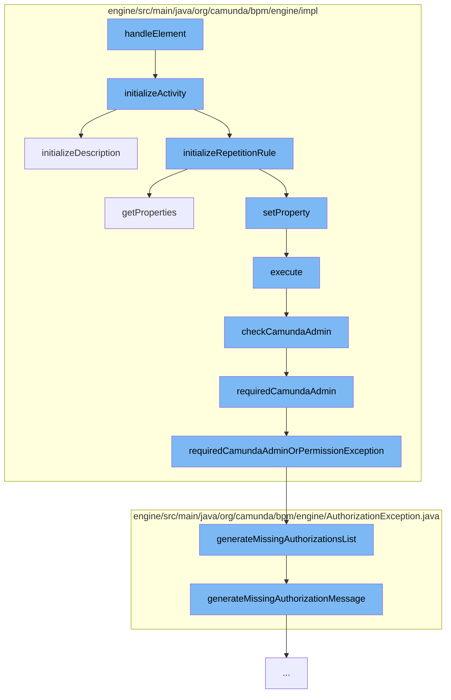

This document will cover the process of handling elements in the Camunda BPMN engine, which includes:

1. Initializing the activity
2. Setting up the repetition rule
3. Checking for admin permissions
4. Handling missing authorizations.



<SwmSnippet path="/engine/src/main/java/org/camunda/bpm/engine/impl/cmmn/handler/ItemHandler.java" line="208">

---

# Initializing the activity

The `initializeActivity` function is the starting point of the flow. It sets up the activity, including its name, type, description, and various rules and listeners. It also initializes entry and exit criteria.

```java
  protected void initializeActivity(CmmnElement element, CmmnActivity activity, CmmnHandlerContext context) {
    if (isDiscretionaryItem(element)) {
      activity.setProperty(PROPERTY_DISCRETIONARY, true);
    }

    String name = getName(element);

    if (name == null) {
      PlanItemDefinition definition = getDefinition(element);
      if (definition != null) {
        name = definition.getName();
      }
    }

    activity.setName(name);

    // activityType
    initializeActivityType(element, activity, context);

    // description
    initializeDescription(element, activity, context);
```

---

</SwmSnippet>

<SwmSnippet path="/engine/src/main/java/org/camunda/bpm/engine/impl/cmmn/handler/ItemHandler.java" line="240">

---

# Setting up the repetition rule

The `initializeRepetitionRule` function is called within `initializeActivity`. It sets up the repetition rule for the activity.

```java
    initializeRepetitionRule(element, activity, context);

```

---

</SwmSnippet>

<SwmSnippet path="/engine/src/main/java/org/camunda/bpm/engine/impl/persistence/entity/AuthorizationManager.java" line="495">

---

# Checking for admin permissions

The `checkCamundaAdmin` function is called within the `execute` function. It checks if the current authentication contains the group `CAMUNDA_ADMIN`. If the check fails, it throws an `AuthorizationException`.

```java
  // predefined authorization checks

  /* MEMBER OF CAMUNDA_ADMIN */

  /**
   * Checks if the current authentication contains the group
   * {@link Groups#CAMUNDA_ADMIN}. The check is ignored if the authorization is
   * disabled or no authentication exists.
   *
   * @throws AuthorizationException
   */
  public void checkCamundaAdmin() {
    final Authentication currentAuthentication = getCurrentAuthentication();

    if (isAuthorizationEnabled() && getCommandContext().isAuthorizationCheckEnabled()
        && currentAuthentication != null && !isCamundaAdmin(currentAuthentication)) {

      throw LOG.requiredCamundaAdmin();
    }
  }
```

---

</SwmSnippet>

<SwmSnippet path="/engine/src/main/java/org/camunda/bpm/engine/AuthorizationException.java" line="161">

---

# Handling missing authorizations

The `generateMissingAuthorizationsList` and `generateMissingAuthorizationMessage` functions are used to generate a detailed message about the missing authorizations when an `AuthorizationException` is thrown.

```java
  /**
   * Generate a String containing a list of missing authorizations.
   *
   * @param missingAuthorizations
   */
  public static String generateMissingAuthorizationsList(List<MissingAuthorization> missingAuthorizations) {
    StringBuilder sBuilder = new StringBuilder();
    boolean first = true;
    for(MissingAuthorization missingAuthorization: missingAuthorizations) {
      if (!first) {
        sBuilder.append(" or ");
      } else {
        first = false;
      }
      sBuilder.append(generateMissingAuthorizationMessage(missingAuthorization));
    }
    return sBuilder.toString();
  }

  /**
   * Generated exception message for the missing authorization.
```

---

</SwmSnippet>

&nbsp;

*This is an auto-generated document by Swimm AI 🌊 and has not yet been verified by a human*

<SwmMeta version="3.0.0" repo-id="Z2l0aHViJTNBJTNBQ2l0aS1jYW11bmRhJTNBJTNBZ2lsYWRuYXZvdA==" repo-name="Citi-camunda" doc-type="flows"><sup>Powered by [Swimm](/)</sup></SwmMeta>
