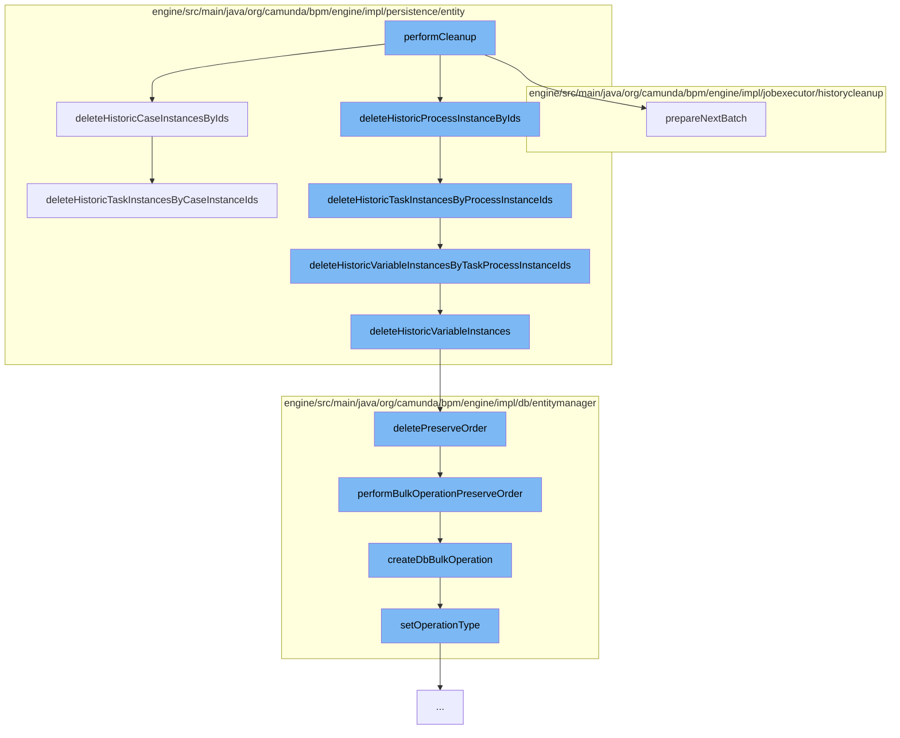

This document will cover the process of historical data cleanup in the Camunda BPM engine. The process includes the following steps:

1. Performing cleanup
2. Deleting historic case instances
3. Deleting historic process instances
4. Deleting historic task instances
5. Deleting historic variable instances
6. Preserving order during deletion
7. Performing bulk operations



<SwmSnippet path="/engine/src/main/java/org/camunda/bpm/engine/impl/jobexecutor/historycleanup/HistoryCleanupBatch.java" line="1">

---

# Performing Cleanup

The `performCleanup` function initiates the cleanup process. It calls several other functions to delete historic instances and prepare the next batch for cleanup.

```java
/*
 * Copyright Camunda Services GmbH and/or licensed to Camunda Services GmbH
 * under one or more contributor license agreements. See the NOTICE file
 * distributed with this work for additional information regarding copyright
 * ownership. Camunda licenses this file to you under the Apache License,
 * Version 2.0; you may not use this file except in compliance with the License.
 * You may obtain a copy of the License at
 *
 *     http://www.apache.org/licenses/LICENSE-2.0
 *
```

---

</SwmSnippet>

<SwmSnippet path="/engine/src/main/java/org/camunda/bpm/engine/impl/persistence/entity/HistoricCaseInstanceManager.java" line="69">

---

# Deleting Historic Case Instances

The `deleteHistoricCaseInstancesByIds` function is responsible for deleting historic case instances by their IDs. It also deletes related historic details, variable instances, case activity instances, and task instances.

```java
  public void deleteHistoricCaseInstancesByIds(List<String> historicCaseInstanceIds) {
    if (isHistoryEnabled()) {
      getHistoricDetailManager().deleteHistoricDetailsByCaseInstanceIds(historicCaseInstanceIds);

      getHistoricVariableInstanceManager().deleteHistoricVariableInstancesByCaseInstanceIds(historicCaseInstanceIds);

      getHistoricCaseActivityInstanceManager().deleteHistoricCaseActivityInstancesByCaseInstanceIds(historicCaseInstanceIds);

      getHistoricTaskInstanceManager().deleteHistoricTaskInstancesByCaseInstanceIds(historicCaseInstanceIds);

      getDbEntityManager().delete(HistoricCaseInstanceEntity.class, "deleteHistoricCaseInstancesByIds", historicCaseInstanceIds);
    }
  }
```

---

</SwmSnippet>

<SwmSnippet path="/engine/src/main/java/org/camunda/bpm/engine/impl/persistence/entity/HistoricProcessInstanceManager.java" line="1">

---

# Deleting Historic Process Instances

The `deleteHistoricProcessInstanceByIds` function deletes historic process instances by their IDs. It also calls the `deleteHistoricTaskInstancesByProcessInstanceIds` function to delete related task instances.

```java
/*
 * Copyright Camunda Services GmbH and/or licensed to Camunda Services GmbH
 * under one or more contributor license agreements. See the NOTICE file
 * distributed with this work for additional information regarding copyright
 * ownership. Camunda licenses this file to you under the Apache License,
 * Version 2.0; you may not use this file except in compliance with the License.
 * You may obtain a copy of the License at
 *
 *     http://www.apache.org/licenses/LICENSE-2.0
 *
```

---

</SwmSnippet>

<SwmSnippet path="/engine/src/main/java/org/camunda/bpm/engine/impl/persistence/entity/HistoricTaskInstanceManager.java" line="49">

---

# Deleting Historic Task Instances

The `deleteHistoricTaskInstancesByProcessInstanceIds` function deletes historic task instances by their process instance IDs. It also deletes related historic details, comments, attachments, and identity links.

```java
  /**
   * Deletes all data related with tasks, which belongs to specified process instance ids.
   * @param processInstanceIds
   * @param deleteVariableInstances when true, will also delete variable instances. Can be false when variable instances were deleted separately.
   */
  public void deleteHistoricTaskInstancesByProcessInstanceIds(List<String> processInstanceIds, boolean deleteVariableInstances) {

    CommandContext commandContext = Context.getCommandContext();

    if (deleteVariableInstances) {
      getHistoricVariableInstanceManager().deleteHistoricVariableInstancesByTaskProcessInstanceIds(processInstanceIds);
    }

    getHistoricDetailManager()
        .deleteHistoricDetailsByTaskProcessInstanceIds(processInstanceIds);

    commandContext
        .getCommentManager()
        .deleteCommentsByTaskProcessInstanceIds(processInstanceIds);

    getAttachmentManager()
```

---

</SwmSnippet>

<SwmSnippet path="/engine/src/main/java/org/camunda/bpm/engine/impl/persistence/entity/HistoricVariableInstanceManager.java" line="54">

---

# Deleting Historic Variable Instances

The `deleteHistoricVariableInstancesByTaskProcessInstanceIds` and `deleteHistoricVariableInstances` functions delete historic variable instances by their task process instance IDs and other parameters respectively.

```java
  public void deleteHistoricVariableInstancesByTaskProcessInstanceIds(List<String> historicProcessInstanceIds) {
    Map<String, Object> parameters = new HashMap<String, Object>();
    parameters.put("taskProcessInstanceIds", historicProcessInstanceIds);
    deleteHistoricVariableInstances(parameters);
  }

  public void deleteHistoricVariableInstanceByCaseInstanceId(String historicCaseInstanceId) {
    deleteHistoricVariableInstancesByProcessCaseInstanceId(null, historicCaseInstanceId);
  }

  public void deleteHistoricVariableInstancesByCaseInstanceIds(List<String> historicCaseInstanceIds) {
    Map<String, Object> parameters = new HashMap<String, Object>();
    parameters.put("caseInstanceIds", historicCaseInstanceIds);
    deleteHistoricVariableInstances(parameters);
  }

  protected void deleteHistoricVariableInstances(Map<String, Object> parameters) {
    getDbEntityManager().deletePreserveOrder(ByteArrayEntity.class, "deleteHistoricVariableInstanceByteArraysByIds", parameters);
    getDbEntityManager().deletePreserveOrder(HistoricVariableInstanceEntity.class, "deleteHistoricVariableInstanceByIds", parameters);
  }
```

---

</SwmSnippet>

<SwmSnippet path="/engine/src/main/java/org/camunda/bpm/engine/impl/db/entitymanager/DbEntityManager.java" line="594">

---

# Preserving Order During Deletion

The `deletePreserveOrder` function ensures that several delete operations are executed in the order they were added, regardless of the entity type they refer to.

```java
  /**
   * Several delete operations added by this method will be executed preserving the order of method calls, no matter what entity type they refer to.
   * They will though be executed after all "not-bulk" operations (e.g. {@link DbEntityManager#insert(DbEntity)} or {@link DbEntityManager#merge(DbEntity)})
   * and after those deletes added by {@link DbEntityManager#delete(Class, String, Object)}.
   * @param entityType
   * @param statement
   * @param parameter
   * @return delete operation
   */
  public DbBulkOperation deletePreserveOrder(Class<? extends DbEntity> entityType, String statement, Object parameter) {
    return performBulkOperationPreserveOrder(entityType, statement, parameter, DELETE_BULK);
  }
```

---

</SwmSnippet>

<SwmSnippet path="/engine/src/main/java/org/camunda/bpm/engine/impl/db/entitymanager/DbEntityManager.java" line="616">

---

# Performing Bulk Operations

The `performBulkOperationPreserveOrder` and `createDbBulkOperation` functions are used to perform bulk operations while preserving the order of operations. The operation type is set using the `setOperationType` function.

```java
  protected DbBulkOperation performBulkOperationPreserveOrder(Class<? extends DbEntity> entityType, String statement, Object parameter, DbOperationType operationType) {
    DbBulkOperation bulkOperation = createDbBulkOperation(entityType, statement, parameter, operationType);

    // schedule operation
    dbOperationManager.addOperationPreserveOrder(bulkOperation);
    return bulkOperation;
  }

  private DbBulkOperation createDbBulkOperation(Class<? extends DbEntity> entityType, String statement, Object parameter, DbOperationType operationType) {
    // create operation
    DbBulkOperation bulkOperation = new DbBulkOperation();

    // configure operation
    bulkOperation.setOperationType(operationType);
    bulkOperation.setEntityType(entityType);
    bulkOperation.setStatement(statement);
    bulkOperation.setParameter(parameter);
    return bulkOperation;
  }
```

---

</SwmSnippet>

&nbsp;

*This is an auto-generated document by Swimm AI 🌊 and has not yet been verified by a human*

<SwmMeta version="3.0.0" repo-id="Z2l0aHViJTNBJTNBQ2l0aS1jYW11bmRhJTNBJTNBZ2lsYWRuYXZvdA==" repo-name="Citi-camunda" doc-type="flows"><sup>Powered by [Swimm](/)</sup></SwmMeta>
