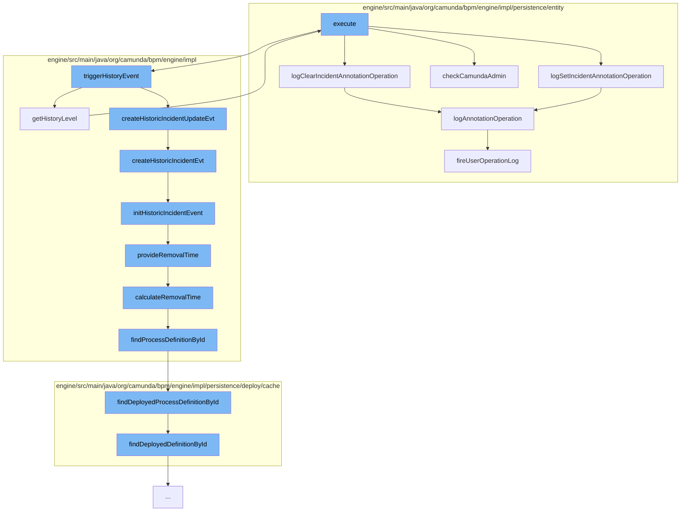

This document will cover the process of setting an annotation for an incident in the Camunda Platform. The process includes the following steps:

1. Execution of the main command
2. Logging of the incident annotation operation
3. Triggering of the history event
4. Creation and initialization of the historic incident event
5. Calculation and provision of the removal time
6. Finding the process definition by ID
7. Execution of the management service command
8. Checking of Camunda admin authorization.



<SwmSnippet path="/engine/src/main/java/org/camunda/bpm/engine/impl/cmd/SetAnnotationForIncidentCmd.java" line="1">

---

# Execution of the main command

The `execute` function in `SetAnnotationForIncidentCmd.java` is the entry point for this process. It is responsible for setting an annotation for a specific incident.

```java
/*
 * Copyright Camunda Services GmbH and/or licensed to Camunda Services GmbH
 * under one or more contributor license agreements. See the NOTICE file
 * distributed with this work for additional information regarding copyright
 * ownership. Camunda licenses this file to you under the Apache License,
 * Version 2.0; you may not use this file except in compliance with the License.
 * You may obtain a copy of the License at
 *
 *     http://www.apache.org/licenses/LICENSE-2.0
 *
```

---

</SwmSnippet>

<SwmSnippet path="/engine/src/main/java/org/camunda/bpm/engine/impl/persistence/entity/UserOperationLogManager.java" line="698">

---

# Logging of the incident annotation operation

The `logClearIncidentAnnotationOperation` and `logSetIncidentAnnotationOperation` functions log the operation of setting and clearing the incident annotation respectively.

```java
  public void logClearIncidentAnnotationOperation(String incidentId, String tenantId) {
    logAnnotationOperation(incidentId, EntityTypes.INCIDENT, "incidentId", UserOperationLogEntry.OPERATION_TYPE_CLEAR_ANNOTATION, tenantId);
  }
```

---

</SwmSnippet>

<SwmSnippet path="/engine/src/main/java/org/camunda/bpm/engine/impl/cmd/SetAnnotationForIncidentCmd.java" line="11">

---

# Triggering of the history event

The `triggerHistoryEvent` function triggers a history event for the incident.

```java
 * Unless required by applicable law or agreed to in writing, software
 * distributed under the License is distributed on an "AS IS" BASIS,
 * WITHOUT WARRANTIES OR CONDITIONS OF ANY KIND, either express or implied.
 * See the License for the specific language governing permissions and
 * limitations under the License.
 */
package org.camunda.bpm.engine.impl.cmd;

import org.camunda.bpm.engine.BadUserRequestException;
import org.camunda.bpm.engine.exception.NotValidException;
```

---

</SwmSnippet>

<SwmSnippet path="/engine/src/main/java/org/camunda/bpm/engine/impl/history/producer/DefaultHistoryEventProducer.java" line="926">

---

# Creation and initialization of the historic incident event

The `createHistoricIncidentEvt` function creates a historic incident event. The `initHistoricIncidentEvent` function initializes the historic incident event with the details of the incident.

```java
  protected HistoryEvent createHistoricIncidentEvt(Incident incident, HistoryEventTypes eventType) {
    // create event
    HistoricIncidentEventEntity evt = loadIncidentEvent(incident);
    // initialize
    initHistoricIncidentEvent(evt, incident, eventType);

    if (HistoryEventTypes.INCIDENT_RESOLVE.equals(eventType) || HistoryEventTypes.INCIDENT_DELETE.equals(eventType)) {
      evt.setEndTime(ClockUtil.getCurrentTime());
    }

    return evt;
  }
```

---

</SwmSnippet>

<SwmSnippet path="/engine/src/main/java/org/camunda/bpm/engine/impl/history/producer/DefaultHistoryEventProducer.java" line="1285">

---

# Calculation and provision of the removal time

The `calculateRemovalTime` function calculates the removal time for the historic incident event. The `provideRemovalTime` function sets the removal time for the historic incident event.

```java
  protected Date calculateRemovalTime(HistoryEvent historyEvent) {
    String processDefinitionId = historyEvent.getProcessDefinitionId();
    ProcessDefinition processDefinition = findProcessDefinitionById(processDefinitionId);

    return Context.getProcessEngineConfiguration()
      .getHistoryRemovalTimeProvider()
      .calculateRemovalTime((HistoricProcessInstanceEventEntity) historyEvent, processDefinition);
  }
```

---

</SwmSnippet>

<SwmSnippet path="/engine/src/main/java/org/camunda/bpm/engine/impl/history/producer/DefaultHistoryEventProducer.java" line="1326">

---

# Finding the process definition by ID

The `findProcessDefinitionById` function finds the process definition by its ID.

```java
  protected ProcessDefinition findProcessDefinitionById(String processDefinitionId) {
    return Context.getCommandContext()
      .getProcessEngineConfiguration()
      .getDeploymentCache()
      .findDeployedProcessDefinitionById(processDefinitionId);
  }
```

---

</SwmSnippet>

<SwmSnippet path="/engine/src/main/java/org/camunda/bpm/engine/impl/ManagementServiceImpl.java" line="664">

---

# Execution of the management service command

The `execute` function in `ManagementServiceImpl.java` executes the management service command.

```java
    @Override
    public String execute(CommandContext commandContext) {
      commandContext.getAuthorizationManager().checkCamundaAdmin();
      DbSqlSessionFactory dbSqlSessionFactory = (DbSqlSessionFactory) commandContext.getSessionFactories().get(DbSqlSession.class);
      DbSqlSession dbSqlSession = dbSqlSessionFactory.openSession(connection, catalog, schema);
      commandContext.getSessions().put(DbSqlSession.class, dbSqlSession);
      dbSqlSession.dbSchemaUpdate();

      return "";
    }
```

---

</SwmSnippet>

<SwmSnippet path="/engine/src/main/java/org/camunda/bpm/engine/impl/persistence/entity/AuthorizationManager.java" line="495">

---

# Checking of Camunda admin authorization

The `checkCamundaAdmin` function checks if the current user has Camunda admin authorization.

```java
  // predefined authorization checks

  /* MEMBER OF CAMUNDA_ADMIN */

  /**
   * Checks if the current authentication contains the group
   * {@link Groups#CAMUNDA_ADMIN}. The check is ignored if the authorization is
   * disabled or no authentication exists.
   *
   * @throws AuthorizationException
   */
  public void checkCamundaAdmin() {
    final Authentication currentAuthentication = getCurrentAuthentication();

    if (isAuthorizationEnabled() && getCommandContext().isAuthorizationCheckEnabled()
        && currentAuthentication != null && !isCamundaAdmin(currentAuthentication)) {

      throw LOG.requiredCamundaAdmin();
    }
  }
```

---

</SwmSnippet>

&nbsp;

*This is an auto-generated document by Swimm AI 🌊 and has not yet been verified by a human*

<SwmMeta version="3.0.0" repo-id="Z2l0aHViJTNBJTNBQ2l0aS1jYW11bmRhJTNBJTNBZ2lsYWRuYXZvdA==" repo-name="Citi-camunda" doc-type="flows"><sup>Powered by [Swimm](/)</sup></SwmMeta>
