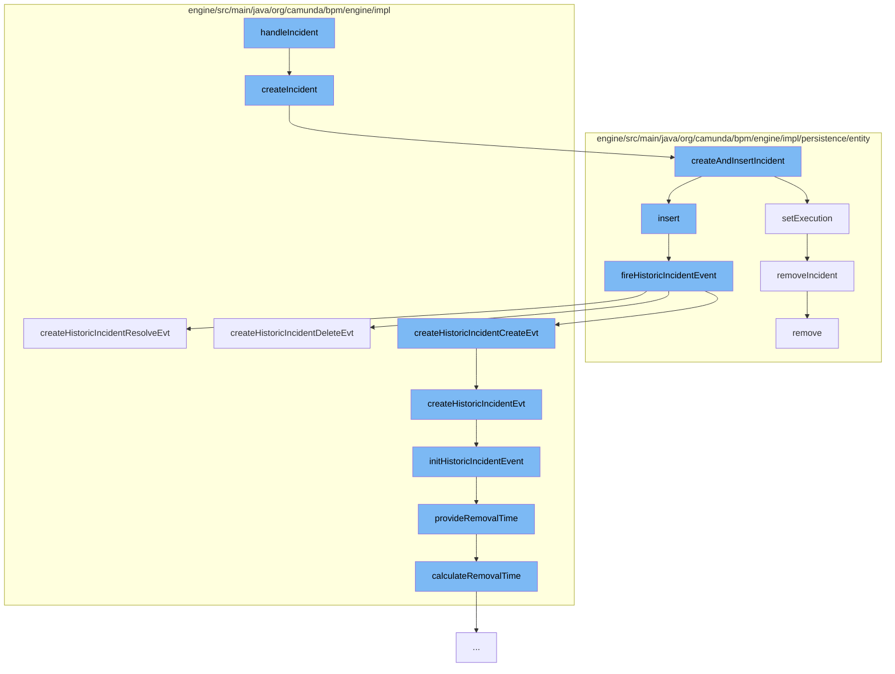

This document will cover the process of handling incidents in the Camunda BPM engine, which includes:

1. Creating an incident
2. Inserting the incident into the database
3. Setting the execution context of the incident
4. Firing a historic incident event
5. Creating a historic incident event
6. Initializing the historic incident event
7. Providing the removal time for the historic incident event
8. Removing the incident from the execution context.



<SwmSnippet path="/engine/src/main/java/org/camunda/bpm/engine/impl/incident/DefaultIncidentHandler.java" line="61">

---

# Creating an incident

The `createIncident` function is the entry point for creating a new incident. It creates a new incident and if the execution context is not null, it creates recursive incidents.

```java
  public Incident createIncident(IncidentContext context, String message) {
    IncidentEntity newIncident = IncidentEntity.createAndInsertIncident(type, context, message);

    if(context.getExecutionId() != null) {
      newIncident.createRecursiveIncidents();
    }

    return newIncident;
  }
```

---

</SwmSnippet>

<SwmSnippet path="/engine/src/main/java/org/camunda/bpm/engine/impl/persistence/entity/IncidentEntity.java" line="115">

---

# Inserting the incident into the database

The `createAndInsertIncident` function creates a new incident and sets its properties from the incident context. If the execution context is not null, it fetches the execution and links the incident with the execution. Finally, it inserts the new incident into the database.

```java
  public static IncidentEntity createAndInsertIncident(String incidentType, IncidentContext context, String message) {
    // create new incident
    IncidentEntity newIncident = create(incidentType);
    newIncident.setIncidentMessage(message);

    // set properties from incident context
    newIncident.setConfiguration(context.getConfiguration());
    newIncident.setActivityId(context.getActivityId());
    newIncident.setProcessDefinitionId(context.getProcessDefinitionId());
    newIncident.setTenantId(context.getTenantId());
    newIncident.setJobDefinitionId(context.getJobDefinitionId());
    newIncident.setHistoryConfiguration(context.getHistoryConfiguration());
    newIncident.setFailedActivityId(context.getFailedActivityId());

    if (context.getExecutionId() != null) {
      // fetch execution
      ExecutionEntity execution = Context
        .getCommandContext()
        .getExecutionManager()
        .findExecutionById(context.getExecutionId());

```

---

</SwmSnippet>

<SwmSnippet path="/engine/src/main/java/org/camunda/bpm/engine/impl/persistence/entity/IncidentEntity.java" line="416">

---

# Setting the execution context of the incident

The `setExecution` function sets the execution context of the incident. If the old execution context is not null, it removes the incident from the old execution context. If the new execution context is not null, it adds the incident to the new execution context.

```java
  public void setExecution(ExecutionEntity execution) {
    ExecutionEntity oldExecution = getExecution();
    if (oldExecution != null) {
      oldExecution.removeIncident(this);
    }

    if (execution != null) {
      executionId = execution.getId();
      processInstanceId = execution.getProcessInstanceId();
      execution.addIncident(this);
    }
    else {
      executionId = null;
      processInstanceId = null;
    }
  }
```

---

</SwmSnippet>

<SwmSnippet path="/engine/src/main/java/org/camunda/bpm/engine/impl/persistence/entity/IncidentEntity.java" line="225">

---

# Firing a historic incident event

The `fireHistoricIncidentEvent` function fires a historic incident event. It creates a historic incident event based on the event type.

```java
  protected void fireHistoricIncidentEvent(final HistoryEventType eventType) {
    ProcessEngineConfigurationImpl processEngineConfiguration = Context.getProcessEngineConfiguration();

    HistoryLevel historyLevel = processEngineConfiguration.getHistoryLevel();
    if(historyLevel.isHistoryEventProduced(eventType, this)) {

      HistoryEventProcessor.processHistoryEvents(new HistoryEventProcessor.HistoryEventCreator() {
        @Override
        public HistoryEvent createHistoryEvent(HistoryEventProducer producer) {

          HistoryEvent event = null;
          if (HistoryEvent.INCIDENT_CREATE.equals(eventType.getEventName())) {
            event = producer.createHistoricIncidentCreateEvt(IncidentEntity.this);

          } else if (HistoryEvent.INCIDENT_RESOLVE.equals(eventType.getEventName())) {
            event = producer.createHistoricIncidentResolveEvt(IncidentEntity.this);

          } else if (HistoryEvent.INCIDENT_DELETE.equals(eventType.getEventName())) {
            event = producer.createHistoricIncidentDeleteEvt(IncidentEntity.this);
          }
          return event;
```

---

</SwmSnippet>

<SwmSnippet path="/engine/src/main/java/org/camunda/bpm/engine/impl/history/producer/DefaultHistoryEventProducer.java" line="926">

---

# Creating a historic incident event

The `createHistoricIncidentEvt` function creates a historic incident event. It initializes the historic incident event and sets the end time if the event type is resolve or delete.

```java
  protected HistoryEvent createHistoricIncidentEvt(Incident incident, HistoryEventTypes eventType) {
    // create event
    HistoricIncidentEventEntity evt = loadIncidentEvent(incident);
    // initialize
    initHistoricIncidentEvent(evt, incident, eventType);

    if (HistoryEventTypes.INCIDENT_RESOLVE.equals(eventType) || HistoryEventTypes.INCIDENT_DELETE.equals(eventType)) {
      evt.setEndTime(ClockUtil.getCurrentTime());
    }

    return evt;
  }
```

---

</SwmSnippet>

<SwmSnippet path="/engine/src/main/java/org/camunda/bpm/engine/impl/history/producer/DefaultHistoryEventProducer.java" line="366">

---

# Initializing the historic incident event

The `initHistoricIncidentEvent` function initializes the historic incident event. It sets the properties of the event from the incident and initializes the event type and state.

```java
  protected void initHistoricIncidentEvent(HistoricIncidentEventEntity evt, Incident incident, HistoryEventType eventType) {
    // init properties
    evt.setId(incident.getId());
    evt.setProcessDefinitionId(incident.getProcessDefinitionId());
    evt.setProcessInstanceId(incident.getProcessInstanceId());
    evt.setExecutionId(incident.getExecutionId());
    evt.setCreateTime(incident.getIncidentTimestamp());
    evt.setIncidentType(incident.getIncidentType());
    evt.setActivityId(incident.getActivityId());
    evt.setCauseIncidentId(incident.getCauseIncidentId());
    evt.setRootCauseIncidentId(incident.getRootCauseIncidentId());
    evt.setConfiguration(incident.getConfiguration());
    evt.setIncidentMessage(incident.getIncidentMessage());
    evt.setTenantId(incident.getTenantId());
    evt.setJobDefinitionId(incident.getJobDefinitionId());
    evt.setHistoryConfiguration(incident.getHistoryConfiguration());
    evt.setFailedActivityId(incident.getFailedActivityId());
    evt.setAnnotation(incident.getAnnotation());

    String jobId = incident.getConfiguration();
    if (jobId != null && isHistoryRemovalTimeStrategyStart()) {
```

---

</SwmSnippet>

<SwmSnippet path="/engine/src/main/java/org/camunda/bpm/engine/impl/history/producer/DefaultHistoryEventProducer.java" line="1300">

---

# Providing the removal time for the historic incident event

The `provideRemovalTime` function provides the removal time for the historic incident event. It calculates the removal time based on the history event and process definition.

```java
  protected void provideRemovalTime(HistoricBatchEntity historicBatch) {
    Date removalTime = calculateRemovalTime(historicBatch);
    if (removalTime != null) {
      historicBatch.setRemovalTime(removalTime);
    }
  }
```

---

</SwmSnippet>

<SwmSnippet path="/engine/src/main/java/org/camunda/bpm/engine/impl/persistence/entity/ExecutionEntity.java" line="1573">

---

# Removing the incident from the execution context

The `removeIncident` function removes the incident from the execution context.

```java
  public void removeIncident(IncidentEntity incident) {
    getIncidentsInternal().remove(incident);
  }
```

---

</SwmSnippet>

&nbsp;

*This is an auto-generated document by Swimm AI 🌊 and has not yet been verified by a human*

<SwmMeta version="3.0.0" repo-id="Z2l0aHViJTNBJTNBQ2l0aS1jYW11bmRhJTNBJTNBZ2lsYWRuYXZvdA==" repo-name="Citi-camunda" doc-type="flows"><sup>Powered by [Swimm](/)</sup></SwmMeta>
