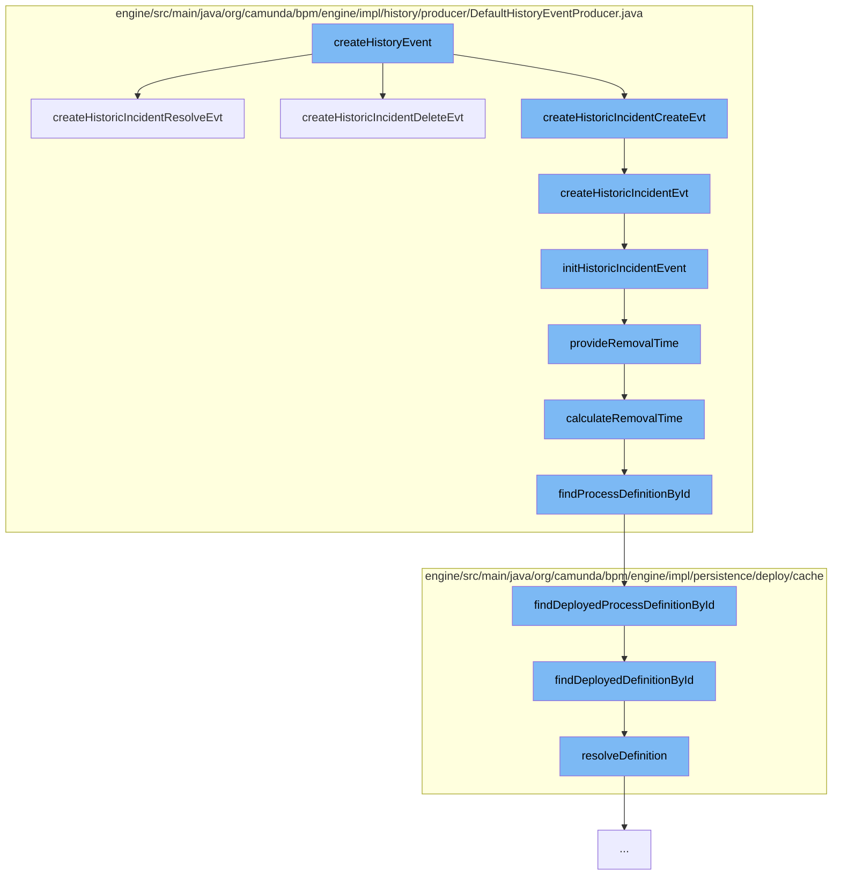

This document will cover the process of creating and managing incidents in the Camunda BPM engine. The steps include:

1. Creating a history event
2. Creating and initializing a historic incident event
3. Providing and calculating removal time for the incident
4. Finding and deploying the process definition associated with the incident.



<SwmSnippet path="/engine/src/main/java/org/camunda/bpm/engine/impl/persistence/entity/IncidentEntity.java" line="1">

---

# Creating a history event

The `createHistoryEvent` function in `IncidentEntity.java` is the starting point of the incident management process. It calls `createHistoricIncidentResolveEvt`, `createHistoricIncidentDeleteEvt`, and `createHistoricIncidentCreateEvt` functions to create different types of historic incident events.

```java
/*
 * Copyright Camunda Services GmbH and/or licensed to Camunda Services GmbH
 * under one or more contributor license agreements. See the NOTICE file
 * distributed with this work for additional information regarding copyright
 * ownership. Camunda licenses this file to you under the Apache License,
 * Version 2.0; you may not use this file except in compliance with the License.
 * You may obtain a copy of the License at
 *
 *     http://www.apache.org/licenses/LICENSE-2.0
 *
```

---

</SwmSnippet>

<SwmSnippet path="/engine/src/main/java/org/camunda/bpm/engine/impl/history/producer/DefaultHistoryEventProducer.java" line="914">

---

# Creating and initializing a historic incident event

The `createHistoricIncidentEvt` function creates a `HistoricIncidentEventEntity` and initializes it with the `initHistoricIncidentEvent` function. The initialization includes setting properties like incident id, process definition id, process instance id, and others.

```java
  public HistoryEvent createHistoricIncidentResolveEvt(Incident incident) {
    return createHistoricIncidentEvt(incident, HistoryEventTypes.INCIDENT_RESOLVE);
  }

  public HistoryEvent createHistoricIncidentDeleteEvt(Incident incident) {
    return createHistoricIncidentEvt(incident, HistoryEventTypes.INCIDENT_DELETE);
  }

  public HistoryEvent createHistoricIncidentMigrateEvt(Incident incident) {
    return createHistoricIncidentEvt(incident, HistoryEventTypes.INCIDENT_MIGRATE);
  }

  protected HistoryEvent createHistoricIncidentEvt(Incident incident, HistoryEventTypes eventType) {
    // create event
    HistoricIncidentEventEntity evt = loadIncidentEvent(incident);
    // initialize
    initHistoricIncidentEvent(evt, incident, eventType);

    if (HistoryEventTypes.INCIDENT_RESOLVE.equals(eventType) || HistoryEventTypes.INCIDENT_DELETE.equals(eventType)) {
      evt.setEndTime(ClockUtil.getCurrentTime());
    }
```

---

</SwmSnippet>

<SwmSnippet path="/engine/src/main/java/org/camunda/bpm/engine/impl/history/producer/DefaultHistoryEventProducer.java" line="1300">

---

# Providing and calculating removal time for the incident

The `provideRemovalTime` function calculates the removal time for the incident using the `calculateRemovalTime` function. The removal time is calculated based on the process definition associated with the incident.

```java
  protected void provideRemovalTime(HistoricBatchEntity historicBatch) {
    Date removalTime = calculateRemovalTime(historicBatch);
    if (removalTime != null) {
      historicBatch.setRemovalTime(removalTime);
    }
  }
```

---

</SwmSnippet>

<SwmSnippet path="/engine/src/main/java/org/camunda/bpm/engine/impl/persistence/deploy/cache/ResourceDefinitionCache.java" line="111">

---

# Finding and deploying the process definition associated with the incident

The `resolveDefinition` function is used to find and deploy the process definition associated with the incident. The process definition is found using its id and then deployed.

```java
  public T resolveDefinition(T definition) {
    String definitionId = definition.getId();
    String deploymentId = definition.getDeploymentId();
    T cachedDefinition = cache.get(definitionId);
    if (cachedDefinition == null) {
      synchronized (this) {
        cachedDefinition = cache.get(definitionId);
        if (cachedDefinition == null) {
          DeploymentEntity deployment = Context
              .getCommandContext()
              .getDeploymentManager()
              .findDeploymentById(deploymentId);
          deployment.setNew(false);
          cacheDeployer.deployOnlyGivenResourcesOfDeployment(deployment, definition.getResourceName(), definition.getDiagramResourceName());
          cachedDefinition = cache.get(definitionId);
        }
      }
      checkInvalidDefinitionWasCached(deploymentId, definitionId, cachedDefinition);
    }
    if (cachedDefinition != null) {
      cachedDefinition.updateModifiableFieldsFromEntity(definition);
```

---

</SwmSnippet>

&nbsp;

*This is an auto-generated document by Swimm AI 🌊 and has not yet been verified by a human*

<SwmMeta version="3.0.0" repo-id="Z2l0aHViJTNBJTNBQ2l0aS1jYW11bmRhJTNBJTNBZ2lsYWRuYXZvdA==" repo-name="Citi-camunda" doc-type="flows"><sup>Powered by [Swimm](/)</sup></SwmMeta>
