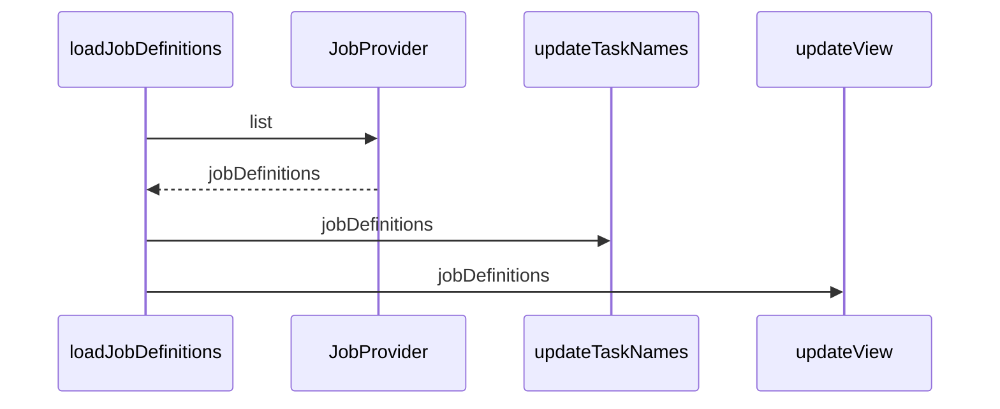

A Job Definition in the Citi-camunda project refers to a specific configuration of a job that is associated with a process definition. It contains information about the job's activity ID, job type, job configuration, and whether it is currently active or suspended. Job Definitions are used to manage and control the execution of jobs in the process automation workflow.

<SwmSnippet path="/webapps/frontend/ui/cockpit/plugins/jobDefinition/app/views/processDefinition/jobDefinitionTable.js" line="117">

---

# Job Definition Properties

Here we see the `loadJobDefinitions` function, which fetches a list of job definitions and stores them in the `$scope.jobDefinitions` variable. Each job definition includes properties such as `activityId`, `jobType`, and `jobConfiguration`.

```javascript
    function loadJobDefinitions() {
      $scope.jobDefinitions = null;

      JobProvider.list({
        processDefinitionId: processDefinition.id,
        maxResults: $scope.pages.size,
        firstResult: ($scope.pages.current - 1) * $scope.pages.size
      }).then(function(res) {
        jobDefinitions = res;

        updateTaskNames();
        updateView({});
      });
    }
```

---

</SwmSnippet>

<SwmSnippet path="/webapps/frontend/ui/cockpit/plugins/jobDefinition/app/views/processDefinition/jobDefinitionTable.js" line="137">

---

# Job Definition Usage

In the `updateView` function, the job definitions are used to control the execution of jobs. If there are no `activityIds` specified, all job definitions are used. Otherwise, only the job definitions with matching `activityIds` are used.

```javascript
    function updateView(filter) {
      $scope.jobDefinitions = null;

      var activityIds = filter.activityIds;

      if (!activityIds || !activityIds.length) {
        $scope.jobDefinitions = jobDefinitions;
        return;
      }

      var jobDefinitionSelection = [];

      angular.forEach(jobDefinitions, function(jobDefinition) {
        var activityId = jobDefinition.activityId;

        if (activityIds.indexOf(activityId) != -1) {
          jobDefinitionSelection.push(jobDefinition);
        }
      });

      $scope.jobDefinitions = jobDefinitionSelection;
```

---

</SwmSnippet>

# Job Definition Functions

This section will cover the main functions related to Job Definition in the Citi-camunda project.

<SwmSnippet path="/webapps/frontend/ui/cockpit/plugins/jobDefinition/app/views/processDefinition/jobDefinitionTable.js" line="117">

---

## loadJobDefinitions Function

The 'loadJobDefinitions' function is used to load job definitions from the Camunda API. It sets the 'jobDefinitions' scope variable to the result of the API call. It also calls the 'updateTaskNames' and 'updateView' functions after loading the job definitions.

```javascript
    function loadJobDefinitions() {
      $scope.jobDefinitions = null;

      JobProvider.list({
        processDefinitionId: processDefinition.id,
        maxResults: $scope.pages.size,
        firstResult: ($scope.pages.current - 1) * $scope.pages.size
      }).then(function(res) {
        jobDefinitions = res;

        updateTaskNames();
        updateView({});
      });
    }
```

---

</SwmSnippet>

<SwmSnippet path="/webapps/frontend/ui/cockpit/plugins/jobDefinition/app/views/processDefinition/jobDefinitionTable.js" line="92">

---

## updateTaskNames Function

The 'updateTaskNames' function is used to update the names of tasks in the job definitions. It iterates over the job definitions and sets the 'activityName' property of each job definition to the name or ID of the corresponding BPMN element.

```javascript
    var updateTaskNames = function() {
      angular.forEach(jobDefinitions, function(jobDefinition) {
        var activityId = jobDefinition.activityId,
          bpmnElement = bpmnElements[activityId];
        jobDefinition.activityName =
          (bpmnElement && (bpmnElement.name || bpmnElement.id)) || activityId;
      });
    };
```

---

</SwmSnippet>

<SwmSnippet path="/webapps/frontend/ui/cockpit/plugins/jobDefinition/app/views/processDefinition/jobDefinitionTable.js" line="137">

---

## updateView Function

The 'updateView' function is used to update the view of job definitions based on a given filter. If the filter includes specific activity IDs, only the job definitions for those activities are included in the view.

```javascript
    function updateView(filter) {
      $scope.jobDefinitions = null;

      var activityIds = filter.activityIds;

      if (!activityIds || !activityIds.length) {
        $scope.jobDefinitions = jobDefinitions;
        return;
      }

      var jobDefinitionSelection = [];

      angular.forEach(jobDefinitions, function(jobDefinition) {
        var activityId = jobDefinition.activityId;

        if (activityIds.indexOf(activityId) != -1) {
          jobDefinitionSelection.push(jobDefinition);
        }
      });

      $scope.jobDefinitions = jobDefinitionSelection;
```

---

</SwmSnippet>



&nbsp;

*This is an auto-generated document by Swimm AI 🌊 and has not yet been verified by a human*

<SwmMeta version="3.0.0" repo-id="Z2l0aHViJTNBJTNBQ2l0aS1jYW11bmRhJTNBJTNBZ2lsYWRuYXZvdA==" repo-name="Citi-camunda" doc-type="overview"><sup>Powered by [Swimm](/)</sup></SwmMeta>
