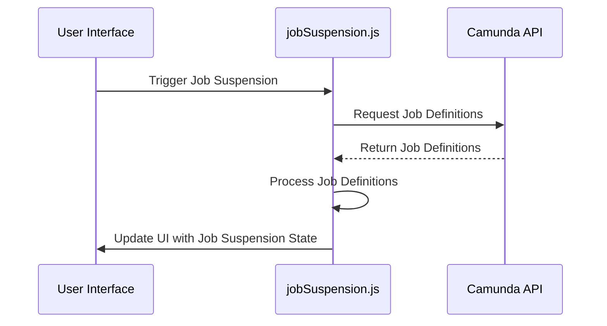

Job Suspension in Citi-camunda refers to the state of a job in the process automation workflow. When a job is suspended, it is not executed or processed until it is activated again. This is managed through the `isSuspended` function, which checks if a job is in the suspended state. The suspension state of a job can be changed and this is handled by the `$processDefinition.suspensionState.changed` event. The `jobSuspension` module is responsible for managing the job suspension functionality.

<SwmSnippet path="/webapps/frontend/ui/cockpit/plugins/jobDefinition/app/views/processDefinition/diagramPlugins/index.js" line="21">

---

## Job Suspension Variable

The `jobSuspension` variable is required from the `jobSuspension` module. This module contains the functionality for suspending jobs.

```javascript
var jobSuspension = require('./jobSuspension');
```

---

</SwmSnippet>

<SwmSnippet path="/webapps/frontend/ui/cockpit/plugins/jobDefinition/app/views/processDefinition/diagramPlugins/jobSuspension.js" line="78">

---

## isSuspended Function

The `isSuspended` function checks if a job is suspended. It does this by checking if the `suspended` property of the job definition is true.

```javascript
                    function isSuspended() {
                      return definitionsForElement.some(function(definition) {
                        return definition.suspended;
                      });
                    }
```

---

</SwmSnippet>

<SwmSnippet path="/webapps/frontend/ui/cockpit/plugins/jobDefinition/app/views/processDefinition/diagramPlugins/jobSuspension.js" line="53">

---

## loadJobDefinitions Function

The `loadJobDefinitions` function is used to load the job definitions and check if they are suspended. If a job is suspended, it will not be executed during the process run.

```javascript
            var loadJobDefinitions = function(_processDefinition) {
              processDefinition = _processDefinition || processDefinition;

              if (!processDefinition) return;

              camAPI
                .resource('job-definition')
                .list({
                  processDefinitionId: processDefinition.id,
                  firstResult: 0,
                  maxResults: 2000
                })
                .then(function(jobDefinitions) {
                  elementRegistry.forEach(function(shape) {
                    var element =
                      processDiagram.bpmnElements[shape.businessObject.id];
                    var definitionsForElement = getElementDefinitions(
                      element,
                      jobDefinitions
                    );

```

---

</SwmSnippet>

# Job Suspension Functionality

This section will delve into the key functions involved in the Job Suspension functionality: loadJobDefinitions, getElementDefinitions, and isSuspended.

<SwmSnippet path="/webapps/frontend/ui/cockpit/plugins/jobDefinition/app/views/processDefinition/diagramPlugins/jobSuspension.js" line="53">

---

## loadJobDefinitions

The `loadJobDefinitions` function is responsible for loading job definitions for a given process definition. It fetches job definitions using the Camunda API and then iterates over each element in the process diagram to identify job definitions associated with each element. If a job definition is found to be suspended, a tooltip is displayed on the UI indicating 'Suspended Job Definition'.

```javascript
            var loadJobDefinitions = function(_processDefinition) {
              processDefinition = _processDefinition || processDefinition;

              if (!processDefinition) return;

              camAPI
                .resource('job-definition')
                .list({
                  processDefinitionId: processDefinition.id,
                  firstResult: 0,
                  maxResults: 2000
                })
                .then(function(jobDefinitions) {
                  elementRegistry.forEach(function(shape) {
                    var element =
                      processDiagram.bpmnElements[shape.businessObject.id];
                    var definitionsForElement = getElementDefinitions(
                      element,
                      jobDefinitions
                    );

```

---

</SwmSnippet>

<SwmSnippet path="/webapps/frontend/ui/cockpit/plugins/jobDefinition/app/views/processDefinition/diagramPlugins/jobSuspension.js" line="124">

---

## getElementDefinitions

The `getElementDefinitions` function is used within `loadJobDefinitions` to filter job definitions based on the activity ID of the element. It returns an array of job definitions that match the element's ID.

```javascript
            function getElementDefinitions(element, jobDefinitions) {
              return jobDefinitions.filter(function(definition) {
                return definition.activityId === element.id;
              });
            }
```

---

</SwmSnippet>

<SwmSnippet path="/webapps/frontend/ui/cockpit/plugins/jobDefinition/app/views/processDefinition/diagramPlugins/jobSuspension.js" line="78">

---

## isSuspended

The `isSuspended` function checks if any of the job definitions for an element are suspended. It returns a boolean value indicating the suspension state.

```javascript
                    function isSuspended() {
                      return definitionsForElement.some(function(definition) {
                        return definition.suspended;
                      });
                    }
```

---

</SwmSnippet>



&nbsp;

*This is an auto-generated document by Swimm AI 🌊 and has not yet been verified by a human*

<SwmMeta version="3.0.0" repo-id="Z2l0aHViJTNBJTNBQ2l0aS1jYW11bmRhJTNBJTNBZ2lsYWRuYXZvdA==" repo-name="Citi-camunda" doc-type="overview"><sup>Powered by [Swimm](/)</sup></SwmMeta>
