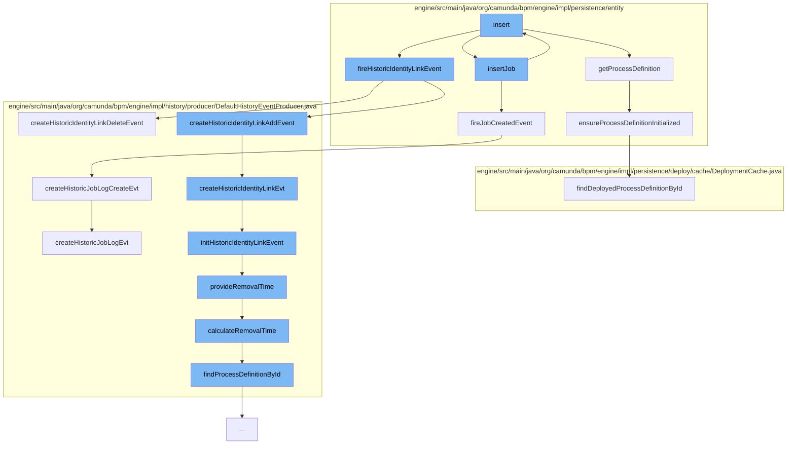

This document will cover the process of job creation and identity link event generation in the Camunda BPM engine. The steps include:

1. Inserting a job entity
2. Firing a job created event
3. Inserting an identity link entity
4. Firing a historic identity link event
5. Creating a historic identity link event
6. Initializing a historic identity link event
7. Providing a removal time for the historic identity link event
8. Calculating the removal time for the historic identity link event
9. Creating a historic job log event



<SwmSnippet path="/engine/src/main/java/org/camunda/bpm/engine/impl/persistence/entity/JobEntity.java" line="1">

---

# Inserting a Job Entity

The `insert` function in `JobEntity.java` is the starting point of the job creation process. It calls `getProcessDefinition` to retrieve the process definition and `insertJob` to insert the job into the `JobManager`.

```java
/*
 * Copyright Camunda Services GmbH and/or licensed to Camunda Services GmbH
 * under one or more contributor license agreements. See the NOTICE file
 * distributed with this work for additional information regarding copyright
 * ownership. Camunda licenses this file to you under the Apache License,
 * Version 2.0; you may not use this file except in compliance with the License.
 * You may obtain a copy of the License at
 *
 *     http://www.apache.org/licenses/LICENSE-2.0
 *
```

---

</SwmSnippet>

<SwmSnippet path="/engine/src/main/java/org/camunda/bpm/engine/impl/persistence/entity/JobManager.java" line="1">

---

# Firing a Job Created Event

The `insertJob` function in `JobManager.java` calls `fireJobCreatedEvent` to trigger a job creation event. This event is logged in the `HistoricJobLogManager`.

```java
/*
 * Copyright Camunda Services GmbH and/or licensed to Camunda Services GmbH
 * under one or more contributor license agreements. See the NOTICE file
 * distributed with this work for additional information regarding copyright
 * ownership. Camunda licenses this file to you under the Apache License,
 * Version 2.0; you may not use this file except in compliance with the License.
 * You may obtain a copy of the License at
 *
 *     http://www.apache.org/licenses/LICENSE-2.0
 *
```

---

</SwmSnippet>

<SwmSnippet path="/engine/src/main/java/org/camunda/bpm/engine/impl/persistence/entity/JobManager.java" line="11">

---

# Inserting an Identity Link Entity

`insertJob` also calls `insert` in `IdentityLinkEntity.java` to create an identity link associated with the job. This link represents a relationship between a user or a group and a task.

```java
 * Unless required by applicable law or agreed to in writing, software
 * distributed under the License is distributed on an "AS IS" BASIS,
 * WITHOUT WARRANTIES OR CONDITIONS OF ANY KIND, either express or implied.
 * See the License for the specific language governing permissions and
 * limitations under the License.
 */
package org.camunda.bpm.engine.impl.persistence.entity;

import static org.camunda.bpm.engine.impl.jobexecutor.TimerEventJobHandler.JOB_HANDLER_CONFIG_PROPERTY_DELIMITER;
import static org.camunda.bpm.engine.impl.jobexecutor.TimerEventJobHandler.JOB_HANDLER_CONFIG_PROPERTY_FOLLOW_UP_JOB_CREATED;
```

---

</SwmSnippet>

<SwmSnippet path="/engine/src/main/java/org/camunda/bpm/engine/impl/persistence/entity/IdentityLinkEntity.java" line="1">

---

# Firing a Historic Identity Link Event

The `insert` function in `IdentityLinkEntity.java` calls `fireHistoricIdentityLinkEvent` to trigger an event that records the creation of the identity link in the history.

```java
/*
 * Copyright Camunda Services GmbH and/or licensed to Camunda Services GmbH
 * under one or more contributor license agreements. See the NOTICE file
 * distributed with this work for additional information regarding copyright
 * ownership. Camunda licenses this file to you under the Apache License,
 * Version 2.0; you may not use this file except in compliance with the License.
 * You may obtain a copy of the License at
 *
 *     http://www.apache.org/licenses/LICENSE-2.0
 *
```

---

</SwmSnippet>

<SwmSnippet path="/engine/src/main/java/org/camunda/bpm/engine/impl/history/producer/DefaultHistoryEventProducer.java" line="1">

---

# Creating a Historic Identity Link Event

`fireHistoricIdentityLinkEvent` calls `createHistoricIdentityLinkAddEvent` in `DefaultHistoryEventProducer.java` to create a historic event that represents the addition of the identity link.

```java
/*
 * Copyright Camunda Services GmbH and/or licensed to Camunda Services GmbH
 * under one or more contributor license agreements. See the NOTICE file
 * distributed with this work for additional information regarding copyright
 * ownership. Camunda licenses this file to you under the Apache License,
 * Version 2.0; you may not use this file except in compliance with the License.
 * You may obtain a copy of the License at
 *
 *     http://www.apache.org/licenses/LICENSE-2.0
 *
```

---

</SwmSnippet>

<SwmSnippet path="/engine/src/main/java/org/camunda/bpm/engine/impl/history/producer/DefaultHistoryEventProducer.java" line="11">

---

# Initializing a Historic Identity Link Event

`createHistoricIdentityLinkAddEvent` calls `initHistoricIdentityLinkEvent` to initialize the historic identity link event with the necessary data.

```java
 * Unless required by applicable law or agreed to in writing, software
 * distributed under the License is distributed on an "AS IS" BASIS,
 * WITHOUT WARRANTIES OR CONDITIONS OF ANY KIND, either express or implied.
 * See the License for the specific language governing permissions and
 * limitations under the License.
 */
package org.camunda.bpm.engine.impl.history.producer;

import static org.camunda.bpm.engine.ProcessEngineConfiguration.HISTORY_REMOVAL_TIME_STRATEGY_END;
import static org.camunda.bpm.engine.ProcessEngineConfiguration.HISTORY_REMOVAL_TIME_STRATEGY_START;
```

---

</SwmSnippet>

<SwmSnippet path="/engine/src/main/java/org/camunda/bpm/engine/impl/history/producer/DefaultHistoryEventProducer.java" line="21">

---

# Providing a Removal Time for the Historic Identity Link Event

`initHistoricIdentityLinkEvent` calls `provideRemovalTime` to calculate and set the removal time for the historic identity link event.

```java
import static org.camunda.bpm.engine.impl.util.ExceptionUtil.createJobExceptionByteArray;
import static org.camunda.bpm.engine.impl.util.ExceptionUtil.getExceptionStacktrace;
import static org.camunda.bpm.engine.impl.util.StringUtil.toByteArray;

import java.util.ArrayList;
import java.util.Date;
import java.util.List;

import org.camunda.bpm.engine.ProcessEngineException;
import org.camunda.bpm.engine.batch.Batch;
```

---

</SwmSnippet>

<SwmSnippet path="/engine/src/main/java/org/camunda/bpm/engine/impl/history/producer/DefaultHistoryEventProducer.java" line="31">

---

# Calculating the Removal Time for the Historic Identity Link Event

`provideRemovalTime` calls `calculateRemovalTime` to determine the removal time based on the process definition and the history removal time provider.

```java
import org.camunda.bpm.engine.delegate.DelegateExecution;
import org.camunda.bpm.engine.delegate.DelegateTask;
import org.camunda.bpm.engine.delegate.VariableScope;
import org.camunda.bpm.engine.externaltask.ExternalTask;
import org.camunda.bpm.engine.history.ExternalTaskState;
import org.camunda.bpm.engine.history.HistoricProcessInstance;
import org.camunda.bpm.engine.history.IncidentState;
import org.camunda.bpm.engine.history.JobState;
import org.camunda.bpm.engine.impl.ProcessEngineLogger;
import org.camunda.bpm.engine.impl.batch.BatchEntity;
```

---

</SwmSnippet>

<SwmSnippet path="/engine/src/main/java/org/camunda/bpm/engine/impl/history/producer/DefaultHistoryEventProducer.java" line="41">

---

# Creating a Historic Job Log Event

`fireJobCreatedEvent` also calls `createHistoricJobLogCreateEvt` to create a historic job log event that records the creation of the job.

```java
import org.camunda.bpm.engine.impl.batch.history.HistoricBatchEntity;
import org.camunda.bpm.engine.impl.cfg.ConfigurationLogger;
import org.camunda.bpm.engine.impl.cfg.IdGenerator;
import org.camunda.bpm.engine.impl.cmmn.entity.repository.CaseDefinitionEntity;
import org.camunda.bpm.engine.impl.cmmn.entity.runtime.CaseExecutionEntity;
import org.camunda.bpm.engine.impl.context.Context;
import org.camunda.bpm.engine.impl.history.DefaultHistoryRemovalTimeProvider;
import org.camunda.bpm.engine.impl.history.event.HistoricActivityInstanceEventEntity;
import org.camunda.bpm.engine.impl.history.event.HistoricExternalTaskLogEntity;
import org.camunda.bpm.engine.impl.history.event.HistoricFormPropertyEventEntity;
```

---

</SwmSnippet>

&nbsp;

*This is an auto-generated document by Swimm AI 🌊 and has not yet been verified by a human*

<SwmMeta version="3.0.0" repo-id="Z2l0aHViJTNBJTNBQ2l0aS1jYW11bmRhJTNBJTNBZ2lsYWRuYXZvdA==" repo-name="Citi-camunda" doc-type="flows"><sup>Powered by [Swimm](/)</sup></SwmMeta>
