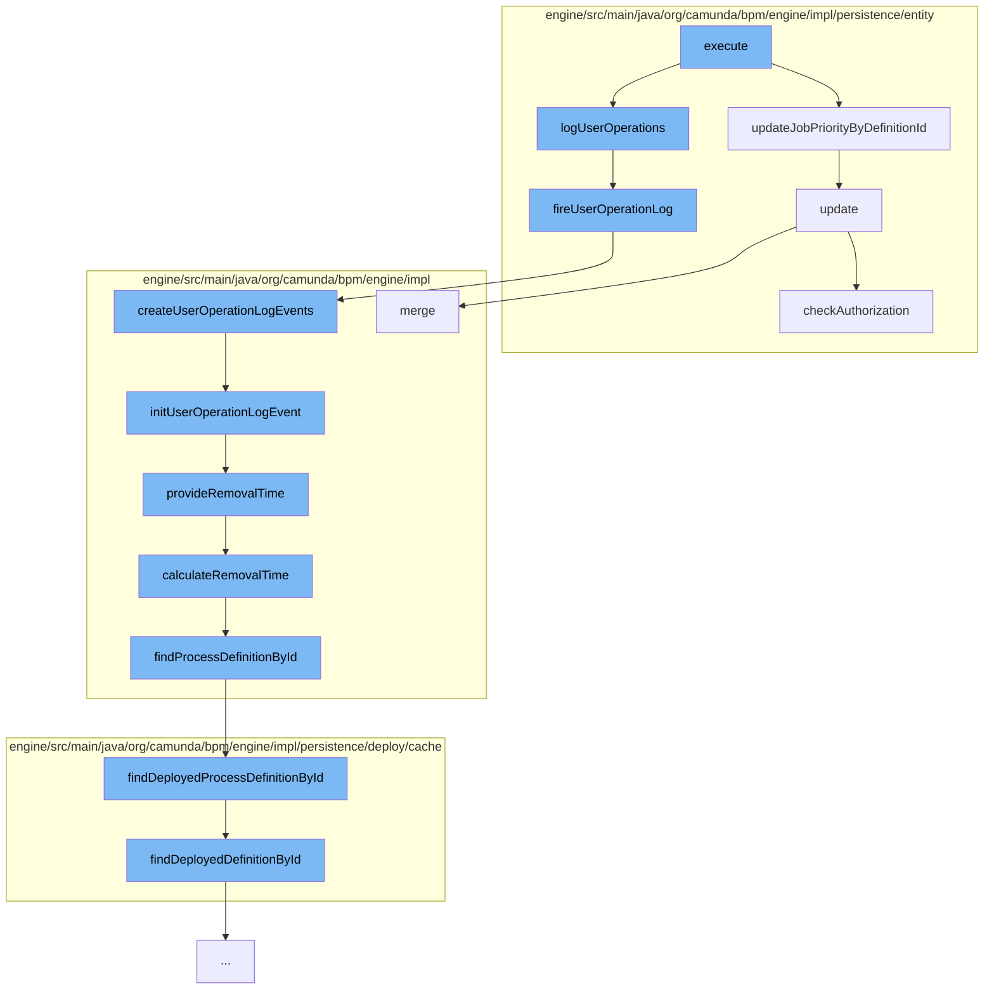

This document will cover the process of setting job definition priority in the Camunda BPM engine. The process includes the following steps:

1. Updating job priority by definition ID
2. Logging user operations
3. Creating user operation log events
4. Initializing user operation log event
5. Providing removal time
6. Calculating removal time
7. Finding process definition by ID
8. Finding deployed process definition by ID
9. Updating authorization



<SwmSnippet path="/engine/src/main/java/org/camunda/bpm/engine/impl/persistence/entity/JobManager.java" line="408">

---

# Updating Job Priority by Definition ID

The function `updateJobPriorityByDefinitionId` is used to update the priority of a job by its definition ID. It takes in the job definition ID and the new priority as parameters, and updates the job entity in the database.

```java
  public void updateJobPriorityByDefinitionId(String jobDefinitionId, long priority) {
    Map<String, Object> parameters = new HashMap<>();
    parameters.put("jobDefinitionId", jobDefinitionId);
    parameters.put("priority", priority);
    getDbEntityManager().update(JobEntity.class, "updateJobPriorityByDefinitionId", parameters);
  }
```

---

</SwmSnippet>

<SwmSnippet path="/engine/src/main/java/org/camunda/bpm/engine/impl/persistence/entity/UserOperationLogManager.java" line="779">

---

# Logging User Operations

The function `fireUserOperationLog` is used to log user operations. It takes in a UserOperationLogContext object, sets the user ID if it's not already set, and processes history events.

```java
  protected void fireUserOperationLog(final UserOperationLogContext context) {
    if (context.getUserId() == null) {
      context.setUserId(getAuthenticatedUserId());
    }

    HistoryEventProcessor.processHistoryEvents(new HistoryEventProcessor.HistoryEventCreator() {
      @Override
      public List<HistoryEvent> createHistoryEvents(HistoryEventProducer producer) {
        return producer.createUserOperationLogEvents(context);
      }
    });
  }
```

---

</SwmSnippet>

<SwmSnippet path="/engine/src/main/java/org/camunda/bpm/engine/impl/history/producer/DefaultHistoryEventProducer.java" line="822">

---

# Creating User Operation Log Events

The function `createUserOperationLogEvents` is used to create user operation log events. It takes in a UserOperationLogContext object, and for each entry in the context, it creates a new UserOperationLogEntryEventEntity and initializes it.

```java
  public List<HistoryEvent> createUserOperationLogEvents(UserOperationLogContext context) {
    List<HistoryEvent> historyEvents = new ArrayList<HistoryEvent>();

    String operationId = Context.getCommandContext().getOperationId();
    context.setOperationId(operationId);

    for (UserOperationLogContextEntry entry : context.getEntries()) {
      for (PropertyChange propertyChange : entry.getPropertyChanges()) {
        UserOperationLogEntryEventEntity evt = new UserOperationLogEntryEventEntity();

        initUserOperationLogEvent(evt, context, entry, propertyChange);

        historyEvents.add(evt);
      }
    }

    return historyEvents;
  }
```

---

</SwmSnippet>

<SwmSnippet path="/engine/src/main/java/org/camunda/bpm/engine/impl/history/producer/DefaultHistoryEventProducer.java" line="330">

---

# Initializing User Operation Log Event

The function `initUserOperationLogEvent` is used to initialize a user operation log event. It sets the properties of the event entity based on the context, context entry, and property change.

```java
  protected void initUserOperationLogEvent(UserOperationLogEntryEventEntity evt, UserOperationLogContext context,
      UserOperationLogContextEntry contextEntry, PropertyChange propertyChange) {
    // init properties
    evt.setDeploymentId(contextEntry.getDeploymentId());
    evt.setEntityType(contextEntry.getEntityType());
    evt.setOperationType(contextEntry.getOperationType());
    evt.setOperationId(context.getOperationId());
    evt.setUserId(context.getUserId());
    evt.setProcessDefinitionId(contextEntry.getProcessDefinitionId());
    evt.setProcessDefinitionKey(contextEntry.getProcessDefinitionKey());
    evt.setProcessInstanceId(contextEntry.getProcessInstanceId());
    evt.setExecutionId(contextEntry.getExecutionId());
    evt.setCaseDefinitionId(contextEntry.getCaseDefinitionId());
    evt.setCaseInstanceId(contextEntry.getCaseInstanceId());
    evt.setCaseExecutionId(contextEntry.getCaseExecutionId());
    evt.setTaskId(contextEntry.getTaskId());
    evt.setJobId(contextEntry.getJobId());
    evt.setJobDefinitionId(contextEntry.getJobDefinitionId());
    evt.setBatchId(contextEntry.getBatchId());
    evt.setCategory(contextEntry.getCategory());
    evt.setTimestamp(ClockUtil.getCurrentTime());
```

---

</SwmSnippet>

<SwmSnippet path="/engine/src/main/java/org/camunda/bpm/engine/impl/history/producer/DefaultHistoryEventProducer.java" line="1300">

---

# Providing Removal Time

The function `provideRemovalTime` is used to provide the removal time for a historic batch. It calculates the removal time and sets it if it's not null.

```java
  protected void provideRemovalTime(HistoricBatchEntity historicBatch) {
    Date removalTime = calculateRemovalTime(historicBatch);
    if (removalTime != null) {
      historicBatch.setRemovalTime(removalTime);
    }
  }
```

---

</SwmSnippet>

<SwmSnippet path="/engine/src/main/java/org/camunda/bpm/engine/impl/history/producer/DefaultHistoryEventProducer.java" line="1285">

---

# Calculating Removal Time

The function `calculateRemovalTime` is used to calculate the removal time for a history event. It finds the process definition by ID and calculates the removal time based on the historic process instance event entity and the process definition.

```java
  protected Date calculateRemovalTime(HistoryEvent historyEvent) {
    String processDefinitionId = historyEvent.getProcessDefinitionId();
    ProcessDefinition processDefinition = findProcessDefinitionById(processDefinitionId);

    return Context.getProcessEngineConfiguration()
      .getHistoryRemovalTimeProvider()
      .calculateRemovalTime((HistoricProcessInstanceEventEntity) historyEvent, processDefinition);
  }
```

---

</SwmSnippet>

<SwmSnippet path="/engine/src/main/java/org/camunda/bpm/engine/impl/history/producer/DefaultHistoryEventProducer.java" line="1326">

---

# Finding Process Definition by ID

The function `findProcessDefinitionById` is used to find the process definition by its ID. It retrieves the process definition from the deployment cache.

```java
  protected ProcessDefinition findProcessDefinitionById(String processDefinitionId) {
    return Context.getCommandContext()
      .getProcessEngineConfiguration()
      .getDeploymentCache()
      .findDeployedProcessDefinitionById(processDefinitionId);
  }
```

---

</SwmSnippet>

<SwmSnippet path="/engine/src/main/java/org/camunda/bpm/engine/impl/persistence/deploy/cache/DeploymentCache.java" line="80">

---

# Finding Deployed Process Definition by ID

The function `findDeployedProcessDefinitionById` is used to find the deployed process definition by its ID. It retrieves the process definition from the process definition entity cache.

```java
  public ProcessDefinitionEntity findDeployedProcessDefinitionById(String processDefinitionId) {
    return processDefinitionEntityCache.findDeployedDefinitionById(processDefinitionId);
  }
```

---

</SwmSnippet>

<SwmSnippet path="/engine/src/main/java/org/camunda/bpm/engine/impl/persistence/entity/AuthorizationManager.java" line="181">

---

# Updating Authorization

The function `update` is used to update an authorization entity. It checks the authorization and merges the authorization entity into the database.

```java
  public void update(AuthorizationEntity authorization) {
    checkAuthorization(UPDATE, AUTHORIZATION, authorization.getId());
    getDbEntityManager().merge(authorization);
  }
```

---

</SwmSnippet>

&nbsp;

*This is an auto-generated document by Swimm AI 🌊 and has not yet been verified by a human*

<SwmMeta version="3.0.0" repo-id="Z2l0aHViJTNBJTNBQ2l0aS1jYW11bmRhJTNBJTNBZ2lsYWRuYXZvdA==" repo-name="Citi-camunda" doc-type="flows"><sup>Powered by [Swimm](/)</sup></SwmMeta>
