This document will cover the process of recalculating job due dates in the Camunda BPMN engine, which includes:

1. Context switching
2. Finding timer declarations
3. Getting process definitions
4. Checking Camunda admin permissions
5. Acquiring jobs

```mermaid
graph TD;
subgraph engine/src/main/java/org/camunda/bpm/engine/impl
  execute:::mainFlowStyle --> doContextSwitch
end
subgraph engine/src/main/java/org/camunda/bpm/engine/impl/cmd
  execute:::mainFlowStyle --> findTimerDeclaration
end
subgraph engine/src/main/java/org/camunda/bpm/engine/impl/jobexecutor
  doContextSwitch --> run
end
subgraph engine/src/main/java/org/camunda/bpm/engine/impl/jobexecutor
  run --> acquireJobs
end
subgraph engine/src/main/java/org/camunda/bpm/engine/impl/cmd
  findTimerDeclaration:::mainFlowStyle --> findTimerDeclarationForProcessStartEvent
end
subgraph engine/src/main/java/org/camunda/bpm/engine/impl/cmd
  findTimerDeclaration:::mainFlowStyle --> findTimerDeclarationForActivity
end
subgraph engine/src/main/java/org/camunda/bpm/engine/impl/persistence/deploy/cache
  findTimerDeclarationForProcessStartEvent --> findDeployedProcessDefinitionById
end
subgraph engine/src/main/java/org/camunda/bpm/engine/impl/persistence/deploy/cache
  findDeployedProcessDefinitionById --> findDeployedDefinitionById
end
subgraph engine/src/main/java/org/camunda/bpm/engine/impl/cmd
  findTimerDeclarationForActivity:::mainFlowStyle --> getProcessDefinition
end
subgraph engine/src/main/java/org/camunda/bpm/engine/impl/jobexecutor
  findTimerDeclarationForActivity:::mainFlowStyle --> getDeclarationsForScope
end
subgraph engine/src/main/java/org/camunda/bpm/engine/impl/cmd
  findTimerDeclarationForActivity:::mainFlowStyle --> findTimeoutListenerDeclaration
end
subgraph engine/src/main/java/org/camunda/bpm/engine/impl/persistence/deploy/cache
  getProcessDefinition --> findDeployedProcessDefinitionById
end
subgraph engine/src/main/java/org/camunda/bpm/engine/impl/jobexecutor
  findTimeoutListenerDeclaration:::mainFlowStyle --> getTimeoutListenerDeclarationsForScope
end
subgraph engine/src/main/java/org/camunda/bpm/engine/impl
  getTimeoutListenerDeclarationsForScope:::mainFlowStyle --> getProperties
end
subgraph engine/src/main/java/org/camunda/bpm/engine/impl
  getProperties:::mainFlowStyle --> execute
end
subgraph engine/src/main/java/org/camunda/bpm/engine/impl/persistence/entity/AuthorizationManager.java
  execute:::mainFlowStyle --> checkCamundaAdmin
end
subgraph engine/src/main/java/org/camunda/bpm/engine/impl
  checkCamundaAdmin:::mainFlowStyle --> requiredCamundaAdmin
end
subgraph engine/src/main/java/org/camunda/bpm/engine/impl
  requiredCamundaAdmin:::mainFlowStyle --> requiredCamundaAdminOrPermissionException
end
  requiredCamundaAdminOrPermissionException:::mainFlowStyle --> ...

 classDef mainFlowStyle color:#000000,fill:#7CB9F4
  classDef rootsStyle color:#000000,fill:#00FFF4
```



<SwmSnippet path="/engine/src/main/java/org/camunda/bpm/engine/impl/context/ProcessApplicationContextUtil.java" line="177">

---

# Context Switching

The `doContextSwitch` function is used to switch the context of the process application. This is necessary when the process application needs to be executed within a different context.

```java
  public static void doContextSwitch(final Runnable runnable, ProcessDefinitionEntity contextDefinition) {
    ProcessApplicationReference processApplication = getTargetProcessApplication(contextDefinition);
    if (requiresContextSwitch(processApplication)) {
      Context.executeWithinProcessApplication(new Callable<Void>() {

        @Override
        public Void call() throws Exception {
          runnable.run();
          return null;
        }
      }, processApplication);
    }
    else {
      runnable.run();
    }
  }
```

---

</SwmSnippet>

<SwmSnippet path="/engine/src/main/java/org/camunda/bpm/engine/impl/cmd/RecalculateJobDuedateCmd.java" line="168">

---

# Finding Timer Declarations

The `findTimerDeclarationForProcessStartEvent` function is used to find timer declarations for the process start event. This is necessary for recalculating job due dates.

```java
  protected TimerDeclarationImpl findTimerDeclarationForProcessStartEvent(CommandContext commandContext, JobEntity job) {
    ProcessDefinitionEntity processDefinition = commandContext.getProcessEngineConfiguration().getDeploymentCache().findDeployedProcessDefinitionById(job.getProcessDefinitionId());
    @SuppressWarnings("unchecked")
    List<TimerDeclarationImpl> timerDeclarations = (List<TimerDeclarationImpl>) processDefinition.getProperty(BpmnParse.PROPERTYNAME_START_TIMER);
    for (TimerDeclarationImpl timerDeclarationCandidate : timerDeclarations) {
      if (timerDeclarationCandidate.getJobDefinitionId().equals(job.getJobDefinitionId())) {
        return timerDeclarationCandidate;
      }
    }
    return null;
  }
```

---

</SwmSnippet>

<SwmSnippet path="/engine/src/main/java/org/camunda/bpm/engine/impl/cmd/AbstractRestartProcessInstanceCmd.java" line="84">

---

# Getting Process Definitions

The `getProcessDefinition` function is used to get the process definition by its ID. This is necessary for finding timer declarations.

```java
  protected ProcessDefinitionEntity getProcessDefinition(CommandContext commandContext, String processDefinitionId) {

    return commandContext
        .getProcessEngineConfiguration()
        .getDeploymentCache()
        .findDeployedProcessDefinitionById(processDefinitionId);
  }
```

---

</SwmSnippet>

<SwmSnippet path="/engine/src/main/java/org/camunda/bpm/engine/impl/persistence/entity/AuthorizationManager.java" line="495">

---

# Checking Camunda Admin Permissions

The `checkCamundaAdmin` function is used to check if the current authentication contains the group CAMUNDA_ADMIN. This is necessary for authorization purposes.

```java
  // predefined authorization checks

  /* MEMBER OF CAMUNDA_ADMIN */

  /**
   * Checks if the current authentication contains the group
   * {@link Groups#CAMUNDA_ADMIN}. The check is ignored if the authorization is
   * disabled or no authentication exists.
   *
   * @throws AuthorizationException
   */
  public void checkCamundaAdmin() {
    final Authentication currentAuthentication = getCurrentAuthentication();

    if (isAuthorizationEnabled() && getCommandContext().isAuthorizationCheckEnabled()
        && currentAuthentication != null && !isCamundaAdmin(currentAuthentication)) {

      throw LOG.requiredCamundaAdmin();
    }
  }
```

---

</SwmSnippet>

<SwmSnippet path="/engine/src/main/java/org/camunda/bpm/engine/impl/jobexecutor/SequentialJobAcquisitionRunnable.java" line="151">

---

# Acquiring Jobs

The `acquireJobs` function is used to acquire jobs for execution. This is the final step in the process of recalculating job due dates.

```java
  protected AcquiredJobs acquireJobs(
      JobAcquisitionContext context,
      JobAcquisitionStrategy acquisitionStrategy,
      ProcessEngineImpl currentProcessEngine) {
    CommandExecutor commandExecutor = currentProcessEngine.getProcessEngineConfiguration()
        .getCommandExecutorTxRequired();

    int numJobsToAcquire = acquisitionStrategy.getNumJobsToAcquire(currentProcessEngine.getName());

    AcquiredJobs acquiredJobs = null;

    if (numJobsToAcquire > 0) {
      jobExecutor.logAcquisitionAttempt(currentProcessEngine);
      acquiredJobs = commandExecutor.execute(jobExecutor.getAcquireJobsCmd(numJobsToAcquire));
    }
    else {
      acquiredJobs = new AcquiredJobs(numJobsToAcquire);
    }

    context.submitAcquiredJobs(currentProcessEngine.getName(), acquiredJobs);

```

---

</SwmSnippet>

&nbsp;

*This is an auto-generated document by Swimm AI 🌊 and has not yet been verified by a human*

<SwmMeta version="3.0.0" repo-id="Z2l0aHViJTNBJTNBQ2l0aS1jYW11bmRhJTNBJTNBZ2lsYWRuYXZvdA==" repo-name="Citi-camunda" doc-type="flows"><sup>Powered by [Swimm](/)</sup></SwmMeta>
