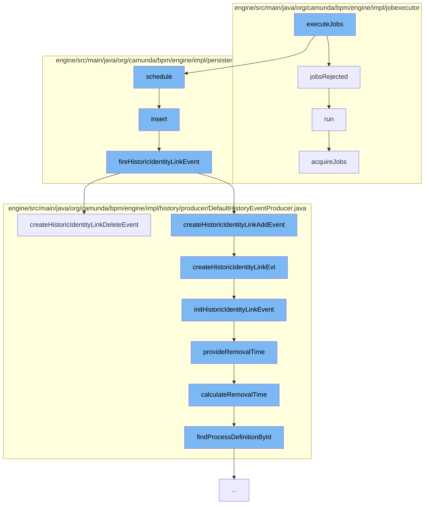

This document will cover the process of job execution in the Camunda BPM engine, which includes:

 1. Execution of jobs
 2. Handling of rejected jobs
 3. Scheduling of jobs
 4. Insertion of identity links
 5. Firing of historic identity link events
 6. Creation of historic identity link events
 7. Initialization of historic identity link events
 8. Provision of removal time for historic identity link events
 9. Calculation of removal time for historic identity link events
10. Acquisition of jobs.



<SwmSnippet path="/engine/src/main/java/org/camunda/bpm/engine/impl/jobexecutor/RuntimeContainerJobExecutor.java" line="1">

---

# Execution of Jobs

The `executeJobs` function in `RuntimeContainerJobExecutor` is the entry point for job execution in the Camunda BPM engine.

```java
/*
 * Copyright Camunda Services GmbH and/or licensed to Camunda Services GmbH
 * under one or more contributor license agreements. See the NOTICE file
 * distributed with this work for additional information regarding copyright
 * ownership. Camunda licenses this file to you under the Apache License,
 * Version 2.0; you may not use this file except in compliance with the License.
 * You may obtain a copy of the License at
 *
 *     http://www.apache.org/licenses/LICENSE-2.0
 *
 * Unless required by applicable law or agreed to in writing, software
 * distributed under the License is distributed on an "AS IS" BASIS,
 * WITHOUT WARRANTIES OR CONDITIONS OF ANY KIND, either express or implied.
 * See the License for the specific language governing permissions and
 * limitations under the License.
 */
package org.camunda.bpm.engine.impl.jobexecutor;

import java.util.List;

import org.camunda.bpm.container.ExecutorService;
```

---

</SwmSnippet>

<SwmSnippet path="/engine/src/main/java/org/camunda/bpm/engine/impl/jobexecutor/CallerRunsRejectedJobsHandler.java" line="29">

---

# Handling of Rejected Jobs

The `jobsRejected` function in `CallerRunsRejectedJobsHandler` is called when jobs are rejected. It runs the jobs directly in the calling thread.

```java
  public void jobsRejected(List<String> jobIds, ProcessEngineImpl processEngine, JobExecutor jobExecutor) {
    jobExecutor.getExecuteJobsRunnable(jobIds, processEngine).run();
  }
```

---

</SwmSnippet>

<SwmSnippet path="/engine/src/main/java/org/camunda/bpm/engine/impl/persistence/entity/JobManager.java" line="1">

---

# Scheduling of Jobs

The `schedule` function in `JobManager` is responsible for scheduling jobs for execution.

```java
/*
 * Copyright Camunda Services GmbH and/or licensed to Camunda Services GmbH
 * under one or more contributor license agreements. See the NOTICE file
 * distributed with this work for additional information regarding copyright
 * ownership. Camunda licenses this file to you under the Apache License,
 * Version 2.0; you may not use this file except in compliance with the License.
 * You may obtain a copy of the License at
 *
 *     http://www.apache.org/licenses/LICENSE-2.0
 *
 * Unless required by applicable law or agreed to in writing, software
 * distributed under the License is distributed on an "AS IS" BASIS,
 * WITHOUT WARRANTIES OR CONDITIONS OF ANY KIND, either express or implied.
 * See the License for the specific language governing permissions and
 * limitations under the License.
 */
package org.camunda.bpm.engine.impl.persistence.entity;

import static org.camunda.bpm.engine.impl.jobexecutor.TimerEventJobHandler.JOB_HANDLER_CONFIG_PROPERTY_DELIMITER;
import static org.camunda.bpm.engine.impl.jobexecutor.TimerEventJobHandler.JOB_HANDLER_CONFIG_PROPERTY_FOLLOW_UP_JOB_CREATED;
import static org.camunda.bpm.engine.impl.util.EnsureUtil.ensureNotNull;
```

---

</SwmSnippet>

<SwmSnippet path="/engine/src/main/java/org/camunda/bpm/engine/impl/persistence/entity/IdentityLinkEntity.java" line="82">

---

# Insertion of Identity Links

The `insert` function in `IdentityLinkEntity` is used to insert identity links, which are used for managing permissions and associations between users, groups, and tasks.

```java
  public void insert() {
    Context
      .getCommandContext()
      .getDbEntityManager()
      .insert(this);
    fireHistoricIdentityLinkEvent(HistoryEventTypes.IDENTITY_LINK_ADD);
  }
```

---

</SwmSnippet>

<SwmSnippet path="/engine/src/main/java/org/camunda/bpm/engine/impl/persistence/entity/IdentityLinkEntity.java" line="204">

---

# Firing of Historic Identity Link Events

The `fireHistoricIdentityLinkEvent` function in `IdentityLinkEntity` is used to fire historic identity link events, which are used for auditing and tracking changes to identity links over time.

```java
  public void fireHistoricIdentityLinkEvent(final HistoryEventType eventType) {
    ProcessEngineConfigurationImpl processEngineConfiguration = Context.getProcessEngineConfiguration();

    HistoryLevel historyLevel = processEngineConfiguration.getHistoryLevel();
    if(historyLevel.isHistoryEventProduced(eventType, this)) {

      HistoryEventProcessor.processHistoryEvents(new HistoryEventProcessor.HistoryEventCreator() {
        @Override
        public HistoryEvent createHistoryEvent(HistoryEventProducer producer) {
          HistoryEvent event = null;
          if (HistoryEvent.IDENTITY_LINK_ADD.equals(eventType.getEventName())) {
            event = producer.createHistoricIdentityLinkAddEvent(IdentityLinkEntity.this);
          } else if (HistoryEvent.IDENTITY_LINK_DELETE.equals(eventType.getEventName())) {
            event = producer.createHistoricIdentityLinkDeleteEvent(IdentityLinkEntity.this);
          }
          return event;
        }
      });

    }
  }
```

---

</SwmSnippet>

<SwmSnippet path="/engine/src/main/java/org/camunda/bpm/engine/impl/history/producer/DefaultHistoryEventProducer.java" line="945">

---

# Creation of Historic Identity Link Events

The `createHistoricIdentityLinkDeleteEvent` and `createHistoricIdentityLinkAddEvent` functions in `DefaultHistoryEventProducer` are used to create historic identity link events.

```java
  @Override
  public HistoryEvent createHistoricIdentityLinkDeleteEvent(IdentityLink identityLink) {
    return createHistoricIdentityLinkEvt(identityLink, HistoryEventTypes.IDENTITY_LINK_DELETE);
  }
```

---

</SwmSnippet>

<SwmSnippet path="/engine/src/main/java/org/camunda/bpm/engine/impl/history/producer/DefaultHistoryEventProducer.java" line="962">

---

# Initialization of Historic Identity Link Events

The `initHistoricIdentityLinkEvent` function in `DefaultHistoryEventProducer` is used to initialize historic identity link events.

```java
  protected void initHistoricIdentityLinkEvent(HistoricIdentityLinkLogEventEntity evt, IdentityLink identityLink, HistoryEventType eventType) {

    if (identityLink.getTaskId() != null) {
      TaskEntity task = Context
          .getCommandContext()
          .getTaskManager()
          .findTaskById(identityLink.getTaskId());

      evt.setProcessDefinitionId(task.getProcessDefinitionId());

      if (task.getProcessDefinition() != null) {
        evt.setProcessDefinitionKey(task.getProcessDefinition().getKey());
      }

      ExecutionEntity execution = task.getExecution();
      if (execution != null) {
        evt.setRootProcessInstanceId(execution.getRootProcessInstanceId());

        if (isHistoryRemovalTimeStrategyStart()) {
          provideRemovalTime(evt);
        }
```

---

</SwmSnippet>

<SwmSnippet path="/engine/src/main/java/org/camunda/bpm/engine/impl/history/producer/DefaultHistoryEventProducer.java" line="1300">

---

# Provision of Removal Time for Historic Identity Link Events

The `provideRemovalTime` function in `DefaultHistoryEventProducer` is used to provide the removal time for historic identity link events.

```java
  protected void provideRemovalTime(HistoricBatchEntity historicBatch) {
    Date removalTime = calculateRemovalTime(historicBatch);
    if (removalTime != null) {
      historicBatch.setRemovalTime(removalTime);
    }
  }
```

---

</SwmSnippet>

<SwmSnippet path="/engine/src/main/java/org/camunda/bpm/engine/impl/history/producer/DefaultHistoryEventProducer.java" line="1285">

---

# Calculation of Removal Time for Historic Identity Link Events

The `calculateRemovalTime` function in `DefaultHistoryEventProducer` is used to calculate the removal time for historic identity link events.

```java
  protected Date calculateRemovalTime(HistoryEvent historyEvent) {
    String processDefinitionId = historyEvent.getProcessDefinitionId();
    ProcessDefinition processDefinition = findProcessDefinitionById(processDefinitionId);

    return Context.getProcessEngineConfiguration()
      .getHistoryRemovalTimeProvider()
      .calculateRemovalTime((HistoricProcessInstanceEventEntity) historyEvent, processDefinition);
  }
```

---

</SwmSnippet>

<SwmSnippet path="/engine/src/main/java/org/camunda/bpm/engine/impl/jobexecutor/SequentialJobAcquisitionRunnable.java" line="151">

---

# Acquisition of Jobs

The `acquireJobs` function in `SequentialJobAcquisitionRunnable` is used to acquire jobs for execution.

```java
  protected AcquiredJobs acquireJobs(
      JobAcquisitionContext context,
      JobAcquisitionStrategy acquisitionStrategy,
      ProcessEngineImpl currentProcessEngine) {
    CommandExecutor commandExecutor = currentProcessEngine.getProcessEngineConfiguration()
        .getCommandExecutorTxRequired();

    int numJobsToAcquire = acquisitionStrategy.getNumJobsToAcquire(currentProcessEngine.getName());

    AcquiredJobs acquiredJobs = null;

    if (numJobsToAcquire > 0) {
      jobExecutor.logAcquisitionAttempt(currentProcessEngine);
      acquiredJobs = commandExecutor.execute(jobExecutor.getAcquireJobsCmd(numJobsToAcquire));
    }
    else {
      acquiredJobs = new AcquiredJobs(numJobsToAcquire);
    }

    context.submitAcquiredJobs(currentProcessEngine.getName(), acquiredJobs);

```

---

</SwmSnippet>

&nbsp;

*This is an auto-generated document by Swimm AI 🌊 and has not yet been verified by a human*

<SwmMeta version="3.0.0" repo-id="Z2l0aHViJTNBJTNBQ2l0aS1jYW11bmRhJTNBJTNBZ2lsYWRuYXZvdA==" repo-name="Citi-camunda" doc-type="flows"><sup>Powered by [Swimm](/)</sup></SwmMeta>
