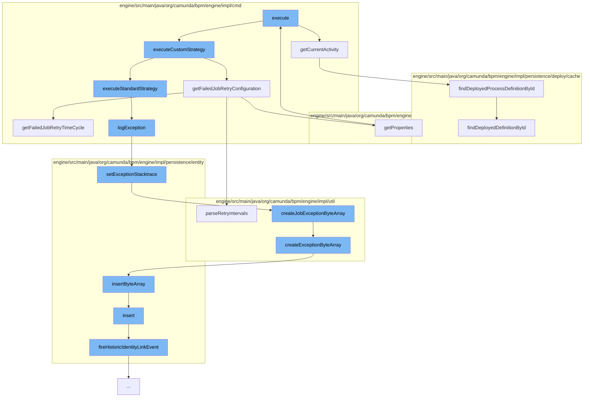

This document will cover the process of handling job retries in the Camunda BPMN engine, which includes:

1. Retrieving the current activity
2. Getting the failed job retry configuration
3. Executing the standard strategy
4. Logging the exception
5. Setting the exception stacktrace
6. Creating the job exception byte array
7. Inserting the byte array
8. Firing the historic identity link event.



<SwmSnippet path="/engine/src/main/java/org/camunda/bpm/engine/impl/cmd/DefaultJobRetryCmd.java" line="127">

---

# Retrieving the current activity

The `getCurrentActivity` function retrieves the current activity from the job handler. If the job handler type is supported, it fetches the process definition from the deployment cache and finds the activity by its ID.

```java
  protected ActivityImpl getCurrentActivity(CommandContext commandContext, JobEntity job) {
    String type = job.getJobHandlerType();
    ActivityImpl activity = null;

    if (SUPPORTED_TYPES.contains(type)) {
      DeploymentCache deploymentCache = Context.getProcessEngineConfiguration().getDeploymentCache();
      ProcessDefinitionEntity processDefinitionEntity =
          deploymentCache.findDeployedProcessDefinitionById(job.getProcessDefinitionId());
      activity = processDefinitionEntity.findActivity(job.getActivityId());

    } else {
      // noop, because activity type is not supported
    }

    return activity;
  }
```

---

</SwmSnippet>

<SwmSnippet path="/engine/src/main/java/org/camunda/bpm/engine/impl/cmd/DefaultJobRetryCmd.java" line="150">

---

# Getting the failed job retry configuration

The `getFailedJobRetryConfiguration` function retrieves the retry configuration for the failed job. If the retry configuration has an expression, it parses the retry intervals from the failed job's retry time cycle.

```java
  protected FailedJobRetryConfiguration getFailedJobRetryConfiguration(JobEntity job, ActivityImpl activity) {
    FailedJobRetryConfiguration retryConfiguration = activity.getProperties().get(DefaultFailedJobParseListener.FAILED_JOB_CONFIGURATION);

    while (retryConfiguration != null && retryConfiguration.getExpression() != null) {
      String retryIntervals = getFailedJobRetryTimeCycle(job, retryConfiguration.getExpression());
      retryConfiguration = ParseUtil.parseRetryIntervals(retryIntervals);
    }

    return retryConfiguration;
  }
```

---

</SwmSnippet>

<SwmSnippet path="/engine/src/main/java/org/camunda/bpm/engine/impl/cmd/JobRetryCmd.java" line="51">

---

# Executing the standard strategy

The `logException` function logs the exception message and stacktrace if an exception occurred during the job execution.

```java
  protected void logException(JobEntity job) {
    if(exception != null) {
      job.setExceptionMessage(exception.getMessage());
      job.setExceptionStacktrace(getExceptionStacktrace());
    }
  }
```

---

</SwmSnippet>

<SwmSnippet path="/engine/src/main/java/org/camunda/bpm/engine/impl/persistence/entity/JobEntity.java" line="438">

---

# Logging the exception

The `setExceptionStacktrace` function sets the exception stacktrace for the job. If the job doesn't have an exception byte array, it creates a new one.

```java
  public void setExceptionStacktrace(String exception) {
    byte[] exceptionBytes = toByteArray(exception);

    ByteArrayEntity byteArray = getExceptionByteArray();

    if(byteArray == null) {
      byteArray = createJobExceptionByteArray(exceptionBytes, ResourceTypes.RUNTIME);
      exceptionByteArrayId = byteArray.getId();
      exceptionByteArray = byteArray;
    }
    else {
      byteArray.setBytes(exceptionBytes);
    }
  }
```

---

</SwmSnippet>

<SwmSnippet path="/engine/src/main/java/org/camunda/bpm/engine/impl/util/ExceptionUtil.java" line="65">

---

# Setting the exception stacktrace

The `createJobExceptionByteArray` function creates a new byte array entity for the job exception.

```java
  public static ByteArrayEntity createJobExceptionByteArray(byte[] byteArray, ResourceType type) {
    return createExceptionByteArray("job.exceptionByteArray", byteArray, type);
  }
```

---

</SwmSnippet>

<SwmSnippet path="/engine/src/main/java/org/camunda/bpm/engine/impl/util/ExceptionUtil.java" line="80">

---

# Creating the job exception byte array

The `createExceptionByteArray` function creates a new byte array entity for the exception and inserts it into the byte array manager.

```java
  public static ByteArrayEntity createExceptionByteArray(String name, byte[] byteArray, ResourceType type) {
    ByteArrayEntity result = null;

    if (byteArray != null) {
      result = new ByteArrayEntity(name, byteArray, type);
      Context.getCommandContext()
        .getByteArrayManager()
        .insertByteArray(result);
    }

    return result;
  }
```

---

</SwmSnippet>

<SwmSnippet path="/engine/src/main/java/org/camunda/bpm/engine/impl/persistence/entity/ByteArrayManager.java" line="44">

---

# Inserting the byte array

The `insertByteArray` function inserts the byte array entity into the database.

```java
  public void insertByteArray(ByteArrayEntity arr) {
    arr.setCreateTime(ClockUtil.getCurrentTime());
    getDbEntityManager().insert(arr);
  }
```

---

</SwmSnippet>

<SwmSnippet path="/engine/src/main/java/org/camunda/bpm/engine/impl/persistence/entity/IdentityLinkEntity.java" line="204">

---

# Firing the historic identity link event

The `fireHistoricIdentityLinkEvent` function fires a historic identity link event. This is used for auditing purposes.

```java
  public void fireHistoricIdentityLinkEvent(final HistoryEventType eventType) {
    ProcessEngineConfigurationImpl processEngineConfiguration = Context.getProcessEngineConfiguration();

    HistoryLevel historyLevel = processEngineConfiguration.getHistoryLevel();
    if(historyLevel.isHistoryEventProduced(eventType, this)) {

      HistoryEventProcessor.processHistoryEvents(new HistoryEventProcessor.HistoryEventCreator() {
        @Override
        public HistoryEvent createHistoryEvent(HistoryEventProducer producer) {
          HistoryEvent event = null;
          if (HistoryEvent.IDENTITY_LINK_ADD.equals(eventType.getEventName())) {
            event = producer.createHistoricIdentityLinkAddEvent(IdentityLinkEntity.this);
          } else if (HistoryEvent.IDENTITY_LINK_DELETE.equals(eventType.getEventName())) {
            event = producer.createHistoricIdentityLinkDeleteEvent(IdentityLinkEntity.this);
          }
          return event;
        }
      });

    }
  }
```

---

</SwmSnippet>

&nbsp;

*This is an auto-generated document by Swimm AI 🌊 and has not yet been verified by a human*

<SwmMeta version="3.0.0" repo-id="Z2l0aHViJTNBJTNBQ2l0aS1jYW11bmRhJTNBJTNBZ2lsYWRuYXZvdA==" repo-name="Citi-camunda" doc-type="flows"><sup>Powered by [Swimm](/)</sup></SwmMeta>
