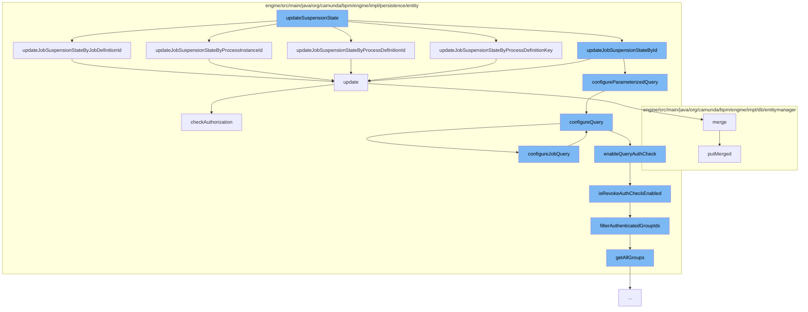

This document will cover the process of updating the job suspension state in the Camunda BPM engine. The steps include:

1. Invoking the `updateSuspensionState` method
2. Updating the job suspension state by various parameters
3. Configuring the query parameters
4. Checking and updating the authorization
5. Merging the updated entity into the database.



<SwmSnippet path="/engine/src/main/java/org/camunda/bpm/engine/impl/cmd/AbstractSetJobStateCmd.java" line="1">

---

# Invoking the `updateSuspensionState` method

The `updateSuspensionState` method is the entry point for this flow. It is responsible for updating the suspension state of a job in the Camunda BPM engine.

```java
/*
 * Copyright Camunda Services GmbH and/or licensed to Camunda Services GmbH
 * under one or more contributor license agreements. See the NOTICE file
 * distributed with this work for additional information regarding copyright
 * ownership. Camunda licenses this file to you under the Apache License,
 * Version 2.0; you may not use this file except in compliance with the License.
 * You may obtain a copy of the License at
 *
 *     http://www.apache.org/licenses/LICENSE-2.0
 *
```

---

</SwmSnippet>

<SwmSnippet path="/engine/src/main/java/org/camunda/bpm/engine/impl/persistence/entity/JobManager.java" line="334">

---

# Updating the job suspension state by various parameters

The `updateJobSuspensionStateByJobDefinitionId` method is called by `updateSuspensionState`. It updates the job suspension state based on the job definition ID.

```java
  public void updateJobSuspensionStateByJobDefinitionId(String jobDefinitionId, SuspensionState suspensionState) {
    Map<String, Object> parameters = new HashMap<>();
    parameters.put("jobDefinitionId", jobDefinitionId);
    parameters.put("suspensionState", suspensionState.getStateCode());
    getDbEntityManager().update(JobEntity.class, "updateJobSuspensionStateByParameters", configureParameterizedQuery(parameters));
  }
```

---

</SwmSnippet>

<SwmSnippet path="/engine/src/main/java/org/camunda/bpm/engine/impl/persistence/entity/JobManager.java" line="415">

---

# Configuring the query parameters

The `configureQuery` method is used to configure the job query with the necessary parameters.

```java
  protected void configureQuery(JobQueryImpl query) {
    getAuthorizationManager().configureJobQuery(query);
    getTenantManager().configureQuery(query);
  }
```

---

</SwmSnippet>

<SwmSnippet path="/engine/src/main/java/org/camunda/bpm/engine/impl/persistence/entity/AuthorizationManager.java" line="181">

---

# Checking and updating the authorization

The `update` method in the `AuthorizationManager` class is responsible for checking the authorization and updating the `AuthorizationEntity`.

```java
  public void update(AuthorizationEntity authorization) {
    checkAuthorization(UPDATE, AUTHORIZATION, authorization.getId());
    getDbEntityManager().merge(authorization);
  }
```

---

</SwmSnippet>

<SwmSnippet path="/engine/src/main/java/org/camunda/bpm/engine/impl/db/entitymanager/DbEntityManager.java" line="180">

---

# Merging the updated entity into the database

The `putMerged` method is used to merge the updated entity into the database.

```java
    List loadedObjects = persistenceSession.selectList(statement, parameter);
    return filterLoadedObjects(loadedObjects);
  }

  public Object selectOne(String statement, Object parameter) {
    Object result = persistenceSession.selectOne(statement, parameter);
    if (result instanceof DbEntity) {
      DbEntity loadedObject = (DbEntity) result;
      result = cacheFilter(loadedObject);
```

---

</SwmSnippet>

&nbsp;

*This is an auto-generated document by Swimm AI 🌊 and has not yet been verified by a human*

<SwmMeta version="3.0.0" repo-id="Z2l0aHViJTNBJTNBQ2l0aS1jYW11bmRhJTNBJTNBZ2lsYWRuYXZvdA==" repo-name="Citi-camunda" doc-type="flows"><sup>Powered by [Swimm](/)</sup></SwmMeta>
