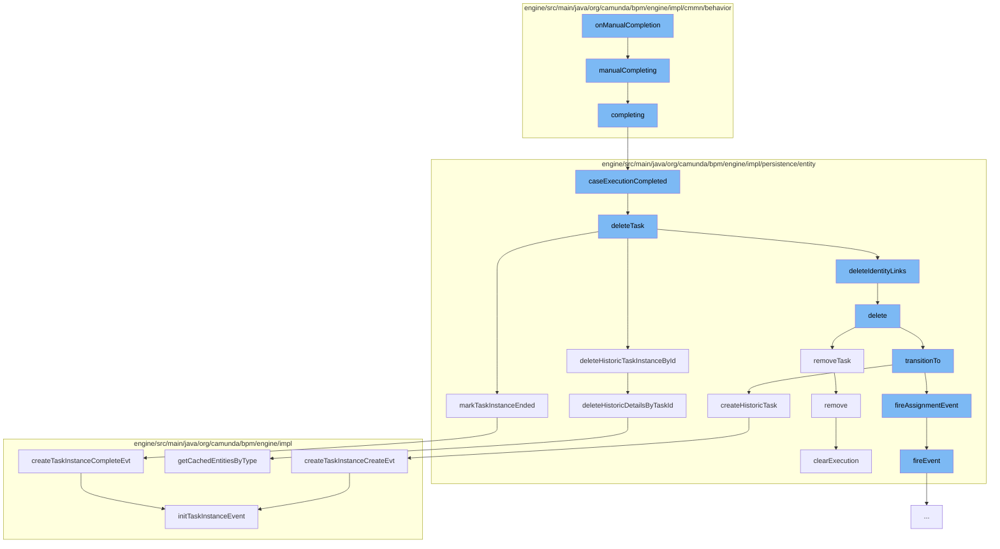

This document will cover the process of manual task completion in the Camunda BPMN engine, which includes:

1. Initiating manual completion
2. Completing the task
3. Deleting the task
4. Updating the historic task instance
5. Removing the task from execution



<SwmSnippet path="/engine/src/main/java/org/camunda/bpm/engine/impl/cmmn/behavior/HumanTaskActivityBehavior.java" line="66">

---

# Initiating manual completion

The `manualCompleting` function is the entry point for the manual completion process. It calls the `completing` function to start the task completion process.

```java
  protected void manualCompleting(CmmnActivityExecution execution) {
    completing(execution);
  }
```

---

</SwmSnippet>

<SwmSnippet path="/engine/src/main/java/org/camunda/bpm/engine/impl/cmmn/behavior/HumanTaskActivityBehavior.java" line="59">

---

# Completing the task

The `completing` function retrieves the task and calls `caseExecutionCompleted` on it to mark the task as completed.

```java
  protected void completing(CmmnActivityExecution execution) {
    TaskEntity task = getTask(execution);
    if (task != null) {
      task.caseExecutionCompleted();
    }
  }
```

---

</SwmSnippet>

<SwmSnippet path="/engine/src/main/java/org/camunda/bpm/engine/impl/persistence/entity/TaskEntity.java" line="351">

---

# Deleting the task

The `caseExecutionCompleted` function transitions the task to the completed state and then deletes the task.

```java
  public void caseExecutionCompleted() {
    // ensure the the Task is not suspended
    ensureTaskActive();

    // trigger TaskListener.complete event for a case execution associated task
    transitionTo(TaskState.STATE_COMPLETED);

    // delete the task
    Context
    .getCommandContext()
    .getTaskManager()
    .deleteTask(this, TaskEntity.DELETE_REASON_COMPLETED, false, false);
  }
```

---

</SwmSnippet>

<SwmSnippet path="/engine/src/main/java/org/camunda/bpm/engine/impl/persistence/entity/TaskManager.java" line="74">

---

# Updating the historic task instance

The `deleteTask` function removes identity links, deletes variable instances, and updates the historic task instance to reflect the task's completion.

```java
  public void deleteTask(TaskEntity task, String deleteReason, boolean cascade, boolean skipCustomListeners) {
    if (!task.isDeleted()) {
      task.setDeleted(true);

      CommandContext commandContext = Context.getCommandContext();
      String taskId = task.getId();

      List<Task> subTasks = findTasksByParentTaskId(taskId);
      for (Task subTask: subTasks) {
        ((TaskEntity) subTask).delete(deleteReason, cascade, skipCustomListeners);
      }

      task.deleteIdentityLinks();

      commandContext
        .getVariableInstanceManager()
        .deleteVariableInstanceByTask(task);

      if (cascade) {
        commandContext
          .getHistoricTaskInstanceManager()
```

---

</SwmSnippet>

<SwmSnippet path="/engine/src/main/java/org/camunda/bpm/engine/impl/persistence/entity/ExecutionEntity.java" line="1611">

---

# Removing the task from execution

The `removeTask` function removes the task from the list of tasks in the current execution.

```java
  public void removeTask(TaskEntity task) {
    getTasksInternal().remove(task);
  }
```

---

</SwmSnippet>

&nbsp;

*This is an auto-generated document by Swimm AI 🌊 and has not yet been verified by a human*

<SwmMeta version="3.0.0" repo-id="Z2l0aHViJTNBJTNBQ2l0aS1jYW11bmRhJTNBJTNBZ2lsYWRuYXZvdA==" repo-name="Citi-camunda" doc-type="flows"><sup>Powered by [Swimm](/)</sup></SwmMeta>
