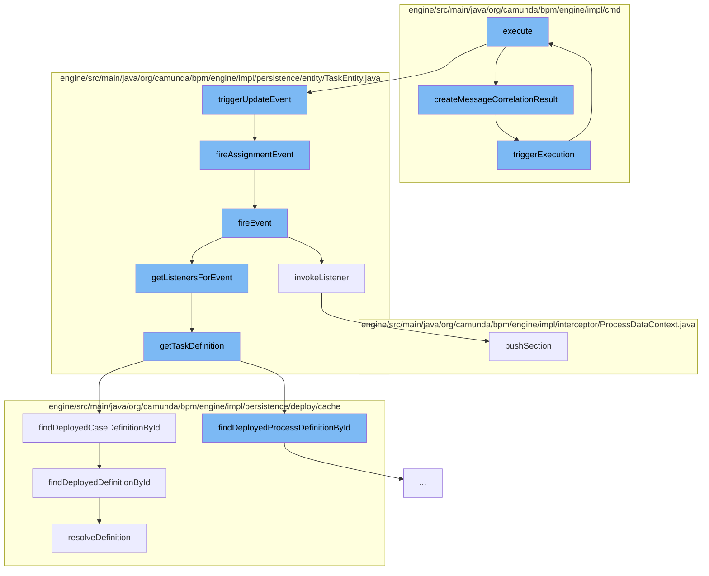

This document will cover the process of message correlation in the Camunda BPMN engine, which includes:

1. Execution of the correlation command
2. Creation of the correlation result
3. Triggering of the execution
4. Updating of the task properties
5. Firing of the update and assignment events
6. Invoking of the task listeners
7. Retrieval of the task definition
8. Deployment of the case definition.



<SwmSnippet path="/engine/src/main/java/org/camunda/bpm/engine/impl/cmd/CorrelateAllMessageCmd.java" line="1">

---

# Execution of the correlation command

The `execute` function in `CorrelateAllMessageCmd.java` is the entry point for the message correlation process. It initiates the correlation of a message to the process instances.

```java
/*
 * Copyright Camunda Services GmbH and/or licensed to Camunda Services GmbH
 * under one or more contributor license agreements. See the NOTICE file
 * distributed with this work for additional information regarding copyright
 * ownership. Camunda licenses this file to you under the Apache License,
 * Version 2.0; you may not use this file except in compliance with the License.
 * You may obtain a copy of the License at
 *
 *     http://www.apache.org/licenses/LICENSE-2.0
 *
```

---

</SwmSnippet>

<SwmSnippet path="/engine/src/main/java/org/camunda/bpm/engine/impl/cmd/AbstractCorrelateMessageCmd.java" line="114">

---

# Creation of the correlation result

The `createMessageCorrelationResult` function creates a correlation result based on the correlation handler result. It sets the process instance and variables for the result.

```java
  protected MessageCorrelationResultImpl createMessageCorrelationResult(final CommandContext commandContext, final CorrelationHandlerResult handlerResult) {
    MessageCorrelationResultImpl resultWithVariables = new MessageCorrelationResultImpl(handlerResult);
    if (MessageCorrelationResultType.Execution.equals(handlerResult.getResultType())) {
      ExecutionEntity execution = findProcessInstanceExecution(commandContext, handlerResult);

      ProcessInstance processInstance = execution.getProcessInstance();
      resultWithVariables.setProcessInstance(processInstance);

      if (variablesInResultEnabled && execution != null) {
        variablesListener = new ExecutionVariableSnapshotObserver(execution, false, deserializeVariableValues);
      }
      triggerExecution(commandContext, handlerResult);
    } else {
      ProcessInstance instance = instantiateProcess(commandContext, handlerResult);
      resultWithVariables.setProcessInstance(instance);
    }

    if (variablesListener != null) {
      resultWithVariables.setVariables(variablesListener.getVariables());
    }

```

---

</SwmSnippet>

<SwmSnippet path="/engine/src/main/java/org/camunda/bpm/engine/impl/cmd/AbstractCorrelateMessageCmd.java" line="69">

---

# Triggering of the execution

The `triggerExecution` function triggers the execution of the message event received command.

```java
  protected void triggerExecution(CommandContext commandContext, CorrelationHandlerResult correlationResult) {
    String executionId = correlationResult.getExecutionEntity().getId();

    MessageEventReceivedCmd command = new MessageEventReceivedCmd(messageName,
                                                                  executionId,
                                                                  builder.getPayloadProcessInstanceVariables(),
                                                                  builder.getPayloadProcessInstanceVariablesLocal(),
                                                                  builder.getPayloadProcessInstanceVariablesToTriggeredScope(),
                                                                  builder.isExclusiveCorrelation());
    command.execute(commandContext);
  }
```

---

</SwmSnippet>

<SwmSnippet path="/engine/src/main/java/org/camunda/bpm/engine/impl/cmd/AbstractSetTaskPropertyCmd.java" line="73">

---

# Updating of the task properties

The `execute` function in `AbstractSetTaskPropertyCmd.java` updates the task properties and triggers an update event.

```java
  @Override
  public Void execute(CommandContext context) {
    TaskEntity task = validateAndGet(taskId, context);

    executeSetOperation(task, value);

    task.triggerUpdateEvent();
    logOperation(context, task);

    return null;
  }
```

---

</SwmSnippet>

<SwmSnippet path="/engine/src/main/java/org/camunda/bpm/engine/impl/persistence/entity/TaskEntity.java" line="1202">

---

# Firing of the update and assignment events

The `triggerUpdateEvent` function fires an update event and an assignment event if the task is in the created state.

```java
  public boolean triggerUpdateEvent() {
    if (lifecycleState == TaskState.STATE_CREATED) {
      registerCommandContextCloseListener();
      setLastUpdated(ClockUtil.getCurrentTime());
      setTaskState(TaskState.STATE_UPDATED.taskState);
      return fireEvent(TaskListener.EVENTNAME_UPDATE) && fireAssignmentEvent();
    }
    else {
      // silently ignore; no events are triggered in the other states
      return true;
    }
  }
```

---

</SwmSnippet>

<SwmSnippet path="/engine/src/main/java/org/camunda/bpm/engine/impl/persistence/entity/TaskEntity.java" line="1032">

---

# Invoking of the task listeners

The `fireEvent` function invokes the task listeners for a given event name.

```java
  /**
   * @return true if invoking the listener was successful;
   *   if not successful, either false is returned (case: BPMN error propagation)
   *   or an exception is thrown
   */
  public boolean fireEvent(String taskEventName) {

    List<TaskListener> taskEventListeners = getListenersForEvent(taskEventName);

    if (taskEventListeners != null) {
      for (TaskListener taskListener : taskEventListeners) {
        if (!invokeListener(taskEventName, taskListener)){
          return false;
        }
      }
    }

    return true;
  }
```

---

</SwmSnippet>

<SwmSnippet path="/engine/src/main/java/org/camunda/bpm/engine/impl/persistence/entity/TaskEntity.java" line="1322">

---

# Retrieval of the task definition

The `getTaskDefinition` function retrieves the task definition based on the task definition key.

```java
  public TaskDefinition getTaskDefinition() {
    if (taskDefinition==null && taskDefinitionKey!=null) {

      Map<String, TaskDefinition> taskDefinitions = null;
      if (processDefinitionId != null) {
        ProcessDefinitionEntity processDefinition = Context
            .getProcessEngineConfiguration()
            .getDeploymentCache()
            .findDeployedProcessDefinitionById(processDefinitionId);

        taskDefinitions = processDefinition.getTaskDefinitions();

      } else {
        CaseDefinitionEntity caseDefinition = Context
            .getProcessEngineConfiguration()
            .getDeploymentCache()
            .findDeployedCaseDefinitionById(caseDefinitionId);

        taskDefinitions = caseDefinition.getTaskDefinitions();
      }

```

---

</SwmSnippet>

<SwmSnippet path="/engine/src/main/java/org/camunda/bpm/engine/impl/persistence/deploy/cache/ResourceDefinitionCache.java" line="111">

---

# Deployment of the case definition

The `resolveDefinition` function deploys the case definition if it is not already cached.

```java
  public T resolveDefinition(T definition) {
    String definitionId = definition.getId();
    String deploymentId = definition.getDeploymentId();
    T cachedDefinition = cache.get(definitionId);
    if (cachedDefinition == null) {
      synchronized (this) {
        cachedDefinition = cache.get(definitionId);
        if (cachedDefinition == null) {
          DeploymentEntity deployment = Context
              .getCommandContext()
              .getDeploymentManager()
              .findDeploymentById(deploymentId);
          deployment.setNew(false);
          cacheDeployer.deployOnlyGivenResourcesOfDeployment(deployment, definition.getResourceName(), definition.getDiagramResourceName());
          cachedDefinition = cache.get(definitionId);
        }
      }
      checkInvalidDefinitionWasCached(deploymentId, definitionId, cachedDefinition);
    }
    if (cachedDefinition != null) {
      cachedDefinition.updateModifiableFieldsFromEntity(definition);
```

---

</SwmSnippet>

&nbsp;

*This is an auto-generated document by Swimm AI 🌊 and has not yet been verified by a human*

<SwmMeta version="3.0.0" repo-id="Z2l0aHViJTNBJTNBQ2l0aS1jYW11bmRhJTNBJTNBZ2lsYWRuYXZvdA==" repo-name="Citi-camunda" doc-type="flows"><sup>Powered by [Swimm](/)</sup></SwmMeta>
