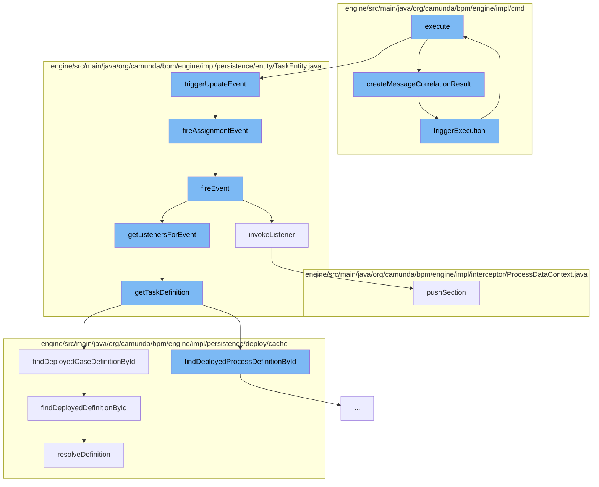

This document will cover the process of message correlation in the Camunda BPMN engine, which includes:

1. Executing the correlation command
2. Creating the correlation result
3. Triggering the execution
4. Setting the task property
5. Triggering the update event
6. Firing the assignment event
7. Firing the event
8. Invoking the listener
9. Getting the task definition



<SwmSnippet path="/engine/src/main/java/org/camunda/bpm/engine/impl/cmd/CorrelateMessageCmd.java" line="1">

---

# Executing the correlation command

The `execute` function in `CorrelateMessageCmd.java` is the entry point for the message correlation process. It is responsible for initiating the correlation of a message to a waiting process instance.

```java
/*
```

---

</SwmSnippet>

<SwmSnippet path="/engine/src/main/java/org/camunda/bpm/engine/impl/cmd/AbstractCorrelateMessageCmd.java" line="114">

---

# Creating the correlation result

The `createMessageCorrelationResult` function is responsible for creating the result of the message correlation. It sets the process instance and variables based on the correlation handler result.

```java
  protected MessageCorrelationResultImpl createMessageCorrelationResult(final CommandContext commandContext, final CorrelationHandlerResult handlerResult) {
    MessageCorrelationResultImpl resultWithVariables = new MessageCorrelationResultImpl(handlerResult);
    if (MessageCorrelationResultType.Execution.equals(handlerResult.getResultType())) {
      ExecutionEntity execution = findProcessInstanceExecution(commandContext, handlerResult);

      ProcessInstance processInstance = execution.getProcessInstance();
      resultWithVariables.setProcessInstance(processInstance);

      if (variablesInResultEnabled && execution != null) {
        variablesListener = new ExecutionVariableSnapshotObserver(execution, false, deserializeVariableValues);
      }
      triggerExecution(commandContext, handlerResult);
    } else {
      ProcessInstance instance = instantiateProcess(commandContext, handlerResult);
      resultWithVariables.setProcessInstance(instance);
    }

    if (variablesListener != null) {
      resultWithVariables.setVariables(variablesListener.getVariables());
    }

```

---

</SwmSnippet>

<SwmSnippet path="/engine/src/main/java/org/camunda/bpm/engine/impl/cmd/AbstractCorrelateMessageCmd.java" line="69">

---

# Triggering the execution

The `triggerExecution` function is responsible for triggering the execution of the correlated message. It creates a new `MessageEventReceivedCmd` and executes it.

```java
  protected void triggerExecution(CommandContext commandContext, CorrelationHandlerResult correlationResult) {
    String executionId = correlationResult.getExecutionEntity().getId();

    MessageEventReceivedCmd command = new MessageEventReceivedCmd(messageName,
                                                                  executionId,
                                                                  builder.getPayloadProcessInstanceVariables(),
                                                                  builder.getPayloadProcessInstanceVariablesLocal(),
                                                                  builder.getPayloadProcessInstanceVariablesToTriggeredScope(),
                                                                  builder.isExclusiveCorrelation());
    command.execute(commandContext);
  }
```

---

</SwmSnippet>

<SwmSnippet path="/engine/src/main/java/org/camunda/bpm/engine/impl/cmd/AbstractSetTaskPropertyCmd.java" line="73">

---

# Setting the task property

The `execute` function in `AbstractSetTaskPropertyCmd.java` is responsible for setting the task property. It validates the task and triggers an update event.

```java
  @Override
  public Void execute(CommandContext context) {
    TaskEntity task = validateAndGet(taskId, context);

    executeSetOperation(task, value);

    task.triggerUpdateEvent();
    logOperation(context, task);

    return null;
  }
```

---

</SwmSnippet>

<SwmSnippet path="/engine/src/main/java/org/camunda/bpm/engine/impl/persistence/entity/TaskEntity.java" line="1202">

---

# Triggering the update event

The `triggerUpdateEvent` function is responsible for triggering an update event for the task. It registers a command context close listener and sets the task state to updated.

```java
  public boolean triggerUpdateEvent() {
    if (lifecycleState == TaskState.STATE_CREATED) {
      registerCommandContextCloseListener();
      setLastUpdated(ClockUtil.getCurrentTime());
      setTaskState(TaskState.STATE_UPDATED.taskState);
      return fireEvent(TaskListener.EVENTNAME_UPDATE) && fireAssignmentEvent();
    }
    else {
      // silently ignore; no events are triggered in the other states
      return true;
    }
  }
```

---

</SwmSnippet>

<SwmSnippet path="/engine/src/main/java/org/camunda/bpm/engine/impl/persistence/entity/TaskEntity.java" line="1229">

---

# Firing the assignment event

The `fireAssignmentEvent` function is responsible for firing an assignment event if the assignee property has changed.

```java
  protected boolean fireAssignmentEvent() {
    PropertyChange assigneePropertyChange = propertyChanges.get(ASSIGNEE);
    if (assigneePropertyChange != null) {
      return fireEvent(TaskListener.EVENTNAME_ASSIGNMENT);
    }

    return true;
  }
```

---

</SwmSnippet>

<SwmSnippet path="/engine/src/main/java/org/camunda/bpm/engine/impl/persistence/entity/TaskEntity.java" line="1032">

---

# Firing the event

The `fireEvent` function is responsible for firing a task event. It retrieves the listeners for the event and invokes them.

```java
  /**
   * @return true if invoking the listener was successful;
   *   if not successful, either false is returned (case: BPMN error propagation)
   *   or an exception is thrown
   */
  public boolean fireEvent(String taskEventName) {

    List<TaskListener> taskEventListeners = getListenersForEvent(taskEventName);

    if (taskEventListeners != null) {
      for (TaskListener taskListener : taskEventListeners) {
        if (!invokeListener(taskEventName, taskListener)){
          return false;
        }
      }
    }

    return true;
  }
```

---

</SwmSnippet>

<SwmSnippet path="/engine/src/main/java/org/camunda/bpm/engine/impl/persistence/entity/TaskEntity.java" line="1076">

---

# Invoking the listener

The `invokeListener` function is responsible for invoking a task listener. It pushes a new section to the process data context and invokes the listener.

```java
  protected boolean invokeListener(String taskEventName, TaskListener taskListener) {
    boolean popProcessDataContext = false;
    CommandInvocationContext commandInvocationContext = Context.getCommandInvocationContext();
    CoreExecution execution = getExecution();
    if (execution == null) {
      execution = getCaseExecution();
    } else {
      if (commandInvocationContext != null) {
        popProcessDataContext = commandInvocationContext.getProcessDataContext().pushSection((ExecutionEntity) execution);
      }
    }
    if (execution != null) {
      setEventName(taskEventName);
    }
    try {
      boolean result = invokeListener(execution, taskEventName, taskListener);
      if (popProcessDataContext) {
        commandInvocationContext.getProcessDataContext().popSection();
      }
      return result;
    } catch (Exception e) {
```

---

</SwmSnippet>

<SwmSnippet path="/engine/src/main/java/org/camunda/bpm/engine/impl/persistence/entity/TaskEntity.java" line="1322">

---

# Getting the task definition

The `getTaskDefinition` function is responsible for retrieving the task definition. It retrieves the task definitions from the process or case definition and returns the task definition for the task definition key.

```java
  public TaskDefinition getTaskDefinition() {
    if (taskDefinition==null && taskDefinitionKey!=null) {

      Map<String, TaskDefinition> taskDefinitions = null;
      if (processDefinitionId != null) {
        ProcessDefinitionEntity processDefinition = Context
            .getProcessEngineConfiguration()
            .getDeploymentCache()
            .findDeployedProcessDefinitionById(processDefinitionId);

        taskDefinitions = processDefinition.getTaskDefinitions();

      } else {
        CaseDefinitionEntity caseDefinition = Context
            .getProcessEngineConfiguration()
            .getDeploymentCache()
            .findDeployedCaseDefinitionById(caseDefinitionId);

        taskDefinitions = caseDefinition.getTaskDefinitions();
      }

```

---

</SwmSnippet>

&nbsp;

*This is an auto-generated document by Swimm AI 🌊 and has not yet been verified by a human*

<SwmMeta version="3.0.0" repo-id="Z2l0aHViJTNBJTNBQ2l0aS1jYW11bmRhJTNBJTNBZ2lsYWRuYXZvdA==" repo-name="Citi-camunda" doc-type="flows"><sup>Powered by [Swimm](/)</sup></SwmMeta>
