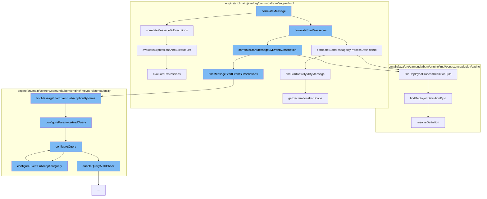

This document will cover the process of message correlation in the Camunda BPMN engine, which includes:

1. Correlating the message to executions
2. Correlating start messages
3. Correlating start message by process definition ID
4. Correlating start message by event subscription



<SwmSnippet path="/engine/src/main/java/org/camunda/bpm/engine/impl/runtime/DefaultCorrelationHandler.java" line="87">

---

# Correlating the message to executions

The `correlateMessageToExecutions` function is used to correlate a message to a list of executions. It constructs a query based on the correlation keys, local correlation keys, business key, process instance ID, message name, and tenant ID. The query is then executed to find matching executions, and a list of correlation results is returned.

```java
  protected List<CorrelationHandlerResult> correlateMessageToExecutions(CommandContext commandContext, String messageName, CorrelationSet correlationSet) {

    ExecutionQueryImpl query = new ExecutionQueryImpl();

    Map<String, Object> correlationKeys = correlationSet.getCorrelationKeys();
    if (correlationKeys != null) {
      for (Map.Entry<String, Object> correlationKey : correlationKeys.entrySet()) {
        query.processVariableValueEquals(correlationKey.getKey(), correlationKey.getValue());
      }
    }

    Map<String, Object> localCorrelationKeys = correlationSet.getLocalCorrelationKeys();
    if (localCorrelationKeys != null) {
      for (Map.Entry<String, Object> correlationKey : localCorrelationKeys.entrySet()) {
        query.variableValueEquals(correlationKey.getKey(), correlationKey.getValue());
      }
    }

    String businessKey = correlationSet.getBusinessKey();
    if (businessKey != null) {
      query.processInstanceBusinessKey(businessKey);
```

---

</SwmSnippet>

<SwmSnippet path="/engine/src/main/java/org/camunda/bpm/engine/impl/runtime/DefaultCorrelationHandler.java" line="206">

---

# Correlating start messages

The `correlateStartMessageByProcessDefinitionId` function is used to correlate a start message to a process definition. It finds the deployed process definition by ID and checks if it is not suspended. If a start activity ID is found by the message, a correlation result is returned.

```java
  protected CorrelationHandlerResult correlateStartMessageByProcessDefinitionId(CommandContext commandContext, String messageName, String processDefinitionId) {
    DeploymentCache deploymentCache = commandContext.getProcessEngineConfiguration().getDeploymentCache();
    ProcessDefinitionEntity processDefinition = deploymentCache.findDeployedProcessDefinitionById(processDefinitionId);
    // only an active process definition will be returned
    if (processDefinition != null && !processDefinition.isSuspended()) {

      String startActivityId = findStartActivityIdByMessage(processDefinition, messageName);
      if (startActivityId != null) {
        return CorrelationHandlerResult.matchedProcessDefinition(processDefinition, startActivityId);
      }
    }
    return null;
  }
```

---

</SwmSnippet>

<SwmSnippet path="/engine/src/main/java/org/camunda/bpm/engine/impl/persistence/deploy/cache/DeploymentCache.java" line="80">

---

# Correlating start message by process definition ID

The `findDeployedProcessDefinitionById` function is used to find a deployed process definition by its ID. It is used in the `correlateStartMessageByProcessDefinitionId` function to find the process definition.

```java
  public ProcessDefinitionEntity findDeployedProcessDefinitionById(String processDefinitionId) {
    return processDefinitionEntityCache.findDeployedDefinitionById(processDefinitionId);
  }
```

---

</SwmSnippet>

<SwmSnippet path="/engine/src/main/java/org/camunda/bpm/engine/impl/persistence/entity/EventSubscriptionManager.java" line="271">

---

# Correlating start message by event subscription

The `findMessageStartEventSubscriptionByName` function is used to find message start event subscriptions by their name. It configures a parameterized query and selects a list of message start event subscriptions by name.

```java
  /**
   * @return the message start event subscriptions with the given message name (from any tenant)
   *
   * @see #findMessageStartEventSubscriptionByNameAndTenantId(String, String)
   */
  @SuppressWarnings("unchecked")
  public List<EventSubscriptionEntity> findMessageStartEventSubscriptionByName(String messageName) {
    return getDbEntityManager().selectList("selectMessageStartEventSubscriptionByName", configureParameterizedQuery(messageName));
  }
```

---

</SwmSnippet>

&nbsp;

*This is an auto-generated document by Swimm AI 🌊 and has not yet been verified by a human*

<SwmMeta version="3.0.0" repo-id="Z2l0aHViJTNBJTNBQ2l0aS1jYW11bmRhJTNBJTNBZ2lsYWRuYXZvdA==" repo-name="Citi-camunda" doc-type="flows"><sup>Powered by [Swimm](/)</sup></SwmMeta>
