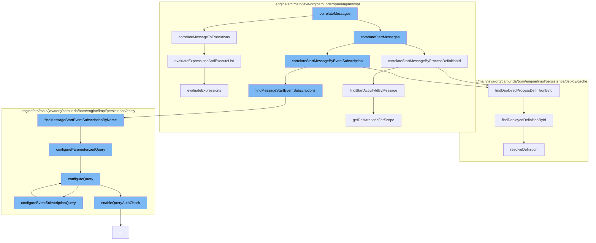

This document will cover the process of message correlation in the Camunda BPMN engine, which includes:

1. Correlating messages to executions
2. Correlating start messages
3. Finding message start event subscriptions
4. Configuring queries for event subscriptions
5. Evaluating expressions and executing lists.



<SwmSnippet path="/engine/src/main/java/org/camunda/bpm/engine/impl/runtime/DefaultCorrelationHandler.java" line="87">

---

# Correlating messages to executions

The `correlateMessageToExecutions` function is used to correlate messages to executions. It creates a new `ExecutionQueryImpl` and sets various query parameters based on the `correlationSet`. The function then executes the query and returns a list of `CorrelationHandlerResult` objects.

```java
  protected List<CorrelationHandlerResult> correlateMessageToExecutions(CommandContext commandContext, String messageName, CorrelationSet correlationSet) {

    ExecutionQueryImpl query = new ExecutionQueryImpl();

    Map<String, Object> correlationKeys = correlationSet.getCorrelationKeys();
    if (correlationKeys != null) {
      for (Map.Entry<String, Object> correlationKey : correlationKeys.entrySet()) {
        query.processVariableValueEquals(correlationKey.getKey(), correlationKey.getValue());
      }
    }

    Map<String, Object> localCorrelationKeys = correlationSet.getLocalCorrelationKeys();
    if (localCorrelationKeys != null) {
      for (Map.Entry<String, Object> correlationKey : localCorrelationKeys.entrySet()) {
        query.variableValueEquals(correlationKey.getKey(), correlationKey.getValue());
      }
    }

    String businessKey = correlationSet.getBusinessKey();
    if (businessKey != null) {
      query.processInstanceBusinessKey(businessKey);
```

---

</SwmSnippet>

<SwmSnippet path="/engine/src/main/java/org/camunda/bpm/engine/impl/runtime/DefaultCorrelationHandler.java" line="206">

---

# Correlating start messages

The `correlateStartMessageByProcessDefinitionId` function is used to correlate start messages by process definition ID. It retrieves the process definition from the deployment cache and checks if it is not suspended. If the process definition is active, it finds the start activity ID by message and returns a `CorrelationHandlerResult`.

```java
  protected CorrelationHandlerResult correlateStartMessageByProcessDefinitionId(CommandContext commandContext, String messageName, String processDefinitionId) {
    DeploymentCache deploymentCache = commandContext.getProcessEngineConfiguration().getDeploymentCache();
    ProcessDefinitionEntity processDefinition = deploymentCache.findDeployedProcessDefinitionById(processDefinitionId);
    // only an active process definition will be returned
    if (processDefinition != null && !processDefinition.isSuspended()) {

      String startActivityId = findStartActivityIdByMessage(processDefinition, messageName);
      if (startActivityId != null) {
        return CorrelationHandlerResult.matchedProcessDefinition(processDefinition, startActivityId);
      }
    }
    return null;
  }
```

---

</SwmSnippet>

<SwmSnippet path="/engine/src/main/java/org/camunda/bpm/engine/impl/persistence/entity/EventSubscriptionManager.java" line="271">

---

# Finding message start event subscriptions

The `findMessageStartEventSubscriptionByName` function is used to find message start event subscriptions by name. It configures a parameterized query and executes it to retrieve the subscriptions.

```java
  /**
   * @return the message start event subscriptions with the given message name (from any tenant)
   *
   * @see #findMessageStartEventSubscriptionByNameAndTenantId(String, String)
   */
  @SuppressWarnings("unchecked")
  public List<EventSubscriptionEntity> findMessageStartEventSubscriptionByName(String messageName) {
    return getDbEntityManager().selectList("selectMessageStartEventSubscriptionByName", configureParameterizedQuery(messageName));
  }
```

---

</SwmSnippet>

<SwmSnippet path="/engine/src/main/java/org/camunda/bpm/engine/impl/persistence/entity/AuthorizationManager.java" line="639">

---

# Configuring queries for event subscriptions

The `configureEventSubscriptionQuery` function is used to configure event subscription queries. It sets up a composite permission check for the query and adds it to the authorization check.

```java
  // event subscription query //////////////////////////////

  public void configureEventSubscriptionQuery(EventSubscriptionQueryImpl query) {
    configureQuery(query);
    CompositePermissionCheck permissionCheck = new PermissionCheckBuilder()
            .disjunctive()
            .atomicCheck(PROCESS_INSTANCE, "RES.PROC_INST_ID_", READ)
            .atomicCheck(PROCESS_DEFINITION, "PROCDEF.KEY_", READ_INSTANCE)
            .build();
    addPermissionCheck(query.getAuthCheck(), permissionCheck);
  }
```

---

</SwmSnippet>

<SwmSnippet path="/engine/src/main/java/org/camunda/bpm/engine/impl/AbstractQuery.java" line="215">

---

# Evaluating expressions and executing lists

The `evaluateExpressionsAndExecuteList` function is used to evaluate expressions and execute lists. It validates the query, evaluates the expressions, and executes the list if there are no excluding conditions.

```java
  public List<U> evaluateExpressionsAndExecuteList(CommandContext commandContext, Page page) {
    checkMaxResultsLimit();
    validate();
    evaluateExpressions();
    return !hasExcludingConditions() ? executeList(commandContext, page) : new ArrayList<>();
  }
```

---

</SwmSnippet>

&nbsp;

*This is an auto-generated document by Swimm AI 🌊 and has not yet been verified by a human*

<SwmMeta version="3.0.0" repo-id="Z2l0aHViJTNBJTNBQ2l0aS1jYW11bmRhJTNBJTNBZ2lsYWRuYXZvdA==" repo-name="Citi-camunda" doc-type="flows"><sup>Powered by [Swimm](/)</sup></SwmMeta>
