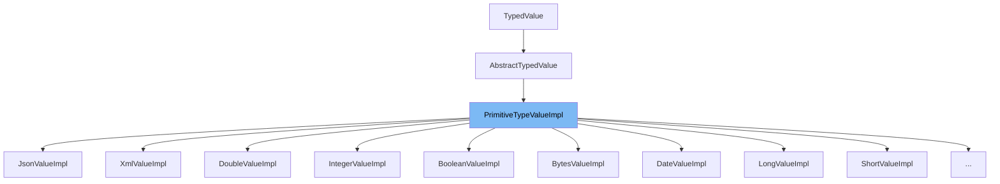

This document will cover the following aspects of the `PrimitiveTypeValueImpl` class:

1. What is `PrimitiveTypeValueImpl`.
2. Explanation of the variables and functions within `PrimitiveTypeValueImpl`.
3. An example of how `PrimitiveTypeValueImpl` is used within `XmlValueImpl`.



# What is PrimitiveTypeValueImpl

`PrimitiveTypeValueImpl` is a class that extends `AbstractTypedValue` and implements `PrimitiveValue`. It is used to represent primitive type values in the Camunda BPM engine. It provides a way to handle primitive types such as boolean, bytes, date, double, integer, long, short, string, and number in a unified manner.

<SwmSnippet path="/commons/typed-values/src/main/java/org/camunda/bpm/engine/variable/impl/value/PrimitiveTypeValueImpl.java" line="42">

---

# Variables and functions

The constructor `PrimitiveTypeValueImpl` takes a value and a `PrimitiveValueType` as parameters. It calls the superclass constructor with these parameters.

```java
  public PrimitiveTypeValueImpl(T value, PrimitiveValueType type) {
    super(value, type);
  }
```

---

</SwmSnippet>

<SwmSnippet path="/commons/typed-values/src/main/java/org/camunda/bpm/engine/variable/impl/value/PrimitiveTypeValueImpl.java" line="47">

---

The function `getType` returns the type of the value. It overrides the `getType` method from the superclass and casts the result to `PrimitiveValueType`.

```java
  public PrimitiveValueType getType() {
    return (PrimitiveValueType) super.getType();
  }
```

---

</SwmSnippet>

<SwmSnippet path="/commons/typed-values/src/main/java/org/camunda/bpm/engine/variable/impl/value/PrimitiveTypeValueImpl.java" line="52">

---

The function `hashCode` computes a hash code for the instance based on its type, value, and transient state. It is used to ensure proper functioning of hash-based collections.

```java
  public int hashCode() {
    final int prime = 31;
    int result = 1;
    result = prime * result + ((type == null) ? 0 : type.hashCode());
    result = prime * result + ((value == null) ? 0 : value.hashCode());
    result = prime * result + (isTransient ? 1 : 0);
    return result;
  }
```

---

</SwmSnippet>

<SwmSnippet path="/commons/typed-values/src/main/java/org/camunda/bpm/engine/variable/impl/value/PrimitiveTypeValueImpl.java" line="62">

---

The function `equals` checks if the current instance is equal to another object. It compares the type, value, and transient state of the two objects.

```java
  public boolean equals(Object obj) {
    if (this == obj)
      return true;
    if (obj == null)
      return false;
    if (getClass() != obj.getClass())
      return false;
    PrimitiveTypeValueImpl<?> other = (PrimitiveTypeValueImpl<?>) obj;
    if (type == null) {
      if (other.type != null)
        return false;
    } else if (!type.equals(other.type))
      return false;
    if (value == null) {
      if (other.value != null)
        return false;
    } else if (!value.equals(other.value))
      return false;
    if (isTransient != other.isTransient()) {
      return false;
    }
```

---

</SwmSnippet>

<SwmSnippet path="/clients/java/client/src/main/java/org/camunda/bpm/client/variable/impl/value/XmlValueImpl.java" line="1">

---

# Usage example

`XmlValueImpl` is an example of a class that extends `PrimitiveTypeValueImpl`. It represents an XML value in the Camunda BPM engine.

```java
/*
 * Copyright Camunda Services GmbH and/or licensed to Camunda Services GmbH
 * under one or more contributor license agreements. See the NOTICE file
 * distributed with this work for additional information regarding copyright
 * ownership. Camunda licenses this file to you under the Apache License,
 * Version 2.0; you may not use this file except in compliance with the License.
 * You may obtain a copy of the License at
 *
 *     http://www.apache.org/licenses/LICENSE-2.0
 *
```

---

</SwmSnippet>

&nbsp;

*This is an auto-generated document by Swimm AI 🌊 and has not yet been verified by a human*

<SwmMeta version="3.0.0" repo-id="Z2l0aHViJTNBJTNBQ2l0aS1jYW11bmRhJTNBJTNBZ2lsYWRuYXZvdA==" repo-name="Citi-camunda" doc-type="general-class"><sup>Powered by [Swimm](/)</sup></SwmMeta>
