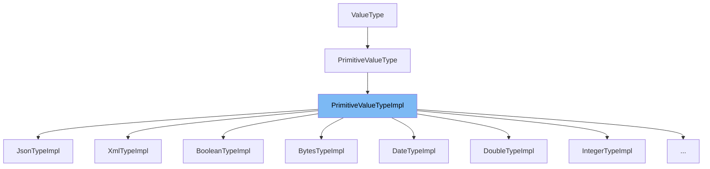

This document will cover the `PrimitiveValueTypeImpl` class in the Citi-camunda repository. We'll cover:

1. What is `PrimitiveValueTypeImpl`.
2. The variables and functions defined in `PrimitiveValueTypeImpl`.
3. An example of how to use `PrimitiveValueTypeImpl`.



# What is PrimitiveValueTypeImpl

`PrimitiveValueTypeImpl` is an abstract class that represents the implementation of primitive variable value types in the Camunda BPMN engine. It is used to handle different types of primitive values such as Boolean, Bytes, Date, Double, Integer, Long, Short, String, and Number. Each of these types is represented as a static inner class within `PrimitiveValueTypeImpl`.

# Variables and functions

`PrimitiveValueTypeImpl` defines a number of variables and functions that are used to manage the primitive value types.

<SwmSnippet path="/commons/typed-values/src/main/java/org/camunda/bpm/engine/variable/impl/type/PrimitiveValueTypeImpl.java" line="53">

---

# Variables and functions

The `javaType` variable is used to store the Java type of the primitive value. It is a protected variable of type `Class<?>`.

```java
  protected Class<?> javaType;
```

---

</SwmSnippet>

<SwmSnippet path="/commons/typed-values/src/main/java/org/camunda/bpm/engine/variable/impl/type/PrimitiveValueTypeImpl.java" line="55">

---

The `PrimitiveValueTypeImpl(Class<?> javaType)` function is a constructor that initializes the `PrimitiveValueTypeImpl` instance with the given Java type.

```java
  public PrimitiveValueTypeImpl(Class<?> javaType) {
    this(javaType.getSimpleName().toLowerCase(), javaType);
  }
```

---

</SwmSnippet>

<SwmSnippet path="/commons/typed-values/src/main/java/org/camunda/bpm/engine/variable/impl/type/PrimitiveValueTypeImpl.java" line="59">

---

The `PrimitiveValueTypeImpl(String name, Class<?> javaType)` function is another constructor that initializes the `PrimitiveValueTypeImpl` instance with the given name and Java type.

```java
  public PrimitiveValueTypeImpl(String name, Class<?> javaType) {
    super(name);
    this.javaType = javaType;
  }
```

---

</SwmSnippet>

<SwmSnippet path="/commons/typed-values/src/main/java/org/camunda/bpm/engine/variable/impl/type/PrimitiveValueTypeImpl.java" line="64">

---

The `getJavaType()` function is used to get the Java type of the primitive value.

```java
  public Class<?> getJavaType() {
    return javaType;
  }
```

---

</SwmSnippet>

<SwmSnippet path="/commons/typed-values/src/main/java/org/camunda/bpm/engine/variable/impl/type/PrimitiveValueTypeImpl.java" line="68">

---

The `isPrimitiveValueType()` function is used to check if the value type is a primitive value type. It always returns true as this class only deals with primitive value types.

```java
  public boolean isPrimitiveValueType() {
    return true;
  }
```

---

</SwmSnippet>

<SwmSnippet path="/commons/typed-values/src/main/java/org/camunda/bpm/engine/variable/impl/type/PrimitiveValueTypeImpl.java" line="72">

---

The `toString()` function is used to get a string representation of the primitive value type.

```java
  @Override
  public String toString() {
    return "PrimitiveValueType["+getName()+"]";
  }
```

---

</SwmSnippet>

<SwmSnippet path="/commons/typed-values/src/main/java/org/camunda/bpm/engine/variable/impl/type/PrimitiveValueTypeImpl.java" line="77">

---

The `getValueInfo(TypedValue typedValue)` function is used to get the value info of the typed value. It returns a map containing the transient status of the typed value.

```java
  public Map<String, Object> getValueInfo(TypedValue typedValue) {
    Map<String, Object> result = new HashMap<String, Object>();
    if (typedValue.isTransient())
      result.put(VALUE_INFO_TRANSIENT, typedValue.isTransient());
    return result;
  }
```

---

</SwmSnippet>

# Usage example

`PrimitiveValueTypeImpl` is an abstract class and cannot be used directly. However, its subclasses such as `BooleanTypeImpl` can be used. For example, `BooleanTypeImpl` is used to create a boolean value with the `createValue` function.

<SwmSnippet path="/commons/typed-values/src/main/java/org/camunda/bpm/engine/variable/impl/type/PrimitiveValueTypeImpl.java" line="86">

---

# Usage example

Here, `BooleanTypeImpl` extends `PrimitiveValueTypeImpl` and overrides the `createValue` function to create a boolean value.

```java
  public static class BooleanTypeImpl extends PrimitiveValueTypeImpl {

    private static final long serialVersionUID = 1L;

    public BooleanTypeImpl() {
      super(Boolean.class);
    }

    public BooleanValue createValue(Object value, Map<String, Object> valueInfo) {
      return Variables.booleanValue((Boolean) value, isTransient(valueInfo));
    }

  }
```

---

</SwmSnippet>

&nbsp;

*This is an auto-generated document by Swimm AI 🌊 and has not yet been verified by a human*

<SwmMeta version="3.0.0" repo-id="Z2l0aHViJTNBJTNBQ2l0aS1jYW11bmRhJTNBJTNBZ2lsYWRuYXZvdA==" repo-name="Citi-camunda" doc-type="general-class"><sup>Powered by [Swimm](/)</sup></SwmMeta>
