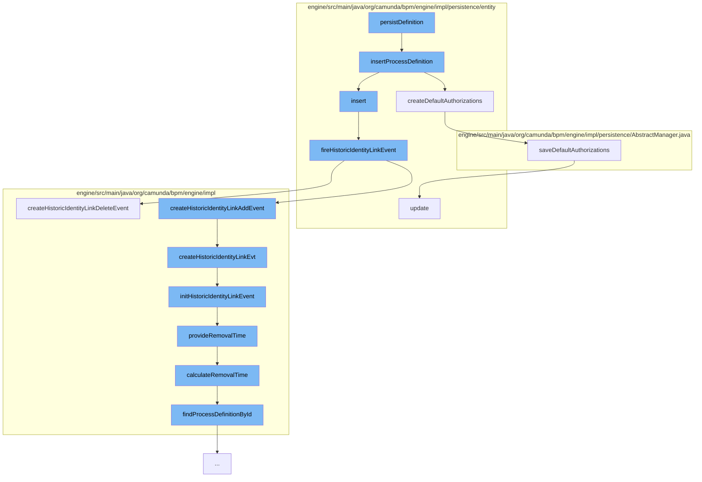

This document will cover the process of persisting a process definition in the Camunda BPMN engine. The steps include:

1. Inserting the process definition
2. Creating default authorizations
3. Firing historic identity link events
4. Providing removal time for historic identity link events
5. Saving default authorizations.



<SwmSnippet path="/engine/src/main/java/org/camunda/bpm/engine/impl/persistence/entity/ProcessDefinitionManager.java" line="54">

---

# Inserting the process definition

The function `insertProcessDefinition` is used to insert the process definition into the database and create default authorizations for it.

```java
  public void insertProcessDefinition(ProcessDefinitionEntity processDefinition) {
    getDbEntityManager().insert(processDefinition);
    createDefaultAuthorizations(processDefinition);
  }
```

---

</SwmSnippet>

<SwmSnippet path="/engine/src/main/java/org/camunda/bpm/engine/impl/persistence/entity/ProcessDefinitionManager.java" line="385">

---

# Creating default authorizations

The function `createDefaultAuthorizations` is used to create default authorizations for the process definition if authorization is enabled.

```java
  protected void createDefaultAuthorizations(ProcessDefinition processDefinition) {
    if(isAuthorizationEnabled()) {
      ResourceAuthorizationProvider provider = getResourceAuthorizationProvider();
      AuthorizationEntity[] authorizations = provider.newProcessDefinition(processDefinition);
      saveDefaultAuthorizations(authorizations);
    }
  }
```

---

</SwmSnippet>

<SwmSnippet path="/engine/src/main/java/org/camunda/bpm/engine/impl/persistence/entity/IdentityLinkEntity.java" line="204">

---

# Firing historic identity link events

The function `fireHistoricIdentityLinkEvent` is used to create historic identity link events if the history level allows it.

```java
  public void fireHistoricIdentityLinkEvent(final HistoryEventType eventType) {
    ProcessEngineConfigurationImpl processEngineConfiguration = Context.getProcessEngineConfiguration();

    HistoryLevel historyLevel = processEngineConfiguration.getHistoryLevel();
    if(historyLevel.isHistoryEventProduced(eventType, this)) {

      HistoryEventProcessor.processHistoryEvents(new HistoryEventProcessor.HistoryEventCreator() {
        @Override
        public HistoryEvent createHistoryEvent(HistoryEventProducer producer) {
          HistoryEvent event = null;
          if (HistoryEvent.IDENTITY_LINK_ADD.equals(eventType.getEventName())) {
            event = producer.createHistoricIdentityLinkAddEvent(IdentityLinkEntity.this);
          } else if (HistoryEvent.IDENTITY_LINK_DELETE.equals(eventType.getEventName())) {
            event = producer.createHistoricIdentityLinkDeleteEvent(IdentityLinkEntity.this);
          }
          return event;
        }
      });

    }
  }
```

---

</SwmSnippet>

<SwmSnippet path="/engine/src/main/java/org/camunda/bpm/engine/impl/history/producer/DefaultHistoryEventProducer.java" line="1300">

---

# Providing removal time for historic identity link events

The function `provideRemovalTime` is used to calculate and set the removal time for the historic batch.

```java
  protected void provideRemovalTime(HistoricBatchEntity historicBatch) {
    Date removalTime = calculateRemovalTime(historicBatch);
    if (removalTime != null) {
      historicBatch.setRemovalTime(removalTime);
    }
  }
```

---

</SwmSnippet>

<SwmSnippet path="/engine/src/main/java/org/camunda/bpm/engine/impl/persistence/AbstractManager.java" line="295">

---

# Saving default authorizations

The function `saveDefaultAuthorizations` is used to save the default authorizations for the process definition in the database.

```java
  public void saveDefaultAuthorizations(final AuthorizationEntity[] authorizations) {
    if(authorizations != null && authorizations.length > 0) {
      Context.getCommandContext().runWithoutAuthorization(new Callable<Void>() {
        public Void call() {
          AuthorizationManager authorizationManager = getAuthorizationManager();
          for (AuthorizationEntity authorization : authorizations) {

            if(authorization.getId() == null) {
              authorizationManager.insert(authorization);
            } else {
              authorizationManager.update(authorization);
            }

          }
          return null;
        }
      });
    }
  }
```

---

</SwmSnippet>

&nbsp;

*This is an auto-generated document by Swimm AI 🌊 and has not yet been verified by a human*

<SwmMeta version="3.0.0" repo-id="Z2l0aHViJTNBJTNBQ2l0aS1jYW11bmRhJTNBJTNBZ2lsYWRuYXZvdA==" repo-name="Citi-camunda" doc-type="flows"><sup>Powered by [Swimm](/)</sup></SwmMeta>
