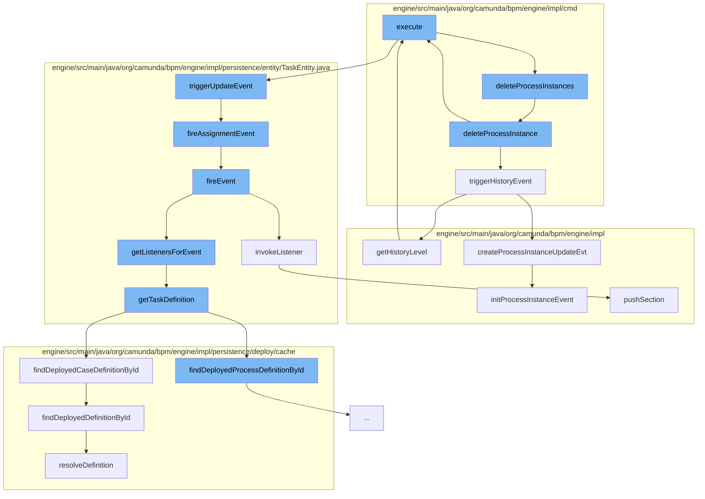

This document will cover the process of deleting process instances in the Citi-camunda repository. The steps include:

 1. Executing the delete command
 2. Deleting individual process instances
 3. Triggering history events
 4. Updating task properties
 5. Firing task events
 6. Invoking task listeners
 7. Retrieving task definitions
 8. Resolving definitions
 9. Pushing data context sections
10. Getting history level
11. Initializing process instance events
12. Executing management service commands.



<SwmSnippet path="/engine/src/main/java/org/camunda/bpm/engine/impl/cmd/DeleteProcessInstancesCmd.java" line="1">

---

# Executing the delete command

The `execute` function in `DeleteProcessInstancesCmd.java` initiates the process of deleting process instances. It calls the `deleteProcessInstances` function in `AbstractDeleteProcessInstanceCmd.java`.

```java
/*
```

---

</SwmSnippet>

<SwmSnippet path="/engine/src/main/java/org/camunda/bpm/engine/impl/cmd/AbstractDeleteProcessInstanceCmd.java" line="65">

---

# Deleting individual process instances

The `deleteProcessInstances` function iterates over the list of process instance IDs and calls the `deleteProcessInstance` function for each one.

```java
  protected void deleteProcessInstances(final CommandContext commandContext, List<String> processInstanceIds) {
    processInstanceIds.forEach(processInstance -> deleteProcessInstance(commandContext, processInstance));
  }
```

---

</SwmSnippet>

<SwmSnippet path="/engine/src/main/java/org/camunda/bpm/engine/impl/cmd/AbstractDeleteProcessInstanceCmd.java" line="115">

---

# Triggering history events

The `triggerHistoryEvent` function is called to create history events for each deleted process instance. This is important for audit and tracking purposes.

```java
  public void triggerHistoryEvent(List<ProcessInstance> subProcesslist) {
    ProcessEngineConfigurationImpl configuration = Context.getProcessEngineConfiguration();
    HistoryLevel historyLevel = configuration.getHistoryLevel();

    for (final ProcessInstance processInstance : subProcesslist) {
      // TODO: This smells bad, as the rest of the history is done via the
      // ParseListener
      if (historyLevel.isHistoryEventProduced(HistoryEventTypes.PROCESS_INSTANCE_UPDATE, processInstance)) {

        HistoryEventProcessor.processHistoryEvents(new HistoryEventProcessor.HistoryEventCreator() {
          @Override
          public HistoryEvent createHistoryEvent(HistoryEventProducer producer) {
            return producer.createProcessInstanceUpdateEvt((DelegateExecution) processInstance);
          }
        });
      }
    }
  }
```

---

</SwmSnippet>

<SwmSnippet path="/engine/src/main/java/org/camunda/bpm/engine/impl/cmd/AbstractSetTaskPropertyCmd.java" line="1">

---

# Updating task properties

The `execute` function in `AbstractSetTaskPropertyCmd.java` is called to update the properties of the task associated with the process instance being deleted.

```java
/*
```

---

</SwmSnippet>

<SwmSnippet path="/engine/src/main/java/org/camunda/bpm/engine/impl/persistence/entity/TaskEntity.java" line="1202">

---

# Firing task events

The `triggerUpdateEvent` function is called to fire an update event for the task. This includes firing an assignment event if the assignee property has changed.

```java
  public boolean triggerUpdateEvent() {
    if (lifecycleState == TaskState.STATE_CREATED) {
      registerCommandContextCloseListener();
      setLastUpdated(ClockUtil.getCurrentTime());
      setTaskState(TaskState.STATE_UPDATED.taskState);
      return fireEvent(TaskListener.EVENTNAME_UPDATE) && fireAssignmentEvent();
    }
    else {
      // silently ignore; no events are triggered in the other states
      return true;
    }
  }
```

---

</SwmSnippet>

<SwmSnippet path="/engine/src/main/java/org/camunda/bpm/engine/impl/persistence/entity/TaskEntity.java" line="1076">

---

# Invoking task listeners

The `invokeListener` function is called to invoke any listeners associated with the task event. This allows custom logic to be executed in response to the event.

```java
  protected boolean invokeListener(String taskEventName, TaskListener taskListener) {
    boolean popProcessDataContext = false;
    CommandInvocationContext commandInvocationContext = Context.getCommandInvocationContext();
    CoreExecution execution = getExecution();
    if (execution == null) {
      execution = getCaseExecution();
    } else {
      if (commandInvocationContext != null) {
        popProcessDataContext = commandInvocationContext.getProcessDataContext().pushSection((ExecutionEntity) execution);
      }
    }
    if (execution != null) {
      setEventName(taskEventName);
    }
    try {
      boolean result = invokeListener(execution, taskEventName, taskListener);
      if (popProcessDataContext) {
        commandInvocationContext.getProcessDataContext().popSection();
      }
      return result;
    } catch (Exception e) {
```

---

</SwmSnippet>

<SwmSnippet path="/engine/src/main/java/org/camunda/bpm/engine/impl/persistence/entity/TaskEntity.java" line="1322">

---

# Retrieving task definitions

The `getTaskDefinition` function is called to retrieve the definition of the task. This includes fetching the process or case definition from the deployment cache.

```java
  public TaskDefinition getTaskDefinition() {
    if (taskDefinition==null && taskDefinitionKey!=null) {

      Map<String, TaskDefinition> taskDefinitions = null;
      if (processDefinitionId != null) {
        ProcessDefinitionEntity processDefinition = Context
            .getProcessEngineConfiguration()
            .getDeploymentCache()
            .findDeployedProcessDefinitionById(processDefinitionId);

        taskDefinitions = processDefinition.getTaskDefinitions();

      } else {
        CaseDefinitionEntity caseDefinition = Context
            .getProcessEngineConfiguration()
            .getDeploymentCache()
            .findDeployedCaseDefinitionById(caseDefinitionId);

        taskDefinitions = caseDefinition.getTaskDefinitions();
      }

```

---

</SwmSnippet>

<SwmSnippet path="/engine/src/main/java/org/camunda/bpm/engine/impl/persistence/deploy/cache/ResourceDefinitionCache.java" line="111">

---

# Resolving definitions

The `resolveDefinition` function is called to resolve the definition of the task. This includes updating the cache with the resolved definition.

```java
  public T resolveDefinition(T definition) {
    String definitionId = definition.getId();
    String deploymentId = definition.getDeploymentId();
    T cachedDefinition = cache.get(definitionId);
    if (cachedDefinition == null) {
      synchronized (this) {
        cachedDefinition = cache.get(definitionId);
        if (cachedDefinition == null) {
          DeploymentEntity deployment = Context
              .getCommandContext()
              .getDeploymentManager()
              .findDeploymentById(deploymentId);
          deployment.setNew(false);
          cacheDeployer.deployOnlyGivenResourcesOfDeployment(deployment, definition.getResourceName(), definition.getDiagramResourceName());
          cachedDefinition = cache.get(definitionId);
        }
      }
      checkInvalidDefinitionWasCached(deploymentId, definitionId, cachedDefinition);
    }
    if (cachedDefinition != null) {
      cachedDefinition.updateModifiableFieldsFromEntity(definition);
```

---

</SwmSnippet>

<SwmSnippet path="/engine/src/main/java/org/camunda/bpm/engine/impl/interceptor/ProcessDataContext.java" line="164">

---

# Pushing data context sections

The `pushSection` function is called to push a new section to the process data context. This is used to keep track of the properties associated with the execution.

```java
  /**
   * Start a new section that keeps track of the pushed properties.
   *
   * If logging context properties are defined, the MDC is updated as well. This
   * also includes clearing the MDC for the first section that is pushed for the
   * logging context so that only the current properties will be present in the
   * MDC (might be less than previously present in the MDC). The previous
   * logging context needs to be reset in the MDC when this one is closed. This
   * can be achieved by using {@link #updateMdc(String)} with the previous
   * logging context.
   *
   * @param execution
   *          the execution to retrieve the context data from
   *
   * @return <code>true</code> if the section contains any updates and therefore
   *         should be popped later by {@link #popSection()}
   */
  public boolean pushSection(ExecutionEntity execution) {
    if (handleMdc && hasNoMdcValues()) {
      clearMdc();
    }
```

---

</SwmSnippet>

<SwmSnippet path="/engine/src/main/java/org/camunda/bpm/engine/impl/ManagementServiceImpl.java" line="509">

---

# Getting history level

The `getHistoryLevel` function is called to retrieve the history level of the process engine. This is used to determine the level of history logging.

```java
  public int getHistoryLevel() {
    return commandExecutor.execute(new GetHistoryLevelCmd());
  }
```

---

</SwmSnippet>

<SwmSnippet path="/engine/src/main/java/org/camunda/bpm/engine/impl/history/producer/DefaultHistoryEventProducer.java" line="182">

---

# Initializing process instance events

The `initProcessInstanceEvent` function is called to initialize a history event for the process instance. This includes setting various properties such as the process definition key and instance ID.

```java
  protected void initProcessInstanceEvent(HistoricProcessInstanceEventEntity evt, ExecutionEntity execution, HistoryEventType eventType) {

    String processDefinitionId = execution.getProcessDefinitionId();
    String processInstanceId = execution.getProcessInstanceId();
    String executionId = execution.getId();
    // the given execution is the process instance!
    String caseInstanceId = execution.getCaseInstanceId();
    String tenantId = execution.getTenantId();

    ProcessDefinitionEntity definition = execution.getProcessDefinition();
    String processDefinitionKey = null;
    if (definition != null) {
      processDefinitionKey = definition.getKey();
    }

    evt.setId(processInstanceId);
    evt.setEventType(eventType.getEventName());
    evt.setProcessDefinitionKey(processDefinitionKey);
    evt.setProcessDefinitionId(processDefinitionId);
    evt.setProcessInstanceId(processInstanceId);
    evt.setExecutionId(executionId);
```

---

</SwmSnippet>

<SwmSnippet path="/engine/src/main/java/org/camunda/bpm/engine/impl/ManagementServiceImpl.java" line="664">

---

# Executing management service commands

The `execute` function in `ManagementServiceImpl.java` is called to execute a command in the context of the management service. This includes updating the database schema.

```java
    @Override
    public String execute(CommandContext commandContext) {
      commandContext.getAuthorizationManager().checkCamundaAdmin();
      DbSqlSessionFactory dbSqlSessionFactory = (DbSqlSessionFactory) commandContext.getSessionFactories().get(DbSqlSession.class);
      DbSqlSession dbSqlSession = dbSqlSessionFactory.openSession(connection, catalog, schema);
      commandContext.getSessions().put(DbSqlSession.class, dbSqlSession);
      dbSqlSession.dbSchemaUpdate();

      return "";
    }
```

---

</SwmSnippet>

&nbsp;

*This is an auto-generated document by Swimm AI 🌊 and has not yet been verified by a human*

<SwmMeta version="3.0.0" repo-id="Z2l0aHViJTNBJTNBQ2l0aS1jYW11bmRhJTNBJTNBZ2lsYWRuYXZvdA==" repo-name="Citi-camunda" doc-type="flows"><sup>Powered by [Swimm](/)</sup></SwmMeta>
