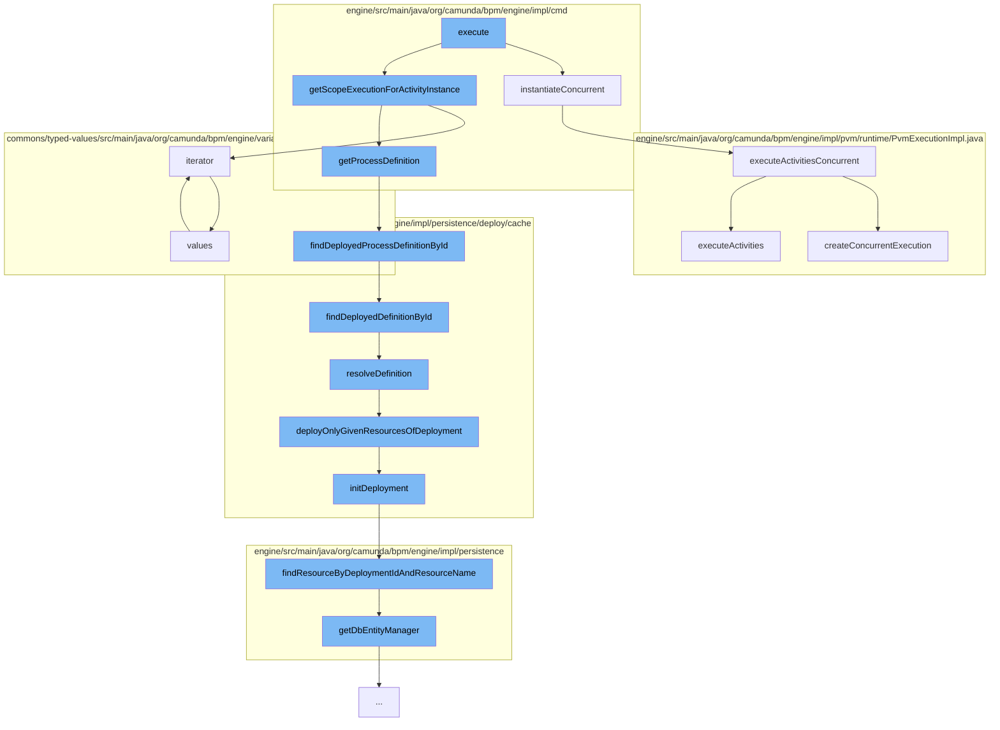

This document will cover the process of executing a process instance in the Camunda BPMN engine, which includes:

1. Instantiating concurrent activities
2. Retrieving scope execution for activity instance
3. Finding deployed process definition by ID
4. Resolving the definition
5. Initializing the deployment
6. Finding resource by deployment ID and resource name



<SwmSnippet path="/engine/src/main/java/org/camunda/bpm/engine/impl/cmd/AbstractInstantiationCmd.java" line="330">

---

# Instantiating concurrent activities

The `instantiateConcurrent` method is used to instantiate concurrent activities in a process instance. It checks if the target element is a transition or an activity and calls the `executeActivitiesConcurrent` method accordingly.

```java
  protected void instantiateConcurrent(ExecutionEntity ancestorScopeExecution, List<PvmActivity> parentFlowScopes, CoreModelElement targetElement) {
    if (PvmTransition.class.isAssignableFrom(targetElement.getClass())) {
      ancestorScopeExecution.executeActivitiesConcurrent(parentFlowScopes, null, (PvmTransition) targetElement, variables,
          variablesLocal, skipCustomListeners, skipIoMappings);
    }
    else if (PvmActivity.class.isAssignableFrom(targetElement.getClass())) {
      ancestorScopeExecution.executeActivitiesConcurrent(parentFlowScopes, (PvmActivity) targetElement, null, variables,
          variablesLocal, skipCustomListeners, skipIoMappings);

    }
    else {
      throw new ProcessEngineException("Cannot instantiate element " + targetElement);
    }
  }
```

---

</SwmSnippet>

<SwmSnippet path="/engine/src/main/java/org/camunda/bpm/engine/impl/cmd/AbstractProcessInstanceModificationCommand.java" line="176">

---

# Retrieving scope execution for activity instance

The `getScopeExecutionForActivityInstance` method retrieves the scope execution for a given activity instance. It uses the `iterator` method to iterate over the variable map.

```java
      }
    }

    // find the scope execution for the given activity instance
    Set<ExecutionEntity> retainedExecutionsForInstance = new HashSet<ExecutionEntity>();
    for (ExecutionEntity execution : executions) {
      if (activityInstanceExecutions.contains(execution.getId())) {
        retainedExecutionsForInstance.add(execution);
      }
    }

    if (retainedExecutionsForInstance.size() != 1) {
      throw new ProcessEngineException("There are " + retainedExecutionsForInstance.size()
          + " (!= 1) executions for activity instance " + activityInstance.getId());
    }

    return retainedExecutionsForInstance.iterator().next();
```

---

</SwmSnippet>

<SwmSnippet path="/engine/src/main/java/org/camunda/bpm/engine/impl/persistence/deploy/cache/DeploymentCache.java" line="80">

---

# Finding deployed process definition by ID

The `findDeployedProcessDefinitionById` method is used to find a deployed process definition by its ID. It uses the `findDeployedDefinitionById` method to retrieve the definition from the cache.

```java
  public ProcessDefinitionEntity findDeployedProcessDefinitionById(String processDefinitionId) {
    return processDefinitionEntityCache.findDeployedDefinitionById(processDefinitionId);
  }
```

---

</SwmSnippet>

<SwmSnippet path="/engine/src/main/java/org/camunda/bpm/engine/impl/persistence/deploy/cache/ResourceDefinitionCache.java" line="111">

---

# Resolving the definition

The `resolveDefinition` method is used to resolve a given definition. If the definition is not in the cache, it deploys the resources of the deployment and retrieves the definition from the cache.

```java
  public T resolveDefinition(T definition) {
    String definitionId = definition.getId();
    String deploymentId = definition.getDeploymentId();
    T cachedDefinition = cache.get(definitionId);
    if (cachedDefinition == null) {
      synchronized (this) {
        cachedDefinition = cache.get(definitionId);
        if (cachedDefinition == null) {
          DeploymentEntity deployment = Context
              .getCommandContext()
              .getDeploymentManager()
              .findDeploymentById(deploymentId);
          deployment.setNew(false);
          cacheDeployer.deployOnlyGivenResourcesOfDeployment(deployment, definition.getResourceName(), definition.getDiagramResourceName());
          cachedDefinition = cache.get(definitionId);
        }
      }
      checkInvalidDefinitionWasCached(deploymentId, definitionId, cachedDefinition);
    }
    if (cachedDefinition != null) {
      cachedDefinition.updateModifiableFieldsFromEntity(definition);
```

---

</SwmSnippet>

<SwmSnippet path="/engine/src/main/java/org/camunda/bpm/engine/impl/persistence/deploy/cache/CacheDeployer.java" line="74">

---

# Initializing the deployment

The `initDeployment` method is used to initialize a deployment. It adds the resources of the deployment to the deployment entity.

```java
  protected void initDeployment(final DeploymentEntity deployment, String... resourceNames) {
    deployment.clearResources();
    for (String resourceName : resourceNames) {
      if (resourceName != null) {
        // with the given resource we prevent the deployment of querying
        // the database which means using all resources that were utilized during the deployment
        ResourceEntity resource = Context.getCommandContext().getResourceManager().findResourceByDeploymentIdAndResourceName(deployment.getId(), resourceName);

        deployment.addResource(resource);
      }
    }
  }
```

---

</SwmSnippet>

<SwmSnippet path="/engine/src/main/java/org/camunda/bpm/engine/impl/persistence/entity/ResourceManager.java" line="41">

---

# Finding resource by deployment ID and resource name

The `findResourceByDeploymentIdAndResourceName` method is used to find a resource by its deployment ID and resource name. It uses the `getDbEntityManager` method to get the database entity manager.

```java
  public ResourceEntity findResourceByDeploymentIdAndResourceName(String deploymentId, String resourceName) {
    Map<String, Object> params = new HashMap<String, Object>();
    params.put("deploymentId", deploymentId);
    params.put("resourceName", resourceName);
    return (ResourceEntity) getDbEntityManager().selectOne("selectResourceByDeploymentIdAndResourceName", params);
  }
```

---

</SwmSnippet>

&nbsp;

*This is an auto-generated document by Swimm AI 🌊 and has not yet been verified by a human*

<SwmMeta version="3.0.0" repo-id="Z2l0aHViJTNBJTNBQ2l0aS1jYW11bmRhJTNBJTNBZ2lsYWRuYXZvdA==" repo-name="Citi-camunda" doc-type="flows"><sup>Powered by [Swimm](/)</sup></SwmMeta>
