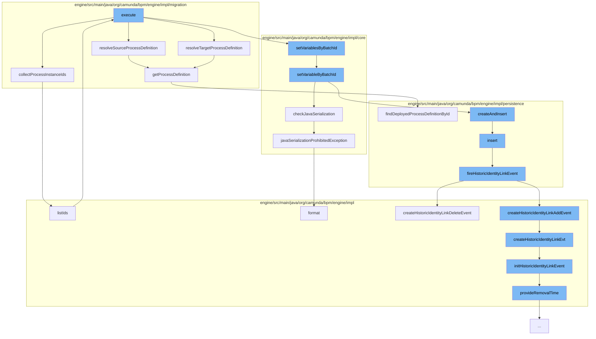

This document will cover the process of migrating process instances in the Camunda BPM engine. We'll cover the following steps:

1. Collecting process instance IDs
2. Resolving source and target process definitions
3. Setting variables by batch ID
4. Checking Java serialization
5. Creating and inserting identity link entities
6. Firing historic identity link events
7. Creating historic identity link events
8. Initializing historic identity link events
9. Providing removal time for historic events



<SwmSnippet path="/engine/src/main/java/org/camunda/bpm/engine/impl/migration/AbstractMigrationCmd.java" line="64">

---

# Collecting process instance IDs

The `collectProcessInstanceIds` function is used to gather all the process instance IDs that are part of the migration. It collects both the IDs directly provided and those obtained from a process instance query.

```java
  protected Collection<String> collectProcessInstanceIds() {

    Set<String> collectedProcessInstanceIds = new HashSet<>();

    List<String> processInstanceIds = executionBuilder.getProcessInstanceIds();
    if (processInstanceIds != null) {
      collectedProcessInstanceIds.addAll(processInstanceIds);
    }

    final ProcessInstanceQueryImpl processInstanceQuery =
        (ProcessInstanceQueryImpl) executionBuilder.getProcessInstanceQuery();
    if (processInstanceQuery != null) {
      collectedProcessInstanceIds.addAll(processInstanceQuery.listIds());
    }

    return collectedProcessInstanceIds;
  }
```

---

</SwmSnippet>

<SwmSnippet path="/engine/src/main/java/org/camunda/bpm/engine/impl/migration/AbstractMigrationCmd.java" line="133">

---

# Resolving source and target process definitions

The `getProcessDefinition` function is used to retrieve the process definition based on the provided ID. This function is used in both `resolveSourceProcessDefinition` and `resolveTargetProcessDefinition` to get the source and target process definitions respectively.

```java
  protected ProcessDefinitionEntity getProcessDefinition(CommandContext commandContext,
                                                         String processDefinitionId) {

    return commandContext
        .getProcessEngineConfiguration()
        .getDeploymentCache()
        .findDeployedProcessDefinitionById(processDefinitionId);
  }
```

---

</SwmSnippet>

<SwmSnippet path="/engine/src/main/java/org/camunda/bpm/engine/impl/core/variable/VariableUtil.java" line="109">

---

# Setting variables by batch ID

The `setVariableByBatchId` function is used to set a variable for a specific batch ID. It checks if the variable is transient and if Java serialization is allowed before creating and inserting a new variable instance.

```java
  public static void setVariableByBatchId(String batchId, String variableName, Object variableValue) {
    TypedValue variableTypedValue = Variables.untypedValue(variableValue);

    boolean isTransient = variableTypedValue.isTransient();
    if (isTransient) {
      throw CMD_LOGGER.exceptionSettingTransientVariablesAsyncNotSupported(variableName);
    }

    checkJavaSerialization(variableName, variableTypedValue);

    VariableInstanceEntity variableInstance =
        VariableInstanceEntity.createAndInsert(variableName, variableTypedValue);

    variableInstance.setVariableScopeId(batchId);
    variableInstance.setBatchId(batchId);
  }
```

---

</SwmSnippet>

<SwmSnippet path="/engine/src/main/java/org/camunda/bpm/engine/impl/core/variable/VariableUtil.java" line="81">

---

# Checking Java serialization

The `checkJavaSerialization` function is used to verify if Java serialization is allowed for the variable. If not, it throws a `ProcessEngineException`.

```java
  public static void checkJavaSerialization(String variableName, TypedValue value) {
    if (isJavaSerializationProhibited(value)) {
      throw CORE_LOGGER.javaSerializationProhibitedException(variableName);
    }
  }
```

---

</SwmSnippet>

<SwmSnippet path="/engine/src/main/java/org/camunda/bpm/engine/impl/persistence/entity/IdentityLinkEntity.java" line="82">

---

# Creating and inserting identity link entities

The `insert` function is used to create a new identity link entity and insert it into the database. After the insertion, it fires a historic identity link event.

```java
  public void insert() {
    Context
      .getCommandContext()
      .getDbEntityManager()
      .insert(this);
    fireHistoricIdentityLinkEvent(HistoryEventTypes.IDENTITY_LINK_ADD);
  }
```

---

</SwmSnippet>

<SwmSnippet path="/engine/src/main/java/org/camunda/bpm/engine/impl/persistence/entity/IdentityLinkEntity.java" line="204">

---

# Firing historic identity link events

The `fireHistoricIdentityLinkEvent` function is used to create a historic event for the identity link. Depending on the event type, it creates either a `HistoricIdentityLinkAddEvent` or a `HistoricIdentityLinkDeleteEvent`.

```java
  public void fireHistoricIdentityLinkEvent(final HistoryEventType eventType) {
    ProcessEngineConfigurationImpl processEngineConfiguration = Context.getProcessEngineConfiguration();

    HistoryLevel historyLevel = processEngineConfiguration.getHistoryLevel();
    if(historyLevel.isHistoryEventProduced(eventType, this)) {

      HistoryEventProcessor.processHistoryEvents(new HistoryEventProcessor.HistoryEventCreator() {
        @Override
        public HistoryEvent createHistoryEvent(HistoryEventProducer producer) {
          HistoryEvent event = null;
          if (HistoryEvent.IDENTITY_LINK_ADD.equals(eventType.getEventName())) {
            event = producer.createHistoricIdentityLinkAddEvent(IdentityLinkEntity.this);
          } else if (HistoryEvent.IDENTITY_LINK_DELETE.equals(eventType.getEventName())) {
            event = producer.createHistoricIdentityLinkDeleteEvent(IdentityLinkEntity.this);
          }
          return event;
        }
      });

    }
  }
```

---

</SwmSnippet>

<SwmSnippet path="/engine/src/main/java/org/camunda/bpm/engine/impl/history/producer/DefaultHistoryEventProducer.java" line="950">

---

# Creating historic identity link events

The `createHistoricIdentityLinkEvt` function is used to create a historic identity link event. It initializes the event with the identity link and event type.

```java
  protected HistoryEvent createHistoricIdentityLinkEvt(IdentityLink identityLink, HistoryEventTypes eventType) {
    // create historic identity link event
    HistoricIdentityLinkLogEventEntity evt = newIdentityLinkEventEntity();
    // Mapping all the values of identity link to HistoricIdentityLinkEvent
    initHistoricIdentityLinkEvent(evt, identityLink, eventType);
    return evt;
  }
```

---

</SwmSnippet>

<SwmSnippet path="/engine/src/main/java/org/camunda/bpm/engine/impl/history/producer/DefaultHistoryEventProducer.java" line="962">

---

# Initializing historic identity link events

The `initHistoricIdentityLinkEvent` function is used to initialize a historic identity link event. It sets the necessary properties of the event and provides a removal time if the history removal time strategy is set to start.

```java
  protected void initHistoricIdentityLinkEvent(HistoricIdentityLinkLogEventEntity evt, IdentityLink identityLink, HistoryEventType eventType) {

    if (identityLink.getTaskId() != null) {
      TaskEntity task = Context
          .getCommandContext()
          .getTaskManager()
          .findTaskById(identityLink.getTaskId());

      evt.setProcessDefinitionId(task.getProcessDefinitionId());

      if (task.getProcessDefinition() != null) {
        evt.setProcessDefinitionKey(task.getProcessDefinition().getKey());
      }

      ExecutionEntity execution = task.getExecution();
      if (execution != null) {
        evt.setRootProcessInstanceId(execution.getRootProcessInstanceId());

        if (isHistoryRemovalTimeStrategyStart()) {
          provideRemovalTime(evt);
        }
```

---

</SwmSnippet>

<SwmSnippet path="/engine/src/main/java/org/camunda/bpm/engine/impl/history/producer/DefaultHistoryEventProducer.java" line="1300">

---

# Providing removal time for historic events

The `provideRemovalTime` function is used to calculate and set the removal time for a historic batch entity.

```java
  protected void provideRemovalTime(HistoricBatchEntity historicBatch) {
    Date removalTime = calculateRemovalTime(historicBatch);
    if (removalTime != null) {
      historicBatch.setRemovalTime(removalTime);
    }
  }
```

---

</SwmSnippet>

&nbsp;

*This is an auto-generated document by Swimm AI 🌊 and has not yet been verified by a human*

<SwmMeta version="3.0.0" repo-id="Z2l0aHViJTNBJTNBQ2l0aS1jYW11bmRhJTNBJTNBZ2lsYWRuYXZvdA==" repo-name="Citi-camunda" doc-type="flows"><sup>Powered by [Swimm](/)</sup></SwmMeta>
