This document will cover the process of migrating process instances in the Camunda Platform. The process includes the following steps:

1. Collecting process instance IDs
2. Resolving source and target process definitions
3. Migrating the process instance
4. Validating the migration
5. Executing the migration in context.

```mermaid
graph TD;
subgraph engine/src/main/java/org/camunda/bpm/engine/impl/migration
  execute:::mainFlowStyle --> collectProcessInstanceIds
end
subgraph engine/src/main/java/org/camunda/bpm/engine/impl/migration
  execute:::mainFlowStyle --> resolveSourceProcessDefinition
end
subgraph engine/src/main/java/org/camunda/bpm/engine/impl/migration
  execute:::mainFlowStyle --> resolveTargetProcessDefinition
end
subgraph engine/src/main/java/org/camunda/bpm/engine/impl/migration
  execute:::mainFlowStyle --> migrateProcessInstance
end
subgraph engine/src/main/java/org/camunda/bpm/engine/impl
  collectProcessInstanceIds --> listIds
end
subgraph engine/src/main/java/org/camunda/bpm/engine/impl
  listIds --> execute
end
subgraph engine/src/main/java/org/camunda/bpm/engine/impl/migration
  resolveSourceProcessDefinition --> getProcessDefinition
end
subgraph engine/src/main/java/org/camunda/bpm/engine/impl/persistence
  getProcessDefinition --> findDeployedProcessDefinitionById
end
subgraph engine/src/main/java/org/camunda/bpm/engine/impl/migration
  resolveTargetProcessDefinition --> getProcessDefinition
end
subgraph engine/src/main/java/org/camunda/bpm/engine/impl/migration
  migrateProcessInstance:::mainFlowStyle --> executeInContext
end
subgraph engine/src/main/java/org/camunda/bpm/engine/impl/migration
  migrateProcessInstance:::mainFlowStyle --> validateInstructions
end
subgraph engine/src/main/java/org/camunda/bpm/engine/impl/migration/instance/parser
  migrateProcessInstance:::mainFlowStyle --> parse
end
subgraph engine/src/main/java/org/camunda/bpm/engine/impl
  executeInContext --> doContextSwitch
end
subgraph engine/src/main/java/org/camunda/bpm/engine/impl
  doContextSwitch --> run
end
subgraph engine/src/main/java/org/camunda/bpm/engine/impl/migration
  validateInstructions --> validateActivityInstance
end
subgraph engine/src/main/java/org/camunda/bpm/engine/impl/migration
  validateInstructions --> validateTransitionInstance
end
subgraph engine/src/main/java/org/camunda/bpm/engine/impl/migration
  validateInstructions --> validateEventScopeInstance
end
subgraph engine/src/main/java/org/camunda/bpm/engine/impl/migration
  validateInstructions --> validateCompensateSubscriptionInstance
end
subgraph engine/src/main/java/org/camunda/bpm/engine/impl/migration
  validateActivityInstance --> validate
end
subgraph engine/src/main/java/org/camunda/bpm/engine/impl/migration
  validateTransitionInstance --> validate
end
subgraph engine/src/main/java/org/camunda/bpm/engine/impl/migration
  validateEventScopeInstance --> validate
end
subgraph engine/src/main/java/org/camunda/bpm/engine/impl/migration
  validateCompensateSubscriptionInstance --> validate
end
subgraph engine/src/main/java/org/camunda/bpm/engine/impl/migration/instance/parser
  parse:::mainFlowStyle --> validateNoEntitiesLeft
end
subgraph engine/src/main/java/org/camunda/bpm/engine/impl/persistence
  parse:::mainFlowStyle --> restoreProcessInstance
end
subgraph engine/src/main/java/org/camunda/bpm/engine/impl/migration/instance/parser
  validateNoEntitiesLeft --> ensureNoEntitiesAreLeft
end
subgraph engine/src/main/java/org/camunda/bpm/engine/impl/util
  ensureNoEntitiesAreLeft --> joinDbEntityIds
end
subgraph engine/src/main/java/org/camunda/bpm/engine/impl/migration
  ensureNoEntitiesAreLeft --> addFailure
end
subgraph engine/src/main/java/org/camunda/bpm/engine/impl/util
  restoreProcessInstance:::mainFlowStyle --> format
end
subgraph engine/src/main/java/org/camunda/bpm/engine/impl
  format:::mainFlowStyle --> printStackTrace
end
subgraph engine/src/main/java/org/camunda/bpm/engine/impl
  printStackTrace:::mainFlowStyle --> logNonVerbose
end
subgraph engine/src/main/java/org/camunda/bpm/engine/impl
  logNonVerbose:::mainFlowStyle --> collectActivityTrace
end
subgraph engine/src/main/java/org/camunda/bpm/engine/impl
  collectActivityTrace:::mainFlowStyle --> equals
end
subgraph engine/src/main/java/org/camunda/bpm/engine/impl
  equals:::mainFlowStyle --> getVariableValue
end
  getVariableValue:::mainFlowStyle --> ...

 classDef mainFlowStyle color:#000000,fill:#7CB9F4
  classDef rootsStyle color:#000000,fill:#00FFF4
```



<SwmSnippet path="/engine/src/main/java/org/camunda/bpm/engine/impl/migration/AbstractMigrationCmd.java" line="64">

---

# Collecting process instance IDs

The `collectProcessInstanceIds` function is used to gather all the process instance IDs that are involved in the migration. It collects both the IDs directly provided and those obtained through a process instance query.

```java
  protected Collection<String> collectProcessInstanceIds() {

    Set<String> collectedProcessInstanceIds = new HashSet<>();

    List<String> processInstanceIds = executionBuilder.getProcessInstanceIds();
    if (processInstanceIds != null) {
      collectedProcessInstanceIds.addAll(processInstanceIds);
    }

    final ProcessInstanceQueryImpl processInstanceQuery =
        (ProcessInstanceQueryImpl) executionBuilder.getProcessInstanceQuery();
    if (processInstanceQuery != null) {
      collectedProcessInstanceIds.addAll(processInstanceQuery.listIds());
    }

    return collectedProcessInstanceIds;
  }
```

---

</SwmSnippet>

<SwmSnippet path="/engine/src/main/java/org/camunda/bpm/engine/impl/migration/AbstractMigrationCmd.java" line="133">

---

# Resolving source and target process definitions

The `getProcessDefinition` function is used to retrieve the process definition based on the provided ID. This function is used in both `resolveSourceProcessDefinition` and `resolveTargetProcessDefinition` to get the source and target process definitions respectively.

```java
  protected ProcessDefinitionEntity getProcessDefinition(CommandContext commandContext,
                                                         String processDefinitionId) {

    return commandContext
        .getProcessEngineConfiguration()
        .getDeploymentCache()
        .findDeployedProcessDefinitionById(processDefinitionId);
  }
```

---

</SwmSnippet>

<SwmSnippet path="/engine/src/main/java/org/camunda/bpm/engine/impl/migration/MigrateProcessInstanceCmd.java" line="170">

---

# Migrating the process instance

The `executeInContext` function is used to perform the migration operation within the context of the target process definition.

```java
  protected <T> void executeInContext(final Runnable runnable,
                                      ProcessDefinitionEntity contextDefinition) {
    ProcessApplicationContextUtil.doContextSwitch(runnable, contextDefinition);
  }
```

---

</SwmSnippet>

<SwmSnippet path="/engine/src/main/java/org/camunda/bpm/engine/impl/migration/MigrateProcessInstanceCmd.java" line="283">

---

# Validating the migration

The `validateActivityInstance` function is used to validate the migration of each activity instance. It uses a list of `migratingActivityInstanceValidators` to perform the validation.

```java
  protected MigratingActivityInstanceValidationReportImpl validateActivityInstance(
      MigratingActivityInstance migratingActivityInstance,
      MigratingProcessInstance migratingProcessInstance,
      List<MigratingActivityInstanceValidator> migratingActivityInstanceValidators) {
    MigratingActivityInstanceValidationReportImpl instanceReport =
        new MigratingActivityInstanceValidationReportImpl(migratingActivityInstance);
    for (MigratingActivityInstanceValidator migratingActivityInstanceValidator :
        migratingActivityInstanceValidators) {
      migratingActivityInstanceValidator.validate(migratingActivityInstance,
          migratingProcessInstance, instanceReport);
    }
    return instanceReport;
  }
```

---

</SwmSnippet>

<SwmSnippet path="/engine/src/main/java/org/camunda/bpm/engine/impl/context/ProcessApplicationContextUtil.java" line="177">

---

# Executing the migration in context

The `doContextSwitch` function is used to execute the migration operation within the context of the target process definition. It uses the `runnable` parameter to perform the actual migration operation.

```java
  public static void doContextSwitch(final Runnable runnable, ProcessDefinitionEntity contextDefinition) {
    ProcessApplicationReference processApplication = getTargetProcessApplication(contextDefinition);
    if (requiresContextSwitch(processApplication)) {
      Context.executeWithinProcessApplication(new Callable<Void>() {

        @Override
        public Void call() throws Exception {
          runnable.run();
          return null;
        }
      }, processApplication);
    }
    else {
      runnable.run();
    }
  }
```

---

</SwmSnippet>

&nbsp;

*This is an auto-generated document by Swimm AI 🌊 and has not yet been verified by a human*

<SwmMeta version="3.0.0" repo-id="Z2l0aHViJTNBJTNBQ2l0aS1jYW11bmRhJTNBJTNBZ2lsYWRuYXZvdA==" repo-name="Citi-camunda" doc-type="flows"><sup>Powered by [Swimm](/)</sup></SwmMeta>
