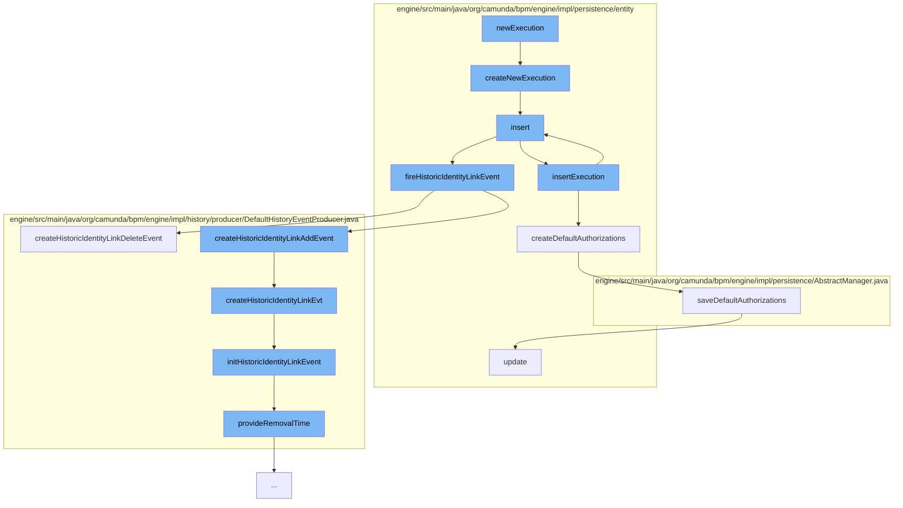

This document will cover the process of creating a new execution in the Camunda BPMN engine. The process includes the following steps:

1. Creating a new execution entity
2. Inserting the execution entity
3. Creating default authorizations
4. Firing a historic identity link event
5. Providing a removal time for the historic identity link event
6. Saving default authorizations



<SwmSnippet path="/engine/src/main/java/org/camunda/bpm/engine/impl/persistence/entity/ExecutionEntity.java" line="313">

---

# Creating a new execution entity

The `createNewExecution` function creates a new `ExecutionEntity` instance and initializes its associations. The new execution entity is then inserted.

```java
  protected static ExecutionEntity createNewExecution() {
    ExecutionEntity newExecution = new ExecutionEntity();
    initializeAssociations(newExecution);
    newExecution.insert();

    return newExecution;
  }
```

---

</SwmSnippet>

<SwmSnippet path="/engine/src/main/java/org/camunda/bpm/engine/impl/persistence/entity/ExecutionEntity.java" line="1440">

---

# Inserting the execution entity

The `insert` function inserts the execution entity into the execution manager.

```java
  public void insert() {
    Context.getCommandContext().getExecutionManager().insertExecution(this);
  }
```

---

</SwmSnippet>

<SwmSnippet path="/engine/src/main/java/org/camunda/bpm/engine/impl/persistence/entity/ExecutionManager.java" line="207">

---

# Creating default authorizations

The `createDefaultAuthorizations` function creates default authorizations for the execution entity if it is a process instance execution and authorization is enabled.

```java
  // helper ///////////////////////////////////////////////////////////

  protected void createDefaultAuthorizations(ExecutionEntity execution) {
    if(execution.isProcessInstanceExecution() && isAuthorizationEnabled()) {
      ResourceAuthorizationProvider provider = getResourceAuthorizationProvider();
      AuthorizationEntity[] authorizations = provider.newProcessInstance(execution);
      saveDefaultAuthorizations(authorizations);
    }
  }
```

---

</SwmSnippet>

<SwmSnippet path="/engine/src/main/java/org/camunda/bpm/engine/impl/persistence/entity/IdentityLinkEntity.java" line="204">

---

# Firing a historic identity link event

The `fireHistoricIdentityLinkEvent` function fires a historic identity link event if the history level allows it. Depending on the event type, it creates a historic identity link add event or a historic identity link delete event.

```java
  public void fireHistoricIdentityLinkEvent(final HistoryEventType eventType) {
    ProcessEngineConfigurationImpl processEngineConfiguration = Context.getProcessEngineConfiguration();

    HistoryLevel historyLevel = processEngineConfiguration.getHistoryLevel();
    if(historyLevel.isHistoryEventProduced(eventType, this)) {

      HistoryEventProcessor.processHistoryEvents(new HistoryEventProcessor.HistoryEventCreator() {
        @Override
        public HistoryEvent createHistoryEvent(HistoryEventProducer producer) {
          HistoryEvent event = null;
          if (HistoryEvent.IDENTITY_LINK_ADD.equals(eventType.getEventName())) {
            event = producer.createHistoricIdentityLinkAddEvent(IdentityLinkEntity.this);
          } else if (HistoryEvent.IDENTITY_LINK_DELETE.equals(eventType.getEventName())) {
            event = producer.createHistoricIdentityLinkDeleteEvent(IdentityLinkEntity.this);
          }
          return event;
        }
      });

    }
  }
```

---

</SwmSnippet>

<SwmSnippet path="/engine/src/main/java/org/camunda/bpm/engine/impl/history/producer/DefaultHistoryEventProducer.java" line="1300">

---

# Providing a removal time for the historic identity link event

The `provideRemovalTime` function calculates and sets the removal time for the historic batch entity.

```java
  protected void provideRemovalTime(HistoricBatchEntity historicBatch) {
    Date removalTime = calculateRemovalTime(historicBatch);
    if (removalTime != null) {
      historicBatch.setRemovalTime(removalTime);
    }
  }
```

---

</SwmSnippet>

<SwmSnippet path="/engine/src/main/java/org/camunda/bpm/engine/impl/persistence/AbstractManager.java" line="295">

---

# Saving default authorizations

The `saveDefaultAuthorizations` function saves the default authorizations for the execution entity. If the authorization entity has an ID, it updates the existing authorization; otherwise, it inserts a new authorization.

```java
  public void saveDefaultAuthorizations(final AuthorizationEntity[] authorizations) {
    if(authorizations != null && authorizations.length > 0) {
      Context.getCommandContext().runWithoutAuthorization(new Callable<Void>() {
        public Void call() {
          AuthorizationManager authorizationManager = getAuthorizationManager();
          for (AuthorizationEntity authorization : authorizations) {

            if(authorization.getId() == null) {
              authorizationManager.insert(authorization);
            } else {
              authorizationManager.update(authorization);
            }

          }
          return null;
        }
      });
    }
  }
```

---

</SwmSnippet>

&nbsp;

*This is an auto-generated document by Swimm AI 🌊 and has not yet been verified by a human*

<SwmMeta version="3.0.0" repo-id="Z2l0aHViJTNBJTNBQ2l0aS1jYW11bmRhJTNBJTNBZ2lsYWRuYXZvdA==" repo-name="Citi-camunda" doc-type="flows"><sup>Powered by [Swimm](/)</sup></SwmMeta>
