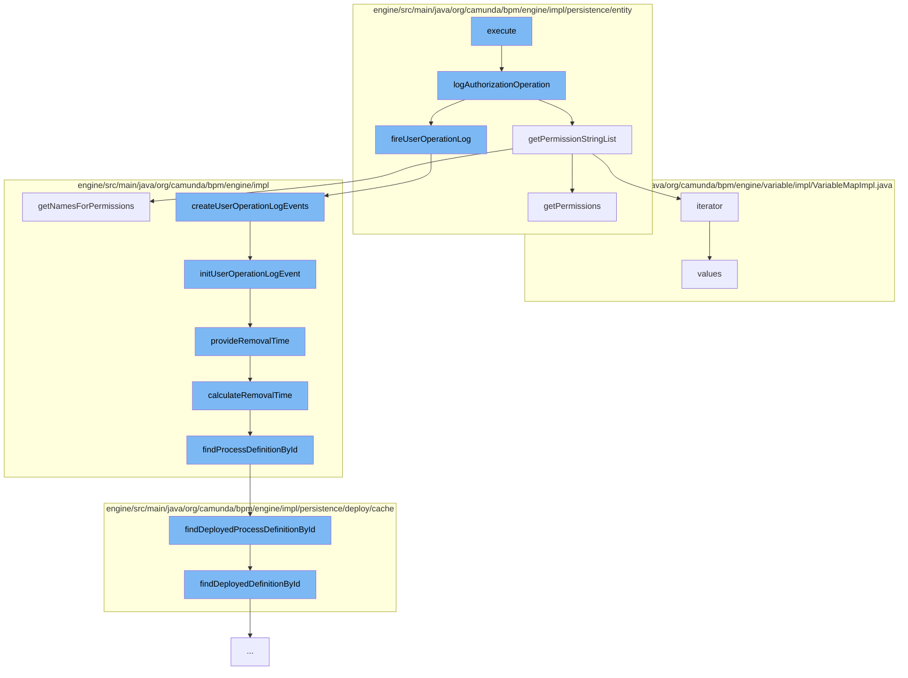

This document will cover the process of saving authorization in the Citi-camunda project, which includes:

1. Executing the save authorization command
2. Logging the authorization operation
3. Creating user operation log events
4. Initializing user operation log event
5. Providing removal time for the event
6. Calculating removal time for the event
7. Finding the process definition by ID



<SwmSnippet path="/engine/src/main/java/org/camunda/bpm/engine/impl/cmd/SaveAuthorizationCmd.java" line="1">

---

# Executing the save authorization command

The process starts with the execution of the `SaveAuthorizationCmd` command. This command is responsible for initiating the process of saving an authorization.

```java
/*
```

---

</SwmSnippet>

<SwmSnippet path="/engine/src/main/java/org/camunda/bpm/engine/impl/persistence/entity/UserOperationLogManager.java" line="719">

---

# Logging the authorization operation

The `logAuthorizationOperation` function logs the operation performed on the authorization. It records changes in permissions, type, resource, resourceId, userId, and groupId.

```java
  public void logAuthorizationOperation(String operation, AuthorizationEntity authorization, AuthorizationEntity previousValues) {
    if (isUserOperationLogEnabled()) {
      List<PropertyChange> propertyChanges = new ArrayList<>();
      propertyChanges.add(new PropertyChange("permissionBits", previousValues == null ? null : previousValues.getPermissions(), authorization.getPermissions()));
      propertyChanges.add(new PropertyChange("permissions", previousValues == null ? null : getPermissionStringList(previousValues), getPermissionStringList(authorization)));
      propertyChanges.add(new PropertyChange("type", previousValues == null ? null : previousValues.getAuthorizationType(), authorization.getAuthorizationType()));
      propertyChanges.add(new PropertyChange("resource", previousValues == null ? null : getResourceName(previousValues.getResourceType()), getResourceName(authorization.getResourceType())));
      propertyChanges.add(new PropertyChange("resourceId", previousValues == null ? null : previousValues.getResourceId(), authorization.getResourceId()));
      if (authorization.getUserId() != null || (previousValues != null && previousValues.getUserId() != null)) {
        propertyChanges.add(new PropertyChange("userId", previousValues == null ? null : previousValues.getUserId(), authorization.getUserId()));
      }
      if (authorization.getGroupId() != null || (previousValues != null && previousValues.getGroupId() != null)) {
        propertyChanges.add(new PropertyChange("groupId", previousValues == null ? null : previousValues.getGroupId(), authorization.getGroupId()));
      }

      UserOperationLogContext context = new UserOperationLogContext();
      UserOperationLogContextEntryBuilder entryBuilder =
          UserOperationLogContextEntryBuilder.entry(operation, EntityTypes.AUTHORIZATION)
            .propertyChanges(propertyChanges)
            .category(UserOperationLogEntry.CATEGORY_ADMIN);
      context.addEntry(entryBuilder.create());
```

---

</SwmSnippet>

<SwmSnippet path="/engine/src/main/java/org/camunda/bpm/engine/impl/history/producer/DefaultHistoryEventProducer.java" line="820">

---

# Creating user operation log events

The `createUserOperationLogEvents` function creates log events for the user operation. These events are then added to the history.

```java
  // User Operation Logs ///////////////////////////

  public List<HistoryEvent> createUserOperationLogEvents(UserOperationLogContext context) {
    List<HistoryEvent> historyEvents = new ArrayList<HistoryEvent>();

    String operationId = Context.getCommandContext().getOperationId();
    context.setOperationId(operationId);

    for (UserOperationLogContextEntry entry : context.getEntries()) {
      for (PropertyChange propertyChange : entry.getPropertyChanges()) {
        UserOperationLogEntryEventEntity evt = new UserOperationLogEntryEventEntity();

        initUserOperationLogEvent(evt, context, entry, propertyChange);

        historyEvents.add(evt);
      }
    }

    return historyEvents;
  }
```

---

</SwmSnippet>

<SwmSnippet path="/engine/src/main/java/org/camunda/bpm/engine/impl/history/producer/DefaultHistoryEventProducer.java" line="330">

---

# Initializing user operation log event

The `initUserOperationLogEvent` function initializes the user operation log event. It sets the properties of the event and provides the removal time if the history removal time strategy is set to start.

```java
  protected void initUserOperationLogEvent(UserOperationLogEntryEventEntity evt, UserOperationLogContext context,
      UserOperationLogContextEntry contextEntry, PropertyChange propertyChange) {
    // init properties
    evt.setDeploymentId(contextEntry.getDeploymentId());
    evt.setEntityType(contextEntry.getEntityType());
    evt.setOperationType(contextEntry.getOperationType());
    evt.setOperationId(context.getOperationId());
    evt.setUserId(context.getUserId());
    evt.setProcessDefinitionId(contextEntry.getProcessDefinitionId());
    evt.setProcessDefinitionKey(contextEntry.getProcessDefinitionKey());
    evt.setProcessInstanceId(contextEntry.getProcessInstanceId());
    evt.setExecutionId(contextEntry.getExecutionId());
    evt.setCaseDefinitionId(contextEntry.getCaseDefinitionId());
    evt.setCaseInstanceId(contextEntry.getCaseInstanceId());
    evt.setCaseExecutionId(contextEntry.getCaseExecutionId());
    evt.setTaskId(contextEntry.getTaskId());
    evt.setJobId(contextEntry.getJobId());
    evt.setJobDefinitionId(contextEntry.getJobDefinitionId());
    evt.setBatchId(contextEntry.getBatchId());
    evt.setCategory(contextEntry.getCategory());
    evt.setTimestamp(ClockUtil.getCurrentTime());
```

---

</SwmSnippet>

<SwmSnippet path="/engine/src/main/java/org/camunda/bpm/engine/impl/history/producer/DefaultHistoryEventProducer.java" line="1300">

---

# Providing removal time for the event

The `provideRemovalTime` function provides the removal time for the historic batch. It calculates the removal time and sets it if it's not null.

```java
  protected void provideRemovalTime(HistoricBatchEntity historicBatch) {
    Date removalTime = calculateRemovalTime(historicBatch);
    if (removalTime != null) {
      historicBatch.setRemovalTime(removalTime);
    }
  }
```

---

</SwmSnippet>

<SwmSnippet path="/engine/src/main/java/org/camunda/bpm/engine/impl/history/producer/DefaultHistoryEventProducer.java" line="1285">

---

# Calculating removal time for the event

The `calculateRemovalTime` function calculates the removal time for the history event. It finds the process definition by ID and calculates the removal time based on it.

```java
  protected Date calculateRemovalTime(HistoryEvent historyEvent) {
    String processDefinitionId = historyEvent.getProcessDefinitionId();
    ProcessDefinition processDefinition = findProcessDefinitionById(processDefinitionId);

    return Context.getProcessEngineConfiguration()
      .getHistoryRemovalTimeProvider()
      .calculateRemovalTime((HistoricProcessInstanceEventEntity) historyEvent, processDefinition);
  }
```

---

</SwmSnippet>

<SwmSnippet path="/engine/src/main/java/org/camunda/bpm/engine/impl/history/producer/DefaultHistoryEventProducer.java" line="1326">

---

# Finding the process definition by ID

The `findProcessDefinitionById` function finds the deployed process definition by its ID. It uses the deployment cache to find the deployed definition.

```java
  protected ProcessDefinition findProcessDefinitionById(String processDefinitionId) {
    return Context.getCommandContext()
      .getProcessEngineConfiguration()
      .getDeploymentCache()
      .findDeployedProcessDefinitionById(processDefinitionId);
  }
```

---

</SwmSnippet>

&nbsp;

*This is an auto-generated document by Swimm AI 🌊 and has not yet been verified by a human*

<SwmMeta version="3.0.0" repo-id="Z2l0aHViJTNBJTNBQ2l0aS1jYW11bmRhJTNBJTNBZ2lsYWRuYXZvdA==" repo-name="Citi-camunda" doc-type="flows"><sup>Powered by [Swimm](/)</sup></SwmMeta>
