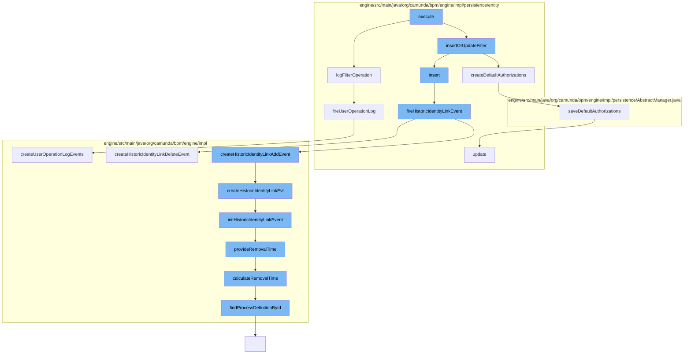

This document will cover the process of saving filters in the Camunda BPM engine. The process includes the following steps:

 1. Executing the save filter command
 2. Logging the filter operation
 3. Inserting or updating the filter
 4. Creating default authorizations
 5. Firing a historic identity link event
 6. Creating a historic identity link event
 7. Initializing the historic identity link event
 8. Providing the removal time
 9. Calculating the removal time
10. Firing a user operation log



<SwmSnippet path="/engine/src/main/java/org/camunda/bpm/engine/impl/cmd/SaveFilterCmd.java" line="1">

---

# Executing the save filter command

The `execute` function in `SaveFilterCmd.java` is the entry point for the process of saving a filter. It calls the `logFilterOperation` and `insertOrUpdateFilter` functions to start the process.

```java
/*
 * Copyright Camunda Services GmbH and/or licensed to Camunda Services GmbH
 * under one or more contributor license agreements. See the NOTICE file
 * distributed with this work for additional information regarding copyright
 * ownership. Camunda licenses this file to you under the Apache License,
 * Version 2.0; you may not use this file except in compliance with the License.
 * You may obtain a copy of the License at
 *
 *     http://www.apache.org/licenses/LICENSE-2.0
 *
```

---

</SwmSnippet>

<SwmSnippet path="/engine/src/main/java/org/camunda/bpm/engine/impl/persistence/entity/UserOperationLogManager.java" line="662">

---

# Logging the filter operation

The `logFilterOperation` function logs the operation of saving a filter. It creates a new `UserOperationLogContext` and adds an entry to it, then fires a user operation log.

```java
  public void logFilterOperation(String operation, String filterId) {
    if (isUserOperationLogEnabled()) {
      UserOperationLogContext context = new UserOperationLogContext();
      UserOperationLogContextEntryBuilder entryBuilder =
          UserOperationLogContextEntryBuilder.entry(operation, EntityTypes.FILTER)
            .propertyChanges(new PropertyChange("filterId", null, filterId))
            .category(UserOperationLogEntry.CATEGORY_TASK_WORKER);
      context.addEntry(entryBuilder.create());
      fireUserOperationLog(context);
    }
  }
```

---

</SwmSnippet>

<SwmSnippet path="/engine/src/main/java/org/camunda/bpm/engine/impl/persistence/entity/FilterManager.java" line="1">

---

# Inserting or updating the filter

The `insertOrUpdateFilter` function either inserts a new filter or updates an existing one. It calls the `createDefaultAuthorizations` function to create default authorizations for the filter.

```java
/*
 * Copyright Camunda Services GmbH and/or licensed to Camunda Services GmbH
 * under one or more contributor license agreements. See the NOTICE file
 * distributed with this work for additional information regarding copyright
 * ownership. Camunda licenses this file to you under the Apache License,
 * Version 2.0; you may not use this file except in compliance with the License.
 * You may obtain a copy of the License at
 *
 *     http://www.apache.org/licenses/LICENSE-2.0
 *
```

---

</SwmSnippet>

<SwmSnippet path="/engine/src/main/java/org/camunda/bpm/engine/impl/persistence/entity/FilterManager.java" line="96">

---

# Creating default authorizations

The `createDefaultAuthorizations` function creates default authorizations for the filter. It calls the `saveDefaultAuthorizations` function to save these authorizations.

```java
  // authorization utils /////////////////////////////////

  protected void createDefaultAuthorizations(Filter filter) {
    if(isAuthorizationEnabled()) {
      saveDefaultAuthorizations(getResourceAuthorizationProvider().newFilter(filter));
    }
  }
```

---

</SwmSnippet>

<SwmSnippet path="/engine/src/main/java/org/camunda/bpm/engine/impl/persistence/entity/IdentityLinkEntity.java" line="204">

---

# Firing a historic identity link event

The `fireHistoricIdentityLinkEvent` function fires a historic identity link event. It creates a new `HistoryEvent` and adds it to the history.

```java
  public void fireHistoricIdentityLinkEvent(final HistoryEventType eventType) {
    ProcessEngineConfigurationImpl processEngineConfiguration = Context.getProcessEngineConfiguration();

    HistoryLevel historyLevel = processEngineConfiguration.getHistoryLevel();
    if(historyLevel.isHistoryEventProduced(eventType, this)) {

      HistoryEventProcessor.processHistoryEvents(new HistoryEventProcessor.HistoryEventCreator() {
        @Override
        public HistoryEvent createHistoryEvent(HistoryEventProducer producer) {
          HistoryEvent event = null;
          if (HistoryEvent.IDENTITY_LINK_ADD.equals(eventType.getEventName())) {
            event = producer.createHistoricIdentityLinkAddEvent(IdentityLinkEntity.this);
          } else if (HistoryEvent.IDENTITY_LINK_DELETE.equals(eventType.getEventName())) {
            event = producer.createHistoricIdentityLinkDeleteEvent(IdentityLinkEntity.this);
          }
          return event;
        }
      });

    }
  }
```

---

</SwmSnippet>

<SwmSnippet path="/engine/src/main/java/org/camunda/bpm/engine/impl/history/producer/DefaultHistoryEventProducer.java" line="945">

---

# Creating a historic identity link event

The `createHistoricIdentityLinkEvt` function creates a historic identity link event. It initializes the event with the `initHistoricIdentityLinkEvent` function.

```java
  @Override
  public HistoryEvent createHistoricIdentityLinkDeleteEvent(IdentityLink identityLink) {
    return createHistoricIdentityLinkEvt(identityLink, HistoryEventTypes.IDENTITY_LINK_DELETE);
  }
```

---

</SwmSnippet>

<SwmSnippet path="/engine/src/main/java/org/camunda/bpm/engine/impl/history/producer/DefaultHistoryEventProducer.java" line="962">

---

# Initializing the historic identity link event

The `initHistoricIdentityLinkEvent` function initializes a historic identity link event. It sets various properties of the event and provides the removal time.

```java
  protected void initHistoricIdentityLinkEvent(HistoricIdentityLinkLogEventEntity evt, IdentityLink identityLink, HistoryEventType eventType) {

    if (identityLink.getTaskId() != null) {
      TaskEntity task = Context
          .getCommandContext()
          .getTaskManager()
          .findTaskById(identityLink.getTaskId());

      evt.setProcessDefinitionId(task.getProcessDefinitionId());

      if (task.getProcessDefinition() != null) {
        evt.setProcessDefinitionKey(task.getProcessDefinition().getKey());
      }

      ExecutionEntity execution = task.getExecution();
      if (execution != null) {
        evt.setRootProcessInstanceId(execution.getRootProcessInstanceId());

        if (isHistoryRemovalTimeStrategyStart()) {
          provideRemovalTime(evt);
        }
```

---

</SwmSnippet>

<SwmSnippet path="/engine/src/main/java/org/camunda/bpm/engine/impl/history/producer/DefaultHistoryEventProducer.java" line="1300">

---

# Providing the removal time

The `provideRemovalTime` function provides the removal time for the historic identity link event. It calls the `calculateRemovalTime` function to calculate the removal time.

```java
  protected void provideRemovalTime(HistoricBatchEntity historicBatch) {
    Date removalTime = calculateRemovalTime(historicBatch);
    if (removalTime != null) {
      historicBatch.setRemovalTime(removalTime);
    }
  }
```

---

</SwmSnippet>

<SwmSnippet path="/engine/src/main/java/org/camunda/bpm/engine/impl/history/producer/DefaultHistoryEventProducer.java" line="1285">

---

# Calculating the removal time

The `calculateRemovalTime` function calculates the removal time for the historic identity link event. It finds the process definition by ID and uses it to calculate the removal time.

```java
  protected Date calculateRemovalTime(HistoryEvent historyEvent) {
    String processDefinitionId = historyEvent.getProcessDefinitionId();
    ProcessDefinition processDefinition = findProcessDefinitionById(processDefinitionId);

    return Context.getProcessEngineConfiguration()
      .getHistoryRemovalTimeProvider()
      .calculateRemovalTime((HistoricProcessInstanceEventEntity) historyEvent, processDefinition);
  }
```

---

</SwmSnippet>

<SwmSnippet path="/engine/src/main/java/org/camunda/bpm/engine/impl/persistence/entity/UserOperationLogManager.java" line="779">

---

# Firing a user operation log

The `fireUserOperationLog` function fires a user operation log. It creates a list of `HistoryEvent` objects and adds them to the history.

```java
  protected void fireUserOperationLog(final UserOperationLogContext context) {
    if (context.getUserId() == null) {
      context.setUserId(getAuthenticatedUserId());
    }

    HistoryEventProcessor.processHistoryEvents(new HistoryEventProcessor.HistoryEventCreator() {
      @Override
      public List<HistoryEvent> createHistoryEvents(HistoryEventProducer producer) {
        return producer.createUserOperationLogEvents(context);
      }
    });
  }
```

---

</SwmSnippet>

&nbsp;

*This is an auto-generated document by Swimm AI 🌊 and has not yet been verified by a human*

<SwmMeta version="3.0.0" repo-id="Z2l0aHViJTNBJTNBQ2l0aS1jYW11bmRhJTNBJTNBZ2lsYWRuYXZvdA==" repo-name="Citi-camunda" doc-type="flows"><sup>Powered by [Swimm](/)</sup></SwmMeta>
