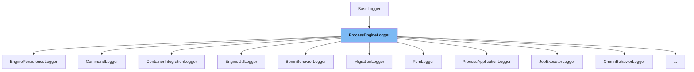

This document will cover the `ProcessEngineLogger` class. We'll cover:

1. What the `ProcessEngineLogger` class is.
2. The variables and functions defined in the `ProcessEngineLogger` class.
3. An example of how to use the `ProcessEngineLogger` class.



# What is ProcessEngineLogger

`ProcessEngineLogger` is a class that extends `BaseLogger`. It is used for logging various events and information in the Camunda BPM engine. It provides a set of static loggers for different components of the engine, each identified by a unique project code. These loggers are used throughout the engine to log events such as process engine creation, initialization, and exceptions.

# Variables and functions

`ProcessEngineLogger` defines a set of static variables and functions. Each variable represents a logger for a specific component of the engine, and each function provides a specific logging operation.

<SwmSnippet path="/engine/src/main/java/org/camunda/bpm/engine/impl/ProcessEngineLogger.java" line="56">

---

## Variable: PROJECT_CODE

`PROJECT_CODE` is a constant string that represents the project code for the engine. It is used as a prefix for the logger names.

```java
  public static final String PROJECT_CODE = "ENGINE";
```

---

</SwmSnippet>

<SwmSnippet path="/engine/src/main/java/org/camunda/bpm/engine/impl/ProcessEngineLogger.java" line="142">

---

## Function: shouldLogJobException

`shouldLogJobException` is a function that determines whether a job exception should be logged. It checks the engine configuration and the job's retry count.

```java
  public static boolean shouldLogJobException(ProcessEngineConfiguration processEngineConfiguration, JobEntity currentJob) {
    boolean enableReducedJobExceptionLogging = processEngineConfiguration.isEnableReducedJobExceptionLogging();
    return currentJob == null || !enableReducedJobExceptionLogging || enableReducedJobExceptionLogging && currentJob.getRetries() <= 1;
  }
```

---

</SwmSnippet>

<SwmSnippet path="/engine/src/main/java/org/camunda/bpm/engine/impl/ProcessEngineLogger.java" line="147">

---

## Function: shouldLogCmdException

`shouldLogCmdException` is a function that determines whether a command exception should be logged. It checks the engine configuration.

```java
  public static boolean shouldLogCmdException(ProcessEngineConfiguration processEngineConfiguration) {
    return processEngineConfiguration.isEnableCmdExceptionLogging();
  }
```

---

</SwmSnippet>

<SwmSnippet path="/engine/src/main/java/org/camunda/bpm/engine/impl/ProcessEngineLogger.java" line="151">

---

## Function: processEngineCreated

`processEngineCreated` is a function that logs the creation of a process engine. It takes the name of the engine as a parameter.

```java
  public void processEngineCreated(String name) {
    logInfo("001", "Process Engine {} created.", name);
  }
```

---

</SwmSnippet>

<SwmSnippet path="/engine/src/main/java/org/camunda/bpm/engine/impl/ProcessEngineLogger.java" line="155">

---

## Function: processEngineAlreadyInitialized

`processEngineAlreadyInitialized` is a function that logs the event of a process engine already being initialized.

```java
  public void processEngineAlreadyInitialized() {
    logInfo("002", "Process engine already initialized");
  }
```

---

</SwmSnippet>

<SwmSnippet path="/engine/src/main/java/org/camunda/bpm/engine/impl/ProcessEngineLogger.java" line="159">

---

## Function: initializingProcessEngineForResource

`initializingProcessEngineForResource` is a function that logs the initialization of a process engine for a specific resource. It takes the URL of the resource as a parameter.

```java
  public void initializingProcessEngineForResource(URL resourceUrl) {
    logInfo(
        "003", "Initializing process engine for resource {}", resourceUrl);
  }
```

---

</SwmSnippet>

<SwmSnippet path="/engine/src/main/java/org/camunda/bpm/engine/impl/ProcessEngineLogger.java" line="164">

---

## Function: initializingProcessEngine

`initializingProcessEngine` is a function that logs the initialization of a process engine. It takes the name of the engine as a parameter.

```java
  public void initializingProcessEngine(String name) {
    logInfo(
        "004", "Initializing process engine {}", name);
  }
```

---

</SwmSnippet>

<SwmSnippet path="/engine/src/main/java/org/camunda/bpm/engine/impl/ProcessEngineLogger.java" line="169">

---

## Function: exceptionWhileInitializingProcessengine

`exceptionWhileInitializingProcessengine` is a function that logs an exception that occurred while initializing a process engine. It takes the exception as a parameter.

```java
  public void exceptionWhileInitializingProcessengine(Throwable e) {
    logError("005", "Exception while initializing process engine {}", e.getMessage(), e);
  }
```

---

</SwmSnippet>

<SwmSnippet path="/engine/src/main/java/org/camunda/bpm/engine/impl/ProcessEngineLogger.java" line="173">

---

## Function: exceptionWhileClosingProcessEngine

`exceptionWhileClosingProcessEngine` is a function that logs an exception that occurred while closing a process engine. It takes the exception as a parameter.

```java
  public void exceptionWhileClosingProcessEngine(String string, Exception e) {
    logError("006", "Exception while closing process engine {}", string, e);
  }
```

---

</SwmSnippet>

<SwmSnippet path="/engine/src/main/java/org/camunda/bpm/engine/impl/ProcessEngineLogger.java" line="177">

---

## Function: processEngineClosed

`processEngineClosed` is a function that logs the event of a process engine being closed. It takes the name of the engine as a parameter.

```java
  public void processEngineClosed(String name) {
    logInfo("007", "Process Engine {} closed", name);
  }
```

---

</SwmSnippet>

<SwmSnippet path="/engine/src/main/java/org/camunda/bpm/engine/impl/ProcessEngineLogger.java" line="181">

---

## Function: historyCleanupJobReconfigurationFailure

`historyCleanupJobReconfigurationFailure` is a function that logs a failure in the reconfiguration of a history cleanup job. It takes the exception as a parameter.

```java
  public void historyCleanupJobReconfigurationFailure(Exception exception) {
    logInfo(
      "008",
      "History Cleanup Job reconfiguration failed on Process Engine Bootstrap. Possible concurrent execution with the JobExecutor: {}",
      exception.getMessage()
    );
  }
```

---

</SwmSnippet>

<SwmSnippet path="/engine/src/main/java/org/camunda/bpm/engine/impl/ProcessEngineLogger.java" line="189">

---

## Function: couldNotDetermineIp

`couldNotDetermineIp` is a function that logs a warning when the local IP address could not be determined. It takes the exception as a parameter.

```java
  public void couldNotDetermineIp(Exception e) {
    logWarn(
        "009", "Could not determine local IP address for generating a host name", e);
  }
```

---

</SwmSnippet>

# Usage example

`ProcessEngineLogger` is used throughout the Camunda BPM engine. For example, the `EnginePersistenceLogger` class uses the `PERSISTENCE_LOGGER` instance of `ProcessEngineLogger` to log events related to engine persistence.

&nbsp;

*This is an auto-generated document by Swimm AI 🌊 and has not yet been verified by a human*

<SwmMeta version="3.0.0" repo-id="Z2l0aHViJTNBJTNBQ2l0aS1jYW11bmRhJTNBJTNBZ2lsYWRuYXZvdA==" repo-name="Citi-camunda" doc-type="class"><sup>Powered by [Swimm](/)</sup></SwmMeta>
