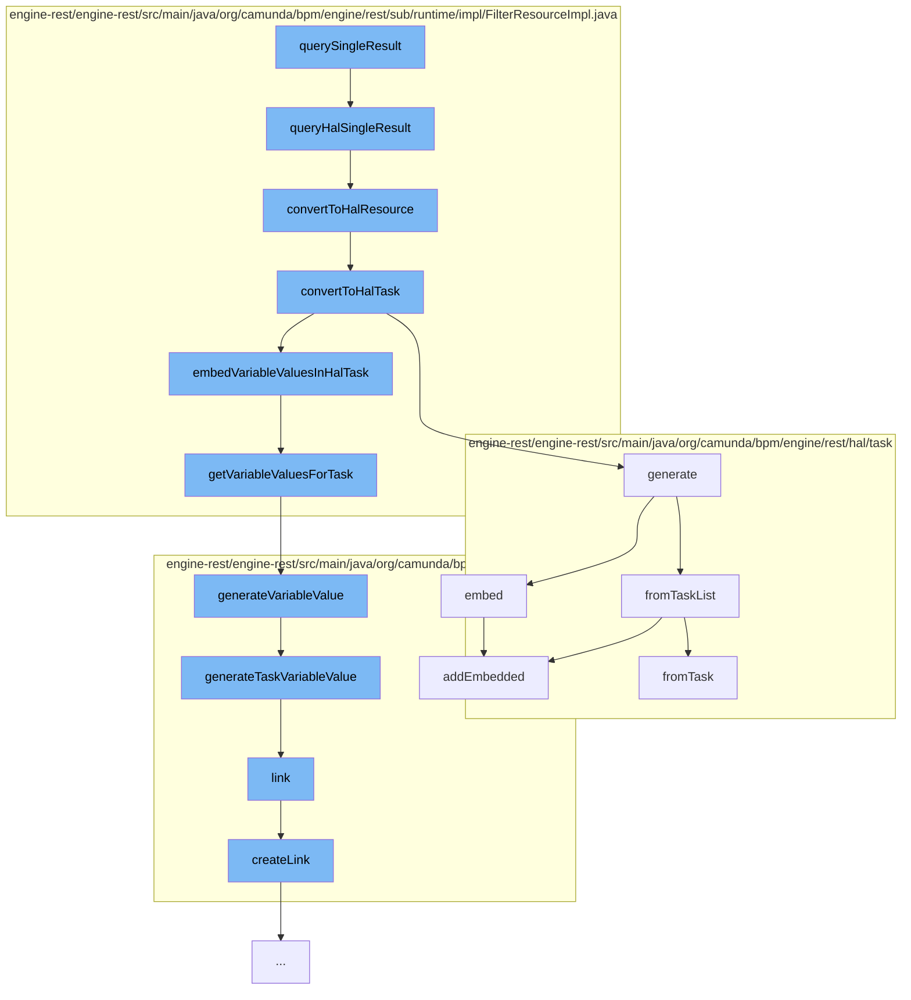

This document will cover the process of querying a single result in the Camunda Platform, which includes:

1. Executing the query for a single result
2. Converting the result to a HAL (Hypertext Application Language) resource
3. Embedding variable values in the HAL task
4. Generating a HAL task list from the task list
5. Adding the embedded tasks to the HAL resource.



<SwmSnippet path="/engine-rest/engine-rest/src/main/java/org/camunda/bpm/engine/rest/sub/runtime/impl/FilterResourceImpl.java" line="182">

---

# Executing the query for a single result

The function `queryHalSingleResult` is used to execute the filter for a single result. If the entity is not null, it is converted to a HAL resource.

```java
  public HalResource queryHalSingleResult(String extendingQuery) {
    Object entity = executeFilterSingleResult(extendingQuery);

    if (entity != null) {
      return convertToHalResource(entity);
    }
    else {
      return EmptyHalResource.INSTANCE;
    }
  }
```

---

</SwmSnippet>

<SwmSnippet path="/engine-rest/engine-rest/src/main/java/org/camunda/bpm/engine/rest/sub/runtime/impl/FilterResourceImpl.java" line="375">

---

# Converting the result to a HAL resource

The function `convertToHalResource` is used to convert the entity to a HAL resource. If the entity is of class `Task`, it is converted to a HAL task.

```java
  protected HalResource<?> convertToHalResource(Object entity) {
    if (isEntityOfClass(entity, Task.class)) {
      return convertToHalTask((Task) entity);
    }
    else {
      throw unsupportedEntityClass(entity);
    }
  }
```

---

</SwmSnippet>

<SwmSnippet path="/engine-rest/engine-rest/src/main/java/org/camunda/bpm/engine/rest/sub/runtime/impl/FilterResourceImpl.java" line="384">

---

# Embedding variable values in the HAL task

The function `convertToHalTask` is used to convert a task to a HAL task. Variable instances for tasks are retrieved and if they are not null, variable values are embedded in the HAL task.

```java
  protected HalTask convertToHalTask(Task task) {
    HalTask halTask = HalTask.generate(task, getProcessEngine());
    Map<String, List<VariableInstance>> variableInstances = getVariableInstancesForTasks(halTask);
    if (variableInstances != null) {
      embedVariableValuesInHalTask(halTask, variableInstances);
    }
    return halTask;
  }
```

---

</SwmSnippet>

<SwmSnippet path="/engine-rest/engine-rest/src/main/java/org/camunda/bpm/engine/rest/hal/task/HalTaskList.java" line="36">

---

# Generating a HAL task list from the task list

The function `generate` is used to generate a HAL task list from the task list. It embeds various entities like assignee, owner, process definition, and case definition in the HAL task list.

```java
  public static HalTaskList generate(List<Task> tasks, long count, ProcessEngine engine) {
    return fromTaskList(tasks, count)
      .embed(HalTask.REL_ASSIGNEE, engine)
      .embed(HalTask.REL_OWNER, engine)
      .embed(HalTask.REL_PROCESS_DEFINITION, engine)
      .embed(HalTask.REL_CASE_DEFINITION, engine);
  }
```

---

</SwmSnippet>

<SwmSnippet path="/engine-rest/engine-rest/src/main/java/org/camunda/bpm/engine/rest/hal/task/HalTaskList.java" line="44">

---

# Adding the embedded tasks to the HAL resource

The function `fromTaskList` is used to create a HAL task list from the task list. It adds the embedded tasks to the HAL resource.

```java
  public static HalTaskList fromTaskList(List<Task> tasks, long count) {

    HalTaskList taskList = new HalTaskList();

    // embed tasks
    List<HalResource<?>> embeddedTasks = new ArrayList<HalResource<?>>();
    for (Task task : tasks) {
      embeddedTasks.add(HalTask.fromTask(task));
    }

    taskList.addEmbedded("task", embeddedTasks);

    // links
    taskList.addLink("self", fromPath(TaskRestService.PATH).build());

    taskList.count = count;

    return taskList;
  }
```

---

</SwmSnippet>

&nbsp;

*This is an auto-generated document by Swimm AI 🌊 and has not yet been verified by a human*

<SwmMeta version="3.0.0" repo-id="Z2l0aHViJTNBJTNBQ2l0aS1jYW11bmRhJTNBJTNBZ2lsYWRuYXZvdA==" repo-name="Citi-camunda" doc-type="flows"><sup>Powered by [Swimm](/)</sup></SwmMeta>
