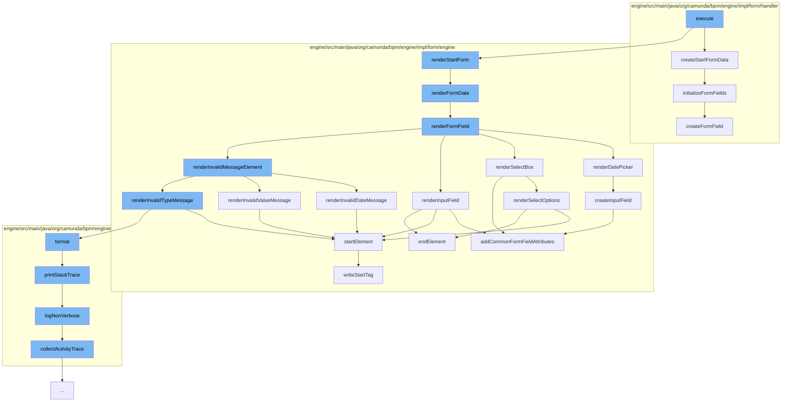

This document will cover the process of rendering a start form in the Camunda BPMN engine. The process includes the following steps:

1. Executing the `GetRenderedStartFormCmd` command
2. Creating start form data
3. Rendering the form data
4. Rendering form fields
5. Handling specific form field types
6. Rendering error messages
7. Logging errors



<SwmSnippet path="/engine/src/main/java/org/camunda/bpm/engine/impl/cmd/GetRenderedStartFormCmd.java" line="1">

---

# Executing the GetRenderedStartFormCmd command

The `GetRenderedStartFormCmd` command is the entry point for this process. It is responsible for initiating the rendering of the start form.

```java
/*
 * Copyright Camunda Services GmbH and/or licensed to Camunda Services GmbH
 * under one or more contributor license agreements. See the NOTICE file
 * distributed with this work for additional information regarding copyright
 * ownership. Camunda licenses this file to you under the Apache License,
 * Version 2.0; you may not use this file except in compliance with the License.
 * You may obtain a copy of the License at
 *
 *     http://www.apache.org/licenses/LICENSE-2.0
 *
```

---

</SwmSnippet>

<SwmSnippet path="/engine/src/main/java/org/camunda/bpm/engine/impl/form/handler/DefaultStartFormHandler.java" line="34">

---

# Creating start form data

The `createStartFormData` method is responsible for creating the start form data. It sets up the form data and initializes form fields.

```java
  public StartFormData createStartFormData(ProcessDefinitionEntity processDefinition) {
    StartFormDataImpl startFormData = new StartFormDataImpl();

    FormDefinition startFormDefinition = processDefinition.getStartFormDefinition();
    Expression formKey = startFormDefinition.getFormKey();
    Expression camundaFormDefinitionKey = startFormDefinition.getCamundaFormDefinitionKey();
    String camundaFormDefinitionBinding = startFormDefinition.getCamundaFormDefinitionBinding();
    Expression camundaFormDefinitionVersion = startFormDefinition.getCamundaFormDefinitionVersion();

    if (formKey != null) {
      startFormData.setFormKey(formKey.getExpressionText());
    } else if (camundaFormDefinitionKey != null && camundaFormDefinitionBinding != null) {
      CamundaFormRefImpl ref = new CamundaFormRefImpl(camundaFormDefinitionKey.getExpressionText(), camundaFormDefinitionBinding);
      if (camundaFormDefinitionBinding.equals(FORM_REF_BINDING_VERSION) && camundaFormDefinitionVersion != null) {
        ref.setVersion(Integer.parseInt(camundaFormDefinitionVersion.getExpressionText()));
      }
      startFormData.setCamundaFormRef(ref);
    }

    startFormData.setDeploymentId(deploymentId);
    startFormData.setProcessDefinition(processDefinition);
```

---

</SwmSnippet>

<SwmSnippet path="/engine/src/main/java/org/camunda/bpm/engine/impl/form/engine/HtmlFormEngine.java" line="151">

---

# Rendering the form data

The `renderFormData` method is responsible for rendering the form data. It creates the HTML structure for the form and iterates over the form fields to render them.

```java
  protected String renderFormData(FormData formData) {

    if(formData == null
        || (formData.getFormFields() == null || formData.getFormFields().isEmpty())
        && (formData.getFormProperties() == null || formData.getFormProperties().isEmpty())) {
      return null;

    } else {
      HtmlElementWriter formElement = new HtmlElementWriter(FORM_ELEMENT)
          .attribute(NAME_ATTRIBUTE, GENERATED_FORM_NAME)
          .attribute(ROLE_ATTRIBUTE, FORM_ROLE);

      HtmlDocumentBuilder documentBuilder = new HtmlDocumentBuilder(formElement);

      // render fields
      for (FormField formField : formData.getFormFields()) {
        renderFormField(formField, documentBuilder);
      }

      // render deprecated form properties
      for (FormProperty formProperty : formData.getFormProperties()) {
```

---

</SwmSnippet>

<SwmSnippet path="/engine/src/main/java/org/camunda/bpm/engine/impl/form/engine/HtmlFormEngine.java" line="183">

---

# Rendering form fields

The `renderFormField` method is responsible for rendering individual form fields. It handles different types of form fields such as select boxes, date pickers, and input fields.

```java
  protected void renderFormField(FormField formField, HtmlDocumentBuilder documentBuilder) {
    // start group
    HtmlElementWriter divElement = new HtmlElementWriter(DIV_ELEMENT)
        .attribute(CLASS_ATTRIBUTE, FORM_GROUP_CLASS);

    documentBuilder.startElement(divElement);

    String formFieldId = formField.getId();
    String formFieldLabel = formField.getLabel();

    // write label
    if (formFieldLabel != null && !formFieldLabel.isEmpty()) {

      HtmlElementWriter labelElement = new HtmlElementWriter(LABEL_ELEMENT)
          .attribute(FOR_ATTRIBUTE, formFieldId)
          .textContent(formFieldLabel);

      // <label for="...">...</label>
      documentBuilder.startElement(labelElement).endElement();
    }

```

---

</SwmSnippet>

<SwmSnippet path="/engine/src/main/java/org/camunda/bpm/engine/impl/form/engine/HtmlFormEngine.java" line="235">

---

# Handling specific form field types

The `renderDatePicker` method is an example of how specific form field types are handled. It creates the HTML structure for a date picker field.

```java
  protected void renderDatePicker(FormField formField, HtmlDocumentBuilder documentBuilder) {
    boolean isReadOnly = isReadOnly(formField);

    // start input-group
    HtmlElementWriter inputGroupDivElement = new HtmlElementWriter(DIV_ELEMENT)
        .attribute(CLASS_ATTRIBUTE, INPUT_GROUP_CLASS);

    String formFieldId = formField.getId();

    // <div>
    documentBuilder.startElement(inputGroupDivElement);

    // input field
    HtmlElementWriter inputField = createInputField(formField);

    String dateFormat = (String) formField.getType().getInformation(DATE_PATTERN_ATTRIBUTE);
    if(!isReadOnly) {
      inputField
          .attribute(DATEPICKER_POPUP_ATTRIBUTE, dateFormat)
          .attribute(IS_OPEN_ATTRIBUTE, String.format(DATE_FIELD_OPENED_ATTRIBUTE, formFieldId));
    }
```

---

</SwmSnippet>

<SwmSnippet path="/engine/src/main/java/org/camunda/bpm/engine/impl/form/engine/HtmlFormEngine.java" line="425">

---

# Rendering error messages

The `renderInvalidDateMessage` method is responsible for rendering error messages for invalid date fields. It creates the HTML structure for the error message.

```java
  protected void renderInvalidDateMessage(FormField formField, HtmlDocumentBuilder documentBuilder) {
    String formFieldId = formField.getId();

    HtmlElementWriter firstDivElement = new HtmlElementWriter(DIV_ELEMENT);

    String firstExpression = String.format(REQUIRED_ERROR_EXPRESSION + " && !" + DATE_ERROR_EXPRESSION, formFieldId, formFieldId);

    firstDivElement
        .attribute(NG_SHOW_ATTRIBUTE, firstExpression)
        .attribute(CLASS_ATTRIBUTE, HELP_BLOCK_CLASS)
        .textContent(REQUIRED_FIELD_MESSAGE);

    documentBuilder
        .startElement(firstDivElement)
        .endElement();

    HtmlElementWriter secondDivElement = new HtmlElementWriter(DIV_ELEMENT);

    String secondExpression = String.format(DATE_ERROR_EXPRESSION, formFieldId);

    secondDivElement
```

---

</SwmSnippet>

<SwmSnippet path="/engine/src/main/java/org/camunda/bpm/engine/impl/interceptor/BpmnStackTrace.java" line="39">

---

# Logging errors

The `printStackTrace` method is responsible for logging errors. It creates a BPMN stack trace and logs it.

```java
  public void printStackTrace(boolean verbose) {
    if(perfromedInvocations.isEmpty()) {
      return;
    }

    StringWriter writer = new StringWriter();
    writer.write("BPMN Stack Trace:\n");

    if(!verbose) {
      logNonVerbose(writer);
    }
    else {
      logVerbose(writer);
    }

    LOG.bpmnStackTrace(writer.toString());

    perfromedInvocations.clear();
  }
```

---

</SwmSnippet>

&nbsp;

*This is an auto-generated document by Swimm AI 🌊 and has not yet been verified by a human*

<SwmMeta version="3.0.0" repo-id="Z2l0aHViJTNBJTNBQ2l0aS1jYW11bmRhJTNBJTNBZ2lsYWRuYXZvdA==" repo-name="Citi-camunda" doc-type="flows"><sup>Powered by [Swimm](/)</sup></SwmMeta>
