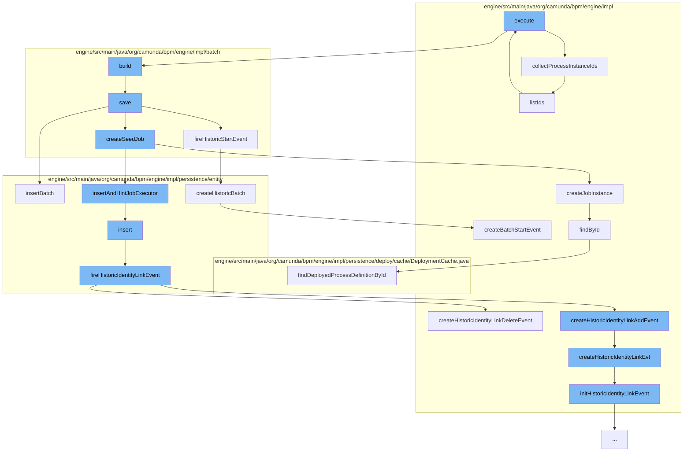

This document will cover the process of restarting process instances in the Camunda BPM engine, which includes:

1. Collecting process instance IDs
2. Building and saving the batch
3. Creating a seed job
4. Inserting identity link and firing historic identity link event
5. Creating historic batch and firing historic start event.



<SwmSnippet path="/engine/src/main/java/org/camunda/bpm/engine/impl/migration/AbstractMigrationCmd.java" line="64">

---

# Collecting process instance IDs

The function `collectProcessInstanceIds` is used to gather all the process instance IDs that need to be restarted. It collects both the IDs directly provided and those obtained from a process instance query.

```java
  protected Collection<String> collectProcessInstanceIds() {

    Set<String> collectedProcessInstanceIds = new HashSet<>();

    List<String> processInstanceIds = executionBuilder.getProcessInstanceIds();
    if (processInstanceIds != null) {
      collectedProcessInstanceIds.addAll(processInstanceIds);
    }

    final ProcessInstanceQueryImpl processInstanceQuery =
        (ProcessInstanceQueryImpl) executionBuilder.getProcessInstanceQuery();
    if (processInstanceQuery != null) {
      collectedProcessInstanceIds.addAll(processInstanceQuery.listIds());
    }

    return collectedProcessInstanceIds;
  }
```

---

</SwmSnippet>

<SwmSnippet path="/engine/src/main/java/org/camunda/bpm/engine/impl/batch/builder/BatchBuilder.java" line="163">

---

# Building and saving the batch

The `save` function is used to build the batch with the collected process instance IDs and save it. It also triggers the creation of the seed job.

```java
  protected void save(BatchEntity batch) {
    commandContext.getBatchManager().insertBatch(batch);

    String seedDeploymentId = null;
    if (config.getIdMappings() != null && !config.getIdMappings().isEmpty()) {
      seedDeploymentId = config.getIdMappings().get(0).getDeploymentId();
    }

    batch.createSeedJobDefinition(seedDeploymentId);
    batch.createMonitorJobDefinition();
    batch.createBatchJobDefinition();

    batch.fireHistoricStartEvent();

    batch.createSeedJob();
  }
```

---

</SwmSnippet>

<SwmSnippet path="/engine/src/main/java/org/camunda/bpm/engine/impl/batch/BatchEntity.java" line="171">

---

# Creating a seed job

The `createSeedJob` function is used to create a seed job for the batch. This job is responsible for creating the batch jobs that will perform the actual process instance restarts.

```java
    this.createUserId = createUserId;
  }

  public String getConfiguration() {
    return configuration.getByteArrayId();
  }

```

---

</SwmSnippet>

<SwmSnippet path="/engine/src/main/java/org/camunda/bpm/engine/impl/persistence/entity/IdentityLinkEntity.java" line="82">

---

# Inserting identity link and firing historic identity link event

The `insert` function is used to insert an identity link for the batch. This link associates the batch with a specific user or group. After the link is inserted, a historic identity link event is fired.

```java
  public void insert() {
    Context
      .getCommandContext()
      .getDbEntityManager()
      .insert(this);
    fireHistoricIdentityLinkEvent(HistoryEventTypes.IDENTITY_LINK_ADD);
  }
```

---

</SwmSnippet>

<SwmSnippet path="/engine/src/main/java/org/camunda/bpm/engine/impl/persistence/entity/HistoricBatchManager.java" line="97">

---

# Creating historic batch and firing historic start event

The `createHistoricBatch` function is used to create a historic batch for the batch. This historic batch records the start of the batch operation. After the historic batch is created, a historic start event is fired.

```java
  public void createHistoricBatch(final BatchEntity batch) {
    ProcessEngineConfigurationImpl configuration = Context.getProcessEngineConfiguration();

    HistoryLevel historyLevel = configuration.getHistoryLevel();
    if(historyLevel.isHistoryEventProduced(HistoryEventTypes.BATCH_START, batch)) {

      HistoryEventProcessor.processHistoryEvents(new HistoryEventProcessor.HistoryEventCreator() {
        @Override
        public HistoryEvent createHistoryEvent(HistoryEventProducer producer) {
          return producer.createBatchStartEvent(batch);
        }
      });
    }
  }
```

---

</SwmSnippet>

&nbsp;

*This is an auto-generated document by Swimm AI 🌊 and has not yet been verified by a human*

<SwmMeta version="3.0.0" repo-id="Z2l0aHViJTNBJTNBQ2l0aS1jYW11bmRhJTNBJTNBZ2lsYWRuYXZvdA==" repo-name="Citi-camunda" doc-type="flows"><sup>Powered by [Swimm](/)</sup></SwmMeta>
