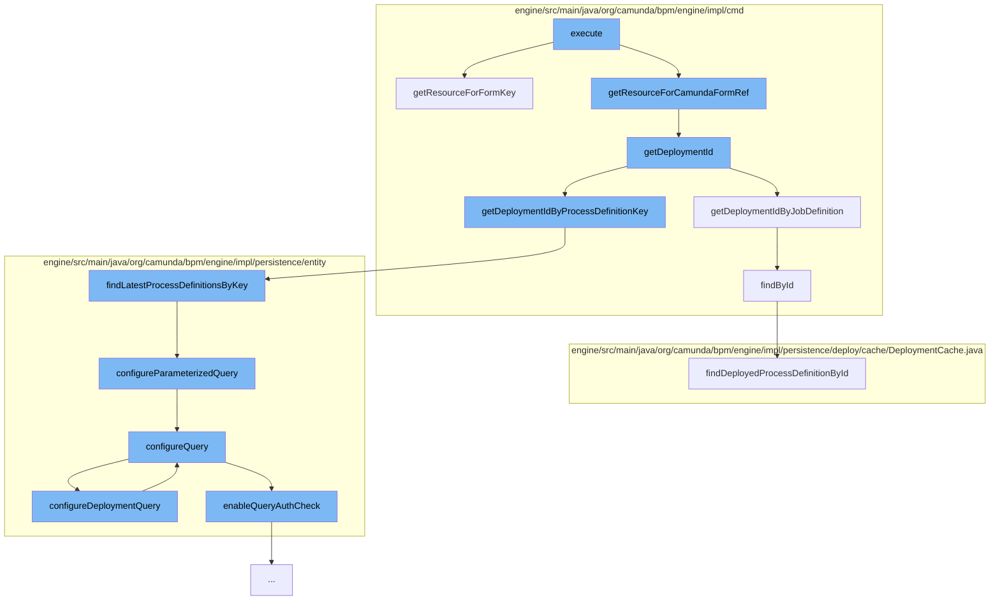

This document will cover the process of retrieving a deployed form in the Camunda Platform, which includes:

1. Getting the resource for the form key
2. Determining the deployment ID
3. Fetching the process definition by the job definition
4. Configuring the query for the process definition
5. Enabling authorization checks for the query
6. Finding the deployed process definition by ID.



<SwmSnippet path="/engine/src/main/java/org/camunda/bpm/engine/impl/cmd/AbstractGetDeployedFormCmd.java" line="63">

---

# Getting the resource for the form key

The `getResourceForFormKey` function is used to get the resource for a given form key. It checks if the resource name starts with certain keys and modifies the resource name accordingly. If the resource name does not start with the `DEPLOYMENT_KEY`, an exception is thrown. Finally, it calls `getDeploymentResource` with the deployment ID and the resource name.

```java
  protected InputStream getResourceForFormKey(FormData formData, String formKey) {
    String resourceName = formKey;

    if (resourceName.startsWith(EMBEDDED_KEY)) {
      resourceName = resourceName.substring(EMBEDDED_KEY_LENGTH, resourceName.length());
    } else if (resourceName.startsWith(CAMUNDA_FORMS_KEY)) {
      resourceName = resourceName.substring(CAMUNDA_FORMS_KEY_LENGTH, resourceName.length());
    }

    if (!resourceName.startsWith(DEPLOYMENT_KEY)) {
      throw new BadUserRequestException("The form key '" + formKey + "' does not reference a deployed form.");
    }

    resourceName = resourceName.substring(DEPLOYMENT_KEY_LENGTH, resourceName.length());

    return getDeploymentResource(formData.getDeploymentId(), resourceName);
  }
```

---

</SwmSnippet>

<SwmSnippet path="/engine/src/main/java/org/camunda/bpm/engine/impl/cmd/AbstractSetJobDefinitionStateCmd.java" line="197">

---

# Determining the deployment ID

The `getDeploymentId` function is used to determine the deployment ID. It checks if the job definition ID, process definition ID, or process definition key is not null and calls the appropriate function to get the deployment ID.

```java
  @Override
  protected String getDeploymentId(CommandContext commandContext) {
    if (jobDefinitionId != null) {
      return getDeploymentIdByJobDefinition(commandContext, jobDefinitionId);
    } else if (processDefinitionId != null) {
      return getDeploymentIdByProcessDefinition(commandContext, processDefinitionId);
    } else if (processDefinitionKey != null) {
      return getDeploymentIdByProcessDefinitionKey(commandContext, processDefinitionKey, isProcessDefinitionTenantIdSet, processDefinitionTenantId);
    }
    return null;
  }
```

---

</SwmSnippet>

<SwmSnippet path="/engine/src/main/java/org/camunda/bpm/engine/impl/cmd/AbstractSetStateCmd.java" line="169">

---

# Fetching the process definition by the job definition

The `getDeploymentIdByJobDefinition` function is used to fetch the process definition by the job definition. It retrieves the job definition by its ID and if it's not null, it calls `getDeploymentIdByProcessDefinition` with the process definition ID.

```java
  protected String getDeploymentIdByJobDefinition(CommandContext commandContext, String jobDefinitionId) {
    JobDefinitionManager jobDefinitionManager = commandContext.getJobDefinitionManager();
    JobDefinitionEntity jobDefinition = jobDefinitionManager.findById(jobDefinitionId);
    if (jobDefinition != null) {
      if (jobDefinition.getProcessDefinitionId() != null) {
        return getDeploymentIdByProcessDefinition(commandContext, jobDefinition.getProcessDefinitionId());
      }
    }
    return null;
  }
```

---

</SwmSnippet>

<SwmSnippet path="/engine/src/main/java/org/camunda/bpm/engine/impl/persistence/entity/ProcessDefinitionManager.java" line="82">

---

# Configuring the query for the process definition

The `findLatestProcessDefinitionsByKey` function is used to configure the query for the process definition. It calls `configureParameterizedQuery` with the process definition key.

```java
  /**
   * @return the latest versions of the process definition with the given key (from any tenant),
   *         contains multiple elements if more than one tenant has a process definition with
   *         the given key
   *
   * @see #findLatestProcessDefinitionByKey(String)
   */
  @SuppressWarnings("unchecked")
  public List<ProcessDefinitionEntity> findLatestProcessDefinitionsByKey(String processDefinitionKey) {
    return getDbEntityManager().selectList("selectLatestProcessDefinitionByKey", configureParameterizedQuery(processDefinitionKey));
  }
```

---

</SwmSnippet>

<SwmSnippet path="/engine/src/main/java/org/camunda/bpm/engine/impl/persistence/entity/AuthorizationManager.java" line="357">

---

# Enabling authorization checks for the query

The `configureQuery` function is used to enable authorization checks for the query. It checks if authorization checks are executed and enables them if they are. It also sets the authorization user ID and group IDs.

```java
  // authorization checks on queries ////////////////////////////////

  public void configureQuery(ListQueryParameterObject query) {

    AuthorizationCheck authCheck = query.getAuthCheck();
    authCheck.getPermissionChecks().clear();

    if(isAuthCheckExecuted()) {
      Authentication currentAuthentication = getCurrentAuthentication();
      authCheck.setAuthUserId(currentAuthentication.getUserId());
      authCheck.setAuthGroupIds(currentAuthentication.getGroupIds());
      enableQueryAuthCheck(authCheck);
    }
    else {
      authCheck.setAuthorizationCheckEnabled(false);
      authCheck.setAuthUserId(null);
      authCheck.setAuthGroupIds(null);
    }
  }
```

---

</SwmSnippet>

<SwmSnippet path="/engine/src/main/java/org/camunda/bpm/engine/impl/persistence/deploy/cache/DeploymentCache.java" line="80">

---

# Finding the deployed process definition by ID

The `findDeployedProcessDefinitionById` function is used to find the deployed process definition by its ID. It calls `findDeployedDefinitionById` with the process definition ID.

```java
  public ProcessDefinitionEntity findDeployedProcessDefinitionById(String processDefinitionId) {
    return processDefinitionEntityCache.findDeployedDefinitionById(processDefinitionId);
  }
```

---

</SwmSnippet>

&nbsp;

*This is an auto-generated document by Swimm AI 🌊 and has not yet been verified by a human*

<SwmMeta version="3.0.0" repo-id="Z2l0aHViJTNBJTNBQ2l0aS1jYW11bmRhJTNBJTNBZ2lsYWRuYXZvdA==" repo-name="Citi-camunda" doc-type="flows"><sup>Powered by [Swimm](/)</sup></SwmMeta>
