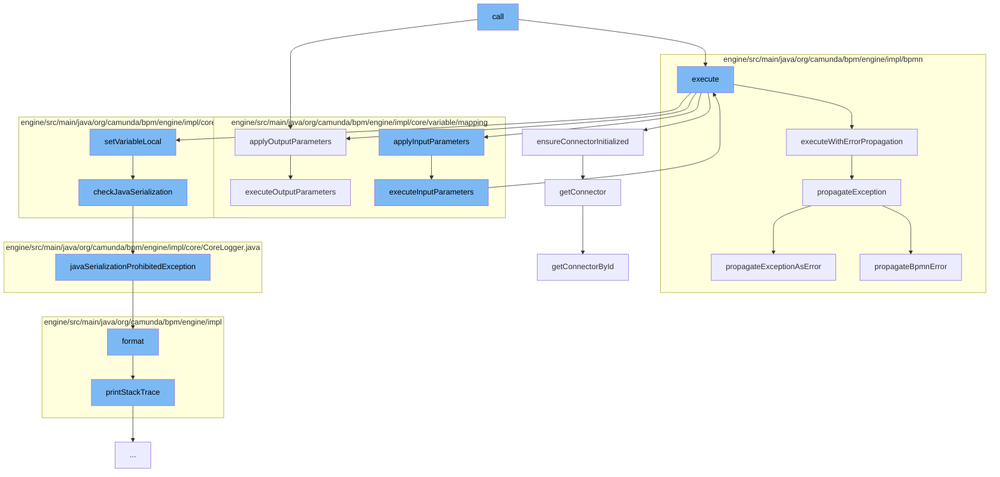

This document will cover the process of executing a service task in Camunda, which includes:

1. Initializing the connector
2. Applying input parameters
3. Executing the service task with error propagation
4. Applying output parameters.



<SwmSnippet path="/engine-plugins/connect-plugin/src/main/java/org/camunda/connect/plugin/impl/ServiceTaskConnectorActivityBehavior.java" line="132">

---

# Initializing the connector

The function `getConnectorById` is used to retrieve the connector by its ID. This is a crucial step in initializing the connector for the service task.

```java

```

---

</SwmSnippet>

<SwmSnippet path="/engine/src/main/java/org/camunda/bpm/engine/impl/core/variable/mapping/InputParameter.java" line="43">

---

# Applying input parameters

The function `execute` is used to apply the input parameters to the service task. It retrieves the value from the outer scope and sets it in the inner scope.

```java
  protected void execute(AbstractVariableScope innerScope, AbstractVariableScope outerScope) {

    // get value from outer scope
    Object value = valueProvider.getValue(outerScope);

    LOG.debugMappingValueFromOuterScopeToInnerScope(value,outerScope, name, innerScope);

    // set variable in inner scope
    innerScope.setVariableLocal(name, value);
  }
```

---

</SwmSnippet>

<SwmSnippet path="/engine/src/main/java/org/camunda/bpm/engine/impl/bpmn/helper/BpmnExceptionHandler.java" line="41">

---

# Executing the service task with error propagation

The function `propagateException` is used to handle exceptions during the execution of the service task. It checks if the exception is a BPMN error and propagates it accordingly.

```java
  /**
   * Decides how to propagate the exception properly, e.g. as bpmn error or "normal" error.
   * @param execution the current execution
   * @param ex the exception to propagate
   * @throws Exception if no error handler could be found
   */
  public static void propagateException(ActivityExecution execution, Exception ex) throws Exception {
    BpmnError bpmnError = checkIfCauseOfExceptionIsBpmnError(ex);
    if (bpmnError != null) {
      propagateBpmnError(bpmnError, execution);
    } else {
      propagateExceptionAsError(ex, execution);
    }
  }
```

---

</SwmSnippet>

<SwmSnippet path="/engine-plugins/connect-plugin/src/main/java/org/camunda/connect/plugin/impl/ServiceTaskConnectorActivityBehavior.java" line="81">

---

# Applying output parameters

The function `applyOutputParameters` is used to apply the output parameters after the service task has been executed. It reads the parameters from the response and maps them to the parent scope.

```java
  protected void applyOutputParameters(ActivityExecution execution, ConnectorResponse response) {
    if(ioMapping != null) {
      // create variable scope for output parameters
      ConnectorVariableScope connectorOutputVariableScope = new ConnectorVariableScope((AbstractVariableScope) execution);
      // read parameters from response
      connectorOutputVariableScope.readFromResponse(response);
      // map variables to parent scope.
      ioMapping.executeOutputParameters(connectorOutputVariableScope);
    }
  }
```

---

</SwmSnippet>

&nbsp;

*This is an auto-generated document by Swimm AI 🌊 and has not yet been verified by a human*

<SwmMeta version="3.0.0" repo-id="Z2l0aHViJTNBJTNBQ2l0aS1jYW11bmRhJTNBJTNBZ2lsYWRuYXZvdA==" repo-name="Citi-camunda" doc-type="flows"><sup>Powered by [Swimm](/)</sup></SwmMeta>
