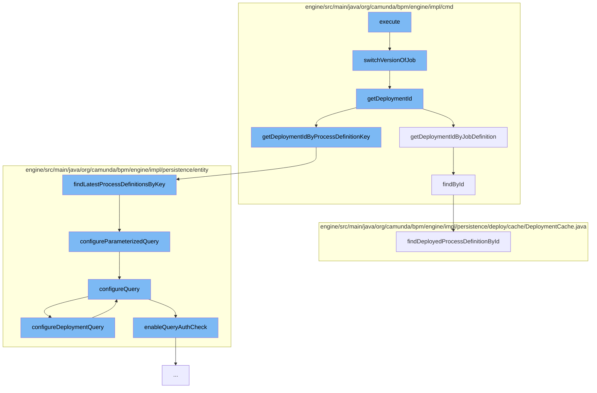

This document will cover the process of setting the process definition version in the Camunda BPM engine. The process involves the following steps:

1. Execution of the main function
2. Switching the version of the job
3. Retrieving the deployment ID
4. Configuring the query parameters
5. Enabling the query authorization check.



<SwmSnippet path="/engine/src/main/java/org/camunda/bpm/engine/impl/cmd/SetProcessDefinitionVersionCmd.java" line="207">

---

# Execution of the main function

The `execute` function is the entry point of the process. It calls the `switchVersionOfJob` function to start the process of switching the version of the job.

```java
  protected void switchVersionOfJob(JobEntity jobEntity, ProcessDefinitionEntity newProcessDefinition, Map<String, String> jobDefinitionMapping) {
    jobEntity.setProcessDefinitionId(newProcessDefinition.getId());
    jobEntity.setDeploymentId(newProcessDefinition.getDeploymentId());

    String newJobDefinitionId = jobDefinitionMapping.get(jobEntity.getJobDefinitionId());
    jobEntity.setJobDefinitionId(newJobDefinitionId);
  }
```

---

</SwmSnippet>

<SwmSnippet path="/engine/src/main/java/org/camunda/bpm/engine/impl/cmd/SetProcessDefinitionVersionCmd.java" line="207">

---

# Switching the version of the job

The `switchVersionOfJob` function sets the new process definition ID and deployment ID for the job entity. It also maps the new job definition ID to the job entity.

```java
  protected void switchVersionOfJob(JobEntity jobEntity, ProcessDefinitionEntity newProcessDefinition, Map<String, String> jobDefinitionMapping) {
    jobEntity.setProcessDefinitionId(newProcessDefinition.getId());
    jobEntity.setDeploymentId(newProcessDefinition.getDeploymentId());

    String newJobDefinitionId = jobDefinitionMapping.get(jobEntity.getJobDefinitionId());
    jobEntity.setJobDefinitionId(newJobDefinitionId);
  }
```

---

</SwmSnippet>

<SwmSnippet path="/engine/src/main/java/org/camunda/bpm/engine/impl/cmd/AbstractSetJobDefinitionStateCmd.java" line="197">

---

# Retrieving the deployment ID

The `getDeploymentId` function retrieves the deployment ID based on the job definition ID, process definition ID, or process definition key.

```java
  @Override
  protected String getDeploymentId(CommandContext commandContext) {
    if (jobDefinitionId != null) {
      return getDeploymentIdByJobDefinition(commandContext, jobDefinitionId);
    } else if (processDefinitionId != null) {
      return getDeploymentIdByProcessDefinition(commandContext, processDefinitionId);
    } else if (processDefinitionKey != null) {
      return getDeploymentIdByProcessDefinitionKey(commandContext, processDefinitionKey, isProcessDefinitionTenantIdSet, processDefinitionTenantId);
    }
    return null;
  }
```

---

</SwmSnippet>

<SwmSnippet path="/engine/src/main/java/org/camunda/bpm/engine/impl/persistence/entity/ProcessDefinitionManager.java" line="398">

---

# Configuring the query parameters

The `configureParameterizedQuery` function is used to configure the query parameters for retrieving the latest process definitions by key.

```java
  protected ListQueryParameterObject configureParameterizedQuery(Object parameter) {
    return getTenantManager().configureQuery(parameter);
  }
```

---

</SwmSnippet>

<SwmSnippet path="/engine/src/main/java/org/camunda/bpm/engine/impl/persistence/entity/AuthorizationManager.java" line="389">

---

# Enabling the query authorization check

The `enableQueryAuthCheck` function enables the authorization check for the query. It sets the user ID and group IDs for the authorization check.

```java
  public void enableQueryAuthCheck(AuthorizationCheck authCheck) {
    List<String> authGroupIds = authCheck.getAuthGroupIds();
    String authUserId = authCheck.getAuthUserId();

    authCheck.setAuthorizationCheckEnabled(true);
    authCheck.setAuthGroupIds(filterAuthenticatedGroupIds(authGroupIds));
    authCheck.setRevokeAuthorizationCheckEnabled(isRevokeAuthCheckEnabled(authUserId, authGroupIds));
  }
```

---

</SwmSnippet>

&nbsp;

*This is an auto-generated document by Swimm AI 🌊 and has not yet been verified by a human*

<SwmMeta version="3.0.0" repo-id="Z2l0aHViJTNBJTNBQ2l0aS1jYW11bmRhJTNBJTNBZ2lsYWRuYXZvdA==" repo-name="Citi-camunda" doc-type="flows"><sup>Powered by [Swimm](/)</sup></SwmMeta>
